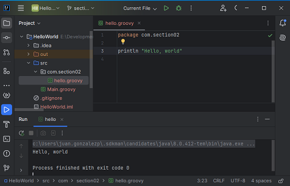

# The Complete Apache Groovy Developer Course
https://perficient.udemy.com/course/apache-groovy
## Prerrequisitos
1. Tener "[Visual Studio Code](https://code.visualstudio.com/download)", como editor
2. Tener Instalado "[JAVA Version 11.0.2](https://jdk.java.net/archive/)", "[GRADLE](https://gradle.org/install/)", "[GROOVY](https://groovy.apache.org/download.html)" y "[MAVEN](https://maven.apache.org/download.cgi)".
3. Instalar Estas Extensiones en el "Visual Studio Code":
* code-groovy  de Marlon Franca.
* 

# Section 1: Introduction

## Paso 1. Introduction and Goals for this course
>[!NOTE]  
>Que se va a ver en el curso y con q posibles herramientas se va a trabajar.

## Paso 2. What is Groovy?
>[!NOTE]  
>**Apach Groovy** es un poderoso tipado y dinámico lenguaje 
>opcional para plataformas Java, dirigido a mejorar la 
>productividad del desarrollo.  
>Está inspirado en leguajes como ´Python´, ´Ruby´ y ´Smalltalk´.
>
> ### Características de Apache Groovy
>* **Curva de aprendizaje plana**
>Sintaxis concisa, legible y expresiva, fácil de 
>aprender para desarrolladores de Java.
>* **Integración fluida de Java**
>Se integra e interopera de forma perfecta y transparente 
>con Java y cualquier biblioteca de terceros.
>* **Ecosistema vibrante y rico**
>Desarrollo web, aplicaciones reactivas, biblioteca de 
>concurrencia/asincrónica/paralelismo, marcos de prueba, 
>herramientas de compilación, análisis de código, creación de GUI
>* **Funciones potentes**
>Cierres, constructores, metaprogramación en tiempo de 
>ejecución y compilación, programación funcional, 
>inferencia de tipos y compilación estática
>* **Idiomas específicos del dominio**
>Sintaxis flexible y maleable, mecanismos avanzados de integración 
>y personalización para integrar reglas comerciales legibles en sus 
>aplicaciones.
>* **Pegamento para secuencias de comandos y pruebas**
>Excelente para escribir pruebas concisas y fáciles de mantener, 
>y para todas sus tareas de compilación y automatización.
>
>

## Paso 3. Source Code
>[!NOTE]  
>Repositiorio con los ejercicios de groovy
>[cfaddict/apache-groovy-course](https://github.com/cfaddict/apache-groovy-course)

## Paso 4. The Groovy Website & Documentation
>[!NOTE]
>Estos son los sitios de recursos aportados en el curso:
> * [Apache Groovy](https://groovy-lang.org/).
> * [Groovhy Website Source Code ](https://github.com/apache/groovy-website/).https://groovy-lang.org/gdk.html
> * [Groovy Developemnt Kit](https://groovy-lang.org/gdk.html).
> * [GroovyDoc of Groovy APIs](https://groovy-lang.org/api.html).

## Paso 5. Groovy Books & Additional Resources
>[!NOTE]  
> Otros libros y documentos:
> * [Groovy in Action](https://www.amazon.com/Groovy-Action-Dierk-246-nig/dp/1935182447/).
> * [Programming Groovy 2](https://www.amazon.com/Programming-Groovy-Productivity-Developer-Programmers/dp/1937785300/).
> * [Making Java Groovy](https://www.amazon.com/Making-Java-Groovy-Ken-Kousen/dp/1935182943).

## Paso 6. How to get the most out of this course
>[!NOTE]  
>Bienvenido de nuevo.  
>Hoy quiero hablar sobre las mejores maneras de sacar todo el provecho posible de este curso para saber cómo  
>emocionante puede ser tomar un nuevo curso y querer aprender un nuevo tema.  
>Es más o menos todo lo que hago fuera de la enseñanza.  
>Me encanta conseguir tantos libros como pueda, muchos cursos y simplemente consumir tanta información como sea posible.  
>poder.  
>Entonces este es un curso bastante largo.  
>Llevamos más de 14 horas aquí, por lo que hay mucha información aquí para aprender.  
>Así que solo voy a hablar sobre un par de cosas que creo que te ayudarán a tener éxito.  
>en este curso.  
>Entonces, comencemos con las pruebas y los ejercicios.  
>En cada sección.
>Tenemos algunos cuestionarios, algunos ejercicios y luego tenemos algunas revisiones a las que iremos tú y yo.
>a través del ejercicio real juntos.  
>Así que estos no son sólo rellenos para poder decirle a la gente que tengo X cantidad de contenido en este curso.
>Realmente están destinados a ayudarle a retener información.  
>Por eso quiero que realices estos cuestionarios.
>Quiero que hagas los ejercicios.
>Y si no entiendes algo, por favor pregunta.  
>Y lo mejor que puedes hacer es preguntar en el foro, porque es probable que alguien más tenga la misma pregunta que haces tu.  
>Así que por favor hable y me aseguraré de recibir respuestas lo más rápido posible.
>Esos son los cuestionarios y ejercicios.
>Dos Los recursos adicionales continúan y saltan hasta el final del curso.  
>Ahora mismo, si quieres, hay una sección de recursos adicionales y vamos a tener un PDF grande.
>aquí lleno de toda la información que necesita.  
>Y esto será como una lista de libros, una lista de artículos, una lista de podcasts, boletines informativos,
>todo lo que puedas intentar consumir de la maravillosa comunidad.  
>Entonces haz eso:  
>Además, si eres blogger o te gusta crear screencasts para YouTube, creo que otra forma de
>Realmente aprendes un tema es a medida que avanzas y encuentras un tema que realmente quieres probar.
>para comprenderlo mejor.  
>Digamos que está realmente interesado en los cierres y desea aprender más sobre ellos.  
>Ya sabes, cuando aprendas algo, sal y escribe una publicación de blog sobre ello o crea un screencast.  
>al respecto Puedo decirte por experiencia que una cosa que siempre he encontrado es cuando quieres contarle a alguien más.
>sobre algo, probablemente seas un poco más duro contigo mismo y quieras asegurarte de que realmente
>Entiende ese tema antes de contarle a alguien más sobre él.  
>Ese tipo de recursos siempre me han ayudado personalmente.
>Quizás ellos también te ayuden.  
>Entonces creo que eso es todo.  
>Sólo un par de consejos.
> * Realmente quiero que tengas éxito en este curso, no sólo que lo tomes.
>Así que espero que ayuden.
>Y entremos en el verdadero meollo del curso.
>Comenzaremos y comenzaremos a repasar algunos conceptos básicos y a configurarlo.
>Entonces vamos.

# Section 2: Getting Started

## Paso 7. Intro
>[!NOTE]  
>Corta explicación del capítulo.

## Paso 8. Installing the Java JDK on Windows
>[!NOTE]  
>Sitio sugerido es este: [Oracle JAVA Downloads](https://www.oracle.com/java/technologies/downloads/?er=221886).  
> Pero yo lo bajo de este autorizado por mi empresa:
> [JAVA Version 11.0.2](https://jdk.java.net/archive/)
>Ya sea en Windows o en MAC opto por la instlación manual, 
>Es decir descargo el comprimido (**.zip** o **tar.gz**).  
>En este sitio hay unas instrucciones para "instalar" el comprimido:
>[OpenJDK en windows 10]([JAVA Version 11.0.2](https://jdk.java.net/archive/))

## Paso 9. Installing the Java JDK on Mac OSX
>[!NOTE]  
>Similar el sitio de descarga [JAVA Version 11.0.2](https://jdk.java.net/archive/)

>[!TIP]  
> Siempre lo importante es ejecutar en una terminal el comando
>```bash
>java --version
>```
>y obtener la versión del java instalado.

## Paso 10. Installing Groovy on Windows
>[!NOTE]  
>La mejor manera es descargar el comprimido (*.zip) y ponerlo de forma
> manual, a lfinal ejecutar el comando ```groovy --version ```

## Paso 11. SDKMAN
>[!NOTE]
> Muy útil  para instalar muchos tipos de software
>La página con el instructivo es [Sdkman Installation](https://sdkman.io/install)

1. el comando para instalar en una términal de `git Bash` o UNIX o
LINUX o emuladores similares sería:
```bash
curl -s "https://get.sdkman.io" | bash
```
2. Si en Windows usando el `git Bash` genera el error q le falta el 
**zip**, en esta página está la solución [How to add man and zip to "git bash" installation on Windows](https://stackoverflow.com/questions/38782928/how-to-add-man-and-zip-to-git-bash-installation-on-windows]
3. Descargar el **zip** de esta página [zip-3.0-bin.zip](https://sourceforge.net/projects/gnuwin32/files/zip/3.0/zip-3.0-bin.zip/download), y copiar el `zip.exe` en esta ruta `C:\Program Files\Git\mingw64\bin\`.
4. Ejecute en el `git Bash` el comando:
```bash
source "$HOME/.sdkman/bin/sdkman-init.sh"
```
5. Por último el comando para estar seguros q quedó bien instalado:
```bash
sdk version
```

## Paso 12. groovysh
1. Ejecuto el comando `groovysh -help` y la respuesta sería
```bash
Usage: groovysh [options] [...]
The Groovy Shell, aka groovysh, is a command-line application which allows easy
access to evaluate Groovy expressions, define classes and run simple
experiments.
  -C, --color[=<FLAG>]    Enable or disable use of ANSI colors
      -cp, -classpath, --classpath
                          Specify where to find the class files - must be first
                            argument
  -d, --debug             Enable debug output
  -D, --define=<name=value>
                          Define a system property
  -e, --evaluate=<CODE>   Evaluate the code first when starting interactive
                            session
  -h, --help              Display this help message
      -pa, --parameters   Generate metadata for reflection on method parameter
                            names (jdk8+ only)
      -pr, --enable-preview
                          Enable preview Java features (jdk12+ only) - must be
                            after classpath but before other arguments
  -q, --quiet             Suppress superfluous output
  -T, --terminal=<TYPE>   Specify the terminal TYPE to use
  -v, --verbose           Enable verbose output
  -V, --version           Display the version
```
2. El comando correcto es `groovysh -V` o `groovysh --version`, pero nunca
`groovysh -version` o `groovysh -v`, para obtener algo parecido a esto:
```bash
@|green Groovy Shell|@ 4.0.16
```
3. El solo commando `groovysh`, te lleva a un ambiente donde groovy evalua y
ejecuta. Por ejemplo:  
ko

4. Se puede salir de este ambiente en cualquier momento con `:q`.

## Paso 13. groovyc
> [!NOTE]  
> `groovyc` es la herramienta de compilación en linea.  
>  Algunos commandos y funciones de la línea de comando
> en este sitio [groovyc - the Groovy compiler](https://groovy-lang.org/groovyc.html).
1. Creo la carpeta "groovy".
2. Creo el archivo **Person.groovy** con lo siguiente:
```groovy
class Person {
	String first
	String last
	
	public Person( String first, String last){
		this.first = first
		this.last = last
	}
	
	public String toString(){
		"Person: $first $last"
	}
}
```
3. Ejecuto el comando `groovyc Person.groovy`.
4. Y observamos el contenido de la carpeta con el comando `ls`,
nos va a aparecer un archivo nuevo llamado **Person.class**.
5. Si repeite el comando `groovyc *.groovy`, hace el proceso por 
cada archivo de extensión **.groovy** en la carpeta.
6. Borremos todos los archivos de extensión **.class**.
7. Crear el directorio "classes" y luego ejecutar el comando:
```bash
groovyc -d classes *.groovy
```
Revisemos el contenido de la carpeta "classes" y allí estarán 
los archivos de extensión **.class**.

8. Borremos la carpeta "classes"(`rm -r classes`).
9. Creamos el archivo **Application.groovy**:
```groovy
Person p = new Person("Dan","Vega")
println p
```
10. Compilamos todas loar archivos **.groovy**, con el comando
`groovyc *.groovy`.
11. Corremos el nuevo **Application**, con el comando : 
`groovy Application` y la repuesta será:
```bash
Person: Dan Vega
```
12. Hay una manera larga de ejecutar lo mismo, usando `java` y este
sería el comando:
```bash
java -cp "$HOME\.sdkman\candidates\groovy\current\embeddable\groovy-all-2.4.5.jar": Application
```
Pero se debe ther dicho archivo **groovy-all-2.4.5.jar** instalado.

## Paso 14. Groovy Console
> [!NOTE]  
> Acá el sitio con la explicación y la ruta donde quedó instalado 
>[groovyConsole - the Groovy Swing console](https://groovy-lang.org/groovyconsole.html)
1. Ejecuta el comando `groovyConsole` y te aparece una nueva
ventana.
2. Puedo añadir varios comando y luego seklecciono en el menú
"Script" -> "Run":  


## Paso 15. Hello, IntelliJ
>[!NOTE]  
> Del sitio [IntelliJ IDEA](https://www.jetbrains.com/idea/download/?section=windows)
>Instlar la versión **Community Edition**
>

1. Selecciona "New Project"
2. Seleccionamos "Groovy" de la lista de la derecha
3. Seleccione la version de java que tengo instalada por el 
`sdkman` (Que fue con este comando: `sdk install java 8.0.412-tem`).
La ruta la puede buscar con:  
`$SDKMAN_CANDIDATES_DIR/java/current/bin`.
3. Seleccionamos la version de groovy tmabién instalada con 
`sdkman` (Que fue con este comando: `sdk install groovy 4.0.16`).
La ruta a mbuscar es:  
`$SDKMAN_CANDIDATES_DIR/groovy/current/bin`.
4. La ruta es donde tengo de forma local este reporosiorio
(`.../groovy/apache-groovy`).
5. El nombre del proyecto sera **HelloWorld**
6. Y se abre el contenido en el programa `IntelliJ`, con una estructura similiar a esta:  
.
7. En la carpeta "src" damos click derecho y seleccionamos 
"New"->"Package" y de nombre **com.section02**
8. Damos click derecho en la carpeta "com.section02" y seleccionamos
"New"->"Groovy Script" y de nombre "hello".

>[!TIP]  
>Si pregunta por hacer algo relacionado con el **Git**, le decimos q
>que NO, que no pregunte de nuevo, pues nos encargaremos de forma
>manual.

9. Añadimos este texto `println "Hello, world"`

Así va el proyecto hasta el momento:  
.

10. Podemos ejecutar de varias formas, la mas simple en el menú 
superior, selccionamos "Run"->"Run hello.groovy".

.

11. Si abrimos el archivo **hello.class** en la ruta
"HelloWorld/out/production/HelloWorld/com/section02", el editor
lo "decompila" y podemos ver su contenido.

## Paso 16. [Exercise] 3 ways to Hello Groovy

>[!NOTE]  
> ## [Exercise] 3 ways to Hello Groovy
>In this exercise, you going to take what you learned in this section and write your own Hello World script. Instead of just writing a single script I want you to use what you have learned and write it 3 different ways.
>
> * Using a text editor, compile and run
> * Using Groovy Console
> * IntelliJ
>
>Good Luck!

## Paso 17. [Exercise Review] 3 ways to Hello, Groovy
### Usando un Editor, compilando y corriendo 
1. Crea un arhivo llamado **HelloWorld_.groovy**,
2. Poner esto en el codigo `println "Hello, world"`.
3. Grabar y salir del editor.
4. En una `TERMINAL` cualquiera el comando es 
`groovyc HelloWorld_.groovy`, esto va a generar el archivo
**HelloWorld_.class**.
5. Solo basta correr el comando `groovy HelloWorld_` y listo.
>[!TIP]  
>Lo del guión bajo (`_`), es para q no lo confunda con el 
>directorio.

### Usando la consola de Groovy
1. en una `TERMINAL` cualquiera escribe el comando:
```bash
groovyConsole HelloWorld_.groovy
```

2. Click en el botón de "Execute Groovy Script" y ver el resultado.

### "Intellij"
>[!NOTE]  
>Eso ya lo vimos en el paso 15.
1. Crear un Proyecto nuevo "New Project".
2. Seleccionamos "Groovy" a la izquierda 
3. Verificamos la versión de Java a 1.8 y la de Groovy a 4.x

3. El nombre sería `HelloIntellij`.
4. En la carpeta "src" creamos un "Groovy Script" con el nombre 
**HelloWorld**
5. Poner esto en el codigo `println "Hello, world"`.
6. Ejecutar simplemente este código y ver el resultado.

### Uno mas: usando "Visual Studio Code"
1. Se instala la extensión en "Visual Studio Code" llamada
"Code Runner" de *Jun Han*.
2. Para la prueba borremos el archivo **HelloWorld_.class**.
3. Abrimos el archivo **HelloWorld_.groovy** y en la parte superior
derecha del archivo presionamos al trángulo a aparece a modo de 
"play" ⏯️ .
4. El resultado aprece abajo en `OUTPUT`.

## Paso 18. From Java to Groovy
>[!NOTE]  
>Explicación teórica con algunos archivos de ejemplo:
>
>
>
>
>
>
>
>
>
>
>
>
>
>
>
>

# Section 3: Groovy Basics

## Paso 19. Intro
>[!NOTE]  
>Hola, chicos. Bienvenido de nuevo. Espero que se hayan divertido en la segunda sección. Ahora estamos en la sección tres y esto es groovy básico. Así que ahora que nuestro entorno de desarrollo está configurado, vamos a empezar a escribir algo de código. No vamos a empezar a correr todavía. Vamos a empezar a caminar primero.
>
>Hay un montón de conceptos básicos que vamos a cubrir en esto. Si vienes de otros idiomas, algunas de ellas pueden ser aburridas, ya sabes, cosas como importaciones y palabras clave, pero es bueno aprenderlas. Así que procure no saltárselo todo. Si ya conoces, sabes, los comentarios y realmente no te interesa aprenderlo, entonces sigue adelante y pásalo por alto. Pero te sugiero que aguantes todo lo que puedas.
>
>Prometo que será más emocionante a medida que avancemos. Así que realmente estamos hablando de palabras clave y comentarios y afirmaciones. Si eres de Java, quédate a verlo. Las afirmaciones son diferentes. En Groovy, vamos a hablar de los fundamentos de un script en clases groovy. Luego veremos un ejercicio de cómo crear tu propia clase.
>
>Hablaremos de números, de lo básico de lo que es una estructura de control groovy control. A continuación, veremos otro ejercicio para utilizar como transformaciones. De nuevo, esto es sólo una especie de introducción a estas cosas. Vamos a tratar todas estas cosas más a fondo a medida que avance el curso. Como las transformaciones, hay una sección entera sobre metaprogramación en tiempo de compilación, así que vamos a cubrir un montón de ellos y luego vamos a ver sólo algunos operadores básicos y hay una prueba rápida al final.
>
>Así que hay mucho que consumir en esta sección. Si quieres, toma notas y vuelve a ver los vídeos. Pero, de nuevo, avíseme si encuentra algo que no entienda. Lo más probable es que alguien más tenga esa misma pregunta. Así que con eso, vamos a entrar en lo básico groovy.

## Paso 20. Imports
>[!NOTE]  
>### [Default imports](https://groovy-lang.org/structure.html#_default_imports):  
>
>Default imports are the imports that Groovy language provides by default. For example look at the following code:
>
>`new Date()`
>
>The same code in Java needs an import statement to `Date` class like this: import java.util.Date. Groovy by default imports these classes for you.
>
>The below imports are added by groovy for you:
>```groovy
>import java.lang.*
>import java.util.*
>import java.io.*
>import java.net.*
>import groovy.lang.*
>import groovy.util.*
>import java.math.BigInteger
>import java.math.BigDecimal
>```
>This is done because the classes from these packages are most commonly used. By importing these boilerplate code is reduced.

1. Ejecute en una `TERMINAL` el comando `groovyConsole`.
2. Coloque este código y ejecute: `def xml = new MarkupBuilder()`.
Aparece el error `unable to resolve class MarkupBuilder`.
3. El error es porque no sabe como manejar el tema y requiere una 
importación. Añade esta lína de primera, por encima de la anterior
`import groovy.xml.MarkupBuilder` y ejecuta.  
El resultado es sin errores.
4. Tambíen se puede importar el paquete completo con la línea:
`import groovy.xml.*`.
5. en Intellij, sería lo mismo, con la ventaja que este lo 
importa de foma automática.

## Paso 21. Keywords
>[!NOTE]  
>### [Java Language Keywords](https://docs.oracle.com/javase/tutorial/java/nutsandbolts/_keywords.html)
>
>Here is a list of keywords in the Java programming language. You cannot use any of the following as identifiers in your programs. The keywords const and goto are reserved, even though they are not currently used. true, false, and null might seem like keywords, but they are actually literals; you cannot use them as identifiers in your programs.
>
>| | | | | |
>|---|---|---|---|---|
>|abstract|	continue|	for|	new|	switch|
>|assert***|	default|	goto*|	package|	synchronized|
>|boolean|	do|	if|	private|	this|
>|break|	double|	implements|	protected|	throw
>|byte|	else|	import|	public|	throws
>|case|	enum****|	instanceof|	return|	transient
>|catch|	extends|	int|	short|	try
>|char|	final|	interface|	static|	void
>|class|	finally|	long|	strictfp**|	volatile
>|const*|	float|	native|	super|	while
>```
>*	 	not used
>**	 	added in 1.2
>***	 	added in 1.4
>****	 	added in 5.0
>```
>
>### [Groovy Keywords](https://groovy-lang.org/syntax.html#_keywords)
>
>| | | | |
>|--|--|--|--|
>|abstract| assert| break| case|
>|catch| class| const| continue|
>|def| default| do| else|
>|enum| extends| final| finally|
>|for| goto| if| implements|
>|import| instanceof| interface| native |
>|new| null| non-sealed| package|
>|public| protected| private| return|
>|static| strictfp| super| switch|
>|synchronized| this| threadsafe| throw|
>|throws| transient| try| while|

## Paso 22. Comments
>[!NOTE]  
>### [Groovy Comments](https://groovy-lang.org/syntax.html#_single_line_comment)
>#### 22.1. Single-line comment
>Single-line comments start with // and can be found at any position in the line. The characters following //, until the end of the line, are considered part of the comment.
>```groovy
>// a standalone single line comment
>println "hello" // a comment till the end of the line
>```
>#### 22.2. Multiline comment
>A multiline comment starts with /* and can be found at any position in the line. The characters following /* will be considered part of the comment, including new line characters, up to the first */ closing the comment. Multiline comments can thus be put at the end of a statement, or even inside a statement.
>```groovy
>/* a standalone multiline comment
>   spanning two lines */
>println "hello" /* a multiline comment starting
>                   at the end of a statement */
>println 1 /* one */ + 2 /* two */
>```
>#### 22.3. Groovydoc comment
>Similarly to multiline comments, Groovydoc comments are multiline, but start with /** and end with */. Lines following the first Groovydoc comment line can optionally start with a star *. Those comments are associated with:
>
>* type definitions (classes, interfaces, enums, annotations),
>* fields and properties definitions
>* methods definitions
>
>Although the compiler will not complain about Groovydoc comments not being associated with the above language elements, you should prepend those constructs with the comment right before it.
>```groovy
>/**
> * A Class description
> */
>class Person {
>    /** the name of the person */
>    String name
>
>    /**
>     * Creates a greeting method for a certain person.
>     *
>     * @param otherPerson the person to greet
>     * @return a greeting message
>     */
>    String greet(String otherPerson) {
>       "Hello ${otherPerson}"
>    }
>}
>```
>Groovydoc follows the same conventions as Java’s own Javadoc. So you’ll be able to use the same tags as with Javadoc.
>
>In addition, Groovy supports Runtime Groovydoc since 3.0.0, i.e. Groovydoc can be retained at runtime.
>
>Runtime Groovydoc is disabled by default. It can be enabled by adding JVM option -Dgroovy.attach.runtime.groovydoc=true
>The Runtime Groovydoc starts with /**@ and ends with */, for example:
>```groovy
>/**@
> * Some class groovydoc for Foo
> */
>class Foo {
>    /**@
>     * Some method groovydoc for bar
>     */
>    void bar() {
>    }
>}
>
>assert Foo.class.groovydoc.content.contains('Some class groovydoc for Foo') 
>assert Foo.class.getMethod('bar', new >Class[0]).groovydoc.content.contains('Some method groovydoc for bar')
>``` 
>Get the runtime groovydoc for class Foo
>Get the runtime groovydoc for method bar
>#### 22.4. Shebang line
>Beside the single-line comment, there is a special line comment, often called the shebang line understood by UNIX systems which allows scripts to be run directly from the command-line, provided you have installed the Groovy distribution and the groovy command is available on the PATH.
>```groovy
>#!/usr/bin/env groovy
>println "Hello from the shebang line"
>```
>The # character must be the first character of the file. Any indentation would yield a compilation error.

>[!TIP]  
>### [The Evolution of a Software Engineer](https://medium.com/@webseanhickey/the-evolution-of-a-software-engineer-db854689243#.5zm1hn71e)
>Tengo este artículo realmente genial y voy a enlazar a esto en los recursos adicionales, pero es la evolución de un ingeniero de software. Estoy cerrando el círculo y esto me ha hecho mucha gracia porque es exactamente lo que me pasó a mí. Y, y no sé, quizás si has hecho algo de programación a lo largo de los años, incluso en otros lenguajes, esto también te parezca divertido.
>
>Pero básicamente el primer año que echamos un vistazo a escribir código, sólo, ya sabes, todo lo que nos preocupa es escribir el código. Así que primero aprendemos a escribir código, ¿no? Entonces empezamos a aprender que a medida que entramos en equipos de desarrollo más grandes e incluso para nosotros mismos, sólo para que en caso de que alguien más se encuentra con nuestro código más tarde, los comentarios pueden ser realmente útiles.
>
>Así que queremos comentar nuestro código para asegurarnos de que otras personas que vengan o incluso nosotros, ya sabes, dentro de cinco años entiendan lo que hace este código y lo que estamos pensando.En el momento en que escribimos un método en particular, luego llegas al tercer año y empiezas a volverte loco, ¿verdad?
>
>Como tengo todos estos, como estos javadocs aquí o hay comentarios de Java en mi clase tiene todo tipo de cosas como que el autor es la versión. Y luego básicamente he comentado cada una de las propiedades y métodos de la clase. Luego en el quinto año tenemos, ya sabes, tenemos como una licencia en la parte superior. Y de nuevo, nos hemos vuelto más locos. Y, ya sabes, esto es algo excesivo.
>
>Quiero decir, tal vez no excesivo. Algo de esto es, ya sabes, dar alguna información útil sobre nuestros métodos es definitivamente algo bueno. Pero luego llegamos hasta el décimo año y acaba de acostumbrarse a mostrar la frase Hola mundo en una consola.
>
>Así que me pareció un artículo divertido y lo comparto con vosotros. Sólo un poco de la evolución de, de donde usted sabe, de donde vienes como programador cuando se trata de comentarios.Creo que hay un término medio.
>
>Una vez más, no hay duda de que debes utilizar los comentarios a tu favor cuando tengan sentido, pero no abuses de ellos.

## Paso 23. Assertions
>[!NOTE]
>### [Power assertion](https://groovy-lang.org/semantics.html#_power_assertion)
>Unlike Java with which Groovy shares the assert keyword, the latter in Groovy behaves very differently. First of all, an assertion in Groovy is always executed, independently of the -ea flag of the JVM. It makes this a first class choice for unit tests. The notion of "power asserts" is directly related to how the Groovy assert behaves.
>
>A power assertion is decomposed into 3 parts:
>```groovy
>assert [left expression] == [right expression] : (optional message)
>```
>The result of the assertion is very different from what you would get in Java. If the assertion is true, then nothing happens. If the assertion is false, then it provides a visual representation of the value of each sub-expressions of the expression being asserted. For example:
>```groovy
>assert 1+1 == 3
>```
>Will yield:
>```groovy
>Caught: Assertion failed:
>
>assert 1+1 == 3
>        |  |
>        2  false
>```
>Power asserts become very interesting when the expressions are more complex, like in the next example:
>```groovy
>def x = 2
>def y = 7
>def z = 5
>def calc = { a,b -> a*b+1 }
>assert calc(x,y) == [x,z].sum()
>```
>Which will print the value for each sub-expression:
>```groovy
>assert calc(x,y) == [x,z].sum()
>       |    | |  |   | |  |
>       15   2 7  |   2 5  7
>                 false
>```
>In case you don’t want a pretty printed error message like above, you can fall back to a custom error message by changing the optional message part of the assertion, like in this example:
>```groovy
>def x = 2
>def y = 7
>def z = 5
>def calc = { a,b -> a*b+1 }
>assert calc(x,y) == z*z : 'Incorrect computation result'
>```
>Which will print the following error message:
>```groovy
>Incorrect computation result. Expression: (calc.call(x, y) == (z * z)). Values: z = 5, z = 5
>```
1. Crear el archivo **Assertions.groovy**.
2. Ejecutar en la `TERMINAL` el comando:  
`groovyConsole Assertions.groovy`.
3. Colocar este código en el script:
```groovy
// you must provide an assetion an expression that evaluates to true 
assert true

// we can provide a full expression on the right hand side
// note that unlike Java and more like Ruby or Scala == is equality
assert 1 == 1

// like the example above we are evaluating an expression 
def x = 1
assert x == 1

// what happens when the expression doesn't evaluate to true?
assert false

// The power assertion output shows evaluation results from the outer to the inner expression 
assert 1 == 2

// complex debug output
assert 1 == (3 + 10) * 100 / 5 * 20
```
4. Puedo seleccionar porciones del código y dar click derecho y
seleccionar "Run Selection (Shift + Ctrl + R)".

Y el resultado será similar a este:
```groovy
groovy> // you must provide an assetion an expression that evaluates to true  
groovy> assert true 
 
groovy> // we can provide a full expression on the right hand side 
groovy> // note that unlike Java and more like Ruby or Scala == is equality 
groovy> assert 1 == 1 
 
groovy> // like the example above we are evaluating an expression  
groovy> def x = 1 
groovy> assert x == 1 
 
groovy> // what happens when the expression doesn't evaluate to true? 
groovy> assert false 
 
Exception thrown

Assertion failed: 


assert false


	at Assertions.run(Assertions.groovy:3)
groovy> // The power assertion output shows evaluation results from the outer to the inner expression  
groovy> assert 1 == 2 
 
Exception thrown

Assertion failed: 


assert 1 == 2
         |
         false


	at Assertions.run(Assertions.groovy:3)
groovy> // complex debug output 
groovy> assert 1 == (3 + 10) * 100 / 5 * 20 
 
Exception thrown

Assertion failed: 


assert 1 == (3 + 10) * 100 / 5 * 20
         |     |     |     |   |
         false 13    1300  260 5200


	at Assertions.run(Assertions.groovy:3)
```
5. Cerremos y guardemos el código de `groovyConsole`.

## Paso 24. Scripts
>[!NOTE]  
>### [Script class](https://groovy-lang.org/structure.html#_script_class)
>A groovy.lang.Script is always compiled into a class. The Groovy compiler will compile the class for you, with the body of the script copied into a run method. The previous example is therefore compiled as if it was the following:
>
>**Main.groovy**
>```groovy
> import org.codehaus.groovy.runtime.InvokerHelper
> class Main extends Script { //---------------->1               
>     def run() { //---------------------------->2                   
>       println 'Groovy world!' //-------------->3             
>    }
>    static void main(String[] args) { //------->4           
>        InvokerHelper.runScript(Main, args) //->5     
>    }
> }
>```
>1) The Main class extends the groovy.lang.Script class
>2) groovy.lang.Script requires a run method returning a value
>3) the script body goes into the run method
>4) the main method is automatically generated
>5) and delegates the execution of the script on the run method
>
>If the script is in a file, then the base name of the file is used to determine the name of the generated script class. In this example, if the name of the file is Main.groovy, then the script class is going to be Main.

1. Crear la carpeta "scripts".
2. Mover los archivos de extensión **.groovy** a la carpeta "scripts".
3. Borrar los archivos de extensión **.class** de la raíz
del proyecto.
4. Crear el archivo **myScript.groovy** en la carpeta nueva llamada
"scripts".
5. Ejecutar en la `TERMINAL` el comando :    
`groovyConsole ./scripts/myScript.groovy`.
6. Este sería el código a escribir en el archivo:
```groovy
// a script is any groovy code not enclosed in a class file
// but don't make the mistake thinking ther is no a class
println "Hello from myScript.groovy"
```
7. En el menú de `groovyConsole`, sleccionamos: 
Script --> Inspect AST.

>[!TIP]  
>Así que ya ves que tenemos esta clase pública, hay script, algún número gracioso después de ella y se extiende groovy llamando script.
>
>Entonces hay algunas propiedades aquí.
>
>Hay un constructor, hay un constructor, ya sabes, un constructor sobrecargado, y luego hay un principal, en realidad hay un método principal aquí.
>
>Y ese método principal tiene una llamada a ejecutar script.Y recuerda que antes te dije que todo lo que escribimos se copia en un método llamado ejecutar.
>
>Así que aquí está nuestra declaración de línea de impresión que teníamos en el método de ejecución. Así que como he dicho, no empezamos con una clase, pero Groovy en realidad compila nuestro código en una clase y pone el cuerpo aquí en ese método de ejecución.
>
>Así que espero que este tutorial haya sido de ayuda y explique cómo funcionan los scripts.

## Paso 25. Classes
>[!NOTE]  
>[Classes](https://groovy-lang.org/objectorientation.html#_class)
>
> Groovy classes are very similar to Java classes, and are compatible with Java ones at JVM level. They may have methods, fields and properties (think JavaBeans properties but with less boilerplate). Classes and class members can have the same modifiers (public, protected, private, static, etc.) as in Java with some minor differences at the source level which are explained shortly.
>
>The key differences between Groovy classes and their Java counterparts are:
>
>Classes or methods with no visibility modifier are automatically public (a special annotation can be used to achieve package private visibility).
>
>Fields with no visibility modifier are turned into properties automatically, which results in less verbose code, since explicit getter and setter methods aren’t needed. More on this aspect will be covered in the fields and properties section.
>
>Classes do not need to have the same base name as their source file definitions but it is highly recommended in most scenarios (see also the next point about scripts).
>
>One source file may contain one or more classes (but if a file contains any code not in a class, it is considered a script). Scripts are just classes with some special conventions and will have the same name as their source file (so don’t include a class definition within a script having the same name as the script source file).
>
>The following code presents an example class.
>```groovy
> class Person {  // ---------------------> 1                     
>
>    String name  // ---------------------> 2                      
>    Integer age
>
>    def increaseAge(Integer years) { // -> 3 
>        this.age += years
>    }
> }
>```
>1. class beginning, with the name Person
>2. string field and property named name
>3. method definition
>### More details are:
>     1. Normal class
>     2. Inner class
>         1. Anonymous inner class
>         2. Abstract class
>     3. Inheritance
>     4. Superclasses
>     5. Interfaces

1. Creamos la carpeta "classes" en la raiz
2. Creamos un archivo en la carpeta "classes" llamada
**AngryBirds.groovy**.
2. Esta vez lo abrimos en el `Visual Studio Code` y colocamos
esto en el código:
```groovy
class AngryBirds {

}

class Bird { }

class Pig { }
```
3. En una `TERMINAL` ejecutamos el comando:  
`groovyc ./classes/AngryBirds.groovy`.
4. Observamos q crea en la raíz del proyecto tres archivos:  
* **AngryBirds.class**
* **Bird.class**
* **Pig.class**

5. Creamos el archivo en la raíz del proyecto llamado:
**Developer.groovy**.
6. En el `Visual Studio Code` editamos el archivo y colocamos 
este código básico:
```groovy
class Developer {

}
```
>[!TIP]  
>Por defecto toda clase es `public`.

7. Colocamos algunas propiedades dentro de la clase:
```groovy
  String first
  String last
  def languages = []
```
8. Se añade en primera linea este código: `@groovy.transform.ToString()`, por encima de el nombre de
la clase.
9. Se añade un método público:
```groovy
  public void work() {
  }
```
>[!TIP]  
>Por defecto las `class` y los métodos son públicos, entonces no es
>necesario poner el método público.

10. Poner este código dentro del método:  
`println "$first $last is working..."`
11. Crear un archivo dentro en la raíz del proyecto llamado:
**app.groovy**, con estos tres comentarios:
```groovy
// create a new instance of a developer

// assign some languages

// call some methods
```
12. Poner este código debajo de: 
`// create a new instance of a developer`
```groovy
Developer dev = new Developer()
dev.first = "Juan"
dev.setLast("Piza")
```
13. Poner esto debajo de : 
`// assign some languages`
```groovy
dev.languages << "Groovy"
dev.languages << "Java"
```
14. Debajo de `// call some methods`, poner esto:
```groovy
dev.work()
```
15. Darle el triángulo de `Run Code (Ctrl + Alt + N)` y ver el
resultado abajo en `OUTPUT`:
```PowerShell
[Running] groovy "...\apache-groovy\app.groovy"
Juan Piza is working...

[Done] exited with code=0 in 1.302 seconds
```

## Paso 26. [Exercise] Create Your own Class
>[!IMPORTANT]
>### [Ejercicio] Crea tu propia clase
>En este ejercicio, creará su propia clase y comenzará a pensar en lo que contendría su clase. No hay una respuesta correcta para esto. Sigue las reglas y mira lo que se te ocurre.
>
> 1. Crea una clase llamada Tweet
>     1. Agregue propiedades a esta clase.
>     * ¿Qué propiedades estarían presentes en una clase que contiene información sobre un tweet?
>    * Piense en cuáles serían sus tipos de datos.
>     2. ¿Qué métodos  irían en esta clase?
>     * ¿Qué tal un constructor para crear un nuevo tweet?
>     * ¿Qué tal los métodos para cambiar algunas de sus propiedades?
>     * ¿Qué tal un método toString (o transformación AST)?
>
>2. Crea un script llamado Twitter.
>   1. En este script crea uno o más Tweets.
>   2. imprima las instancias de Tweet en la consola (y muestre sus representaciones de cadenas)
> ### Bonus
>* Crea un archivo llamado Tweet.groovy.
>* Dentro de este archivo crea una clase llamada Tweet (la que creaste arriba)
>* Luego, en el mismo archivo fuera de la declaración de clase, intente crear un nuevo tweet.
>* ¿Cuál es el error que aparece y por qué sucede esto?

1. Para este Ejercicio usaremos `intellij`.
Selecciona "New Project"
2. Seleccionamos "Groovy" de la lista de la derecha
3. Seleccione la version de java que tengo instalada por el 
`sdkman` (Que fue con este comando: `sdk install java 8.0.412-tem`).
La ruta la puede buscar con:  
`$SDKMAN_CANDIDATES_DIR/java/current/bin`.
4. Seleccionamos la version de groovy tmabién instalada con 
`sdkman` (Que fue con este comando: `sdk install groovy 4.0.16`).
La ruta a mbuscar es:  
`$SDKMAN_CANDIDATES_DIR/groovy/current/bin`.
5. La ruta es donde tengo de forma local este reporosiorio
(`.../groovy/apache-groovy`).
6. El nombre del proyecto sera **TwitterExercise**
7. Algo similar a esto:  


8. Creamos un `Package` dentro de "scr" llamado
**com.classes**
9. Creamos un `Package` dentro de "scr" llamado
**com.scripts**
10. Creamos en "scr/com/classes" , un `Groovy Class` llamado
**Tweet**, con el siguiente código:
```groovy
package com.classes
@groovy.transform.ToString()

class Tweet {
    String from
    String message
    Boolean isLike =false
    Boolean isReTweet =false

    void sendTweet(){
        println("From: $from \n $message \n Like: $isLike \n ReTweet: $isReTweet")
    }
}
```
11. Creamos en "scr/com/classes", un `Groovy Script` llamado
**Twitter**, con el siguiente código:
```groovy
package com.scripts
import com.classes.Tweet
Tweet t = new Tweet()

t.from = "@JuanPiza"
t.message = "Mi primer Tweet"
t.isReTweet = true

t.sendTweet()
```
12. Doy click derecho al archivo **Twitter.groovy** y selecciono 
`Run 'Twitter'` y miramos el resultado abajo:
```dos
%USERHOME%\.sdkman\candidates\java\8.0.412-tem\bin\java.exe -Dtools.jar=%USERHOME%\.sdkman\candidates\java\8.0.412-tem\lib\tools.jar -Dgroovy.home=%WORKSITE%\apache-groovy\TwitterExercise "-javaagent:C:\Program Files\JetBrains\IntelliJ IDEA Community Edition 2024.1.3\lib\idea_rt.jar=64352:C:\Program Files\JetBrains\IntelliJ IDEA Community Edition 2024.1.3\bin" -Dfile.encoding=UTF-8 -classpath %WORKSITE%\apache-groovy\TwitterExercise\lib\groovy-4.0.14.jar org.codehaus.groovy.tools.GroovyStarter --main groovy.ui.GroovyMain --classpath .;%WORKSITE%\apache-groovy\TwitterExercise\out\production\TwitterExercise;%WORKSITE%\apache-groovy\TwitterExercise\lib\groovy-astbuilder-4.0.14.jar;%WORKSITE%\apache-groovy\TwitterExercise\lib\groovy-dateutil-4.0.14.jar;%WORKSITE%\apache-groovy\TwitterExercise\lib\groovy-jsr223-4.0.14.jar;%WORKSITE%\apache-groovy\TwitterExercise\lib\groovy-cli-commons-4.0.14.jar;%WORKSITE%\apache-groovy\TwitterExercise\lib\groovy-contracts-4.0.14.jar;%WORKSITE%\apache-groovy\TwitterExercise\lib\groovy-datetime-4.0.14.jar;%WORKSITE%\apache-groovy\TwitterExercise\lib\groovy-ant-4.0.14.jar;%WORKSITE%\apache-groovy\TwitterExercise\lib\groovy-cli-picocli-4.0.14.jar;%WORKSITE%\apache-groovy\TwitterExercise\lib\groovy-docgenerator-4.0.14.jar;%WORKSITE%\apache-groovy\TwitterExercise\lib\groovy-json-4.0.14.jar;%WORKSITE%\apache-groovy\TwitterExercise\lib\groovy-macro-library-4.0.14.jar;%WORKSITE%\apache-groovy\TwitterExercise\lib\groovy-jmx-4.0.14.jar;%WORKSITE%\apache-groovy\TwitterExercise\lib\groovy-groovydoc-4.0.14.jar;%WORKSITE%\apache-groovy\TwitterExercise\lib\groovy-nio-4.0.14.jar;%WORKSITE%\apache-groovy\TwitterExercise\lib\groovy-servlet-4.0.14.jar;%WORKSITE%\apache-groovy\TwitterExercise\lib\groovy-test-junit5-4.0.14.jar;%WORKSITE%\apache-groovy\TwitterExercise\lib\groovy-testng-4.0.14.jar;%WORKSITE%\apache-groovy\TwitterExercise\lib\groovy-test-4.0.14.jar;%WORKSITE%\apache-groovy\TwitterExercise\lib\groovy-sql-4.0.14.jar;%WORKSITE%\apache-groovy\TwitterExercise\lib\groovy-toml-4.0.14.jar;%WORKSITE%\apache-groovy\TwitterExercise\lib\groovy-ginq-4.0.14.jar;%WORKSITE%\apache-groovy\TwitterExercise\lib\groovy-swing-4.0.14.jar;%WORKSITE%\apache-groovy\TwitterExercise\lib\groovy-typecheckers-4.0.14.jar;%WORKSITE%\apache-groovy\TwitterExercise\lib\groovy-console-4.0.14.jar;%WORKSITE%\apache-groovy\TwitterExercise\lib\groovy-templates-4.0.14.jar;%WORKSITE%\apache-groovy\TwitterExercise\lib\groovy-macro-4.0.14.jar;%WORKSITE%\apache-groovy\TwitterExercise\lib\groovy-groovysh-4.0.14.jar;%WORKSITE%\apache-groovy\TwitterExercise\lib\groovy-xml-4.0.14.jar;%WORKSITE%\apache-groovy\TwitterExercise\lib\groovy-4.0.14.jar --encoding=UTF-8 %WORKSITE%\apache-groovy\TwitterExercise\src\com\scripts\Twitter.groovy
```
```Powershell
From: @JuanPiza 
 Mi primer Tweet 
 Like: false 
 ReTweet: true

Process finished with exit code 0
```
13. Borro el **.gitignore** de "TwitterExercise".
14. Aplico lo solicitado en el bonus, quedando así el código de 
**Tweet.groovy**
```groovy
package com.classes
@groovy.transform.ToString()

class Tweet {
    String from
    String message
    Boolean isLike =false
    Boolean isReTweet =false

    void sendTweet(){
        println("From: $from \n $message \n Like: $isLike \n ReTweet: $isReTweet")
    }
}

Tweet t = new Tweet()

t.from = "@JuanPiza"
t.message = "Mi primer Tweet"
t.isReTweet = true

t.sendTweet()
```
Al correrlo saca este error:
```dos
%WORKSITE%\apache-groovy\TwitterExercise\src\com\classes\Tweet.groovy:2
Groovyc: Invalid duplicate class definition of class com.classes.Tweet : The source %WORKSITE%\apache-groovy\TwitterExercise\src\com\classes\Tweet.groovy contains at least two definitions of the class com.classes.Tweet.
One of the classes is an explicit generated class using the class statement, the other is a class generated from the script body based on the file name. Solutions are to change the file name or to change the class name.
```
15. Retorno el valor de la forma correcta dejando solo lo del punto 10.

## Paso 27. [Exercise Review] Create your own Class

1. Crear un directorio llamada "twitterdemo".
2. Cambiar al directorio "twitterdemo" en la `TERMINAL`:  
`cd ./twitterdemo`
3. Crear dos archivos: **Tweet.groovy** y  **Twitter.groovy**.
4. Ejecutamos el comando en la `TERMINAL`:  
`groovyConsole Tweet.groovy`
5. Creamos una clase vacía llamada `Tweet`
```groovy
class Tweet {

}
```
6. Añadimos las siguiente propiedades:
 * `username` de tipo `String`.
 * `text` de tipo `String`.
 * `retweets` de tipo `Integer`.
 * `favorites` de tipo `Integer`.
 * `createOn` de tipo `Date`.

7. Creamos el constructor de la siguiente manera:
```groovy
    public Tweet( String user, String tweet ) {
        username = user
        text = tweet
        retweets = 0
        favorites = 0
        createOn = new Date()
    }
```
8. Creamos un método que retorna `void` llamado `addToRetweets`:
```groovy
    void addToRetweets() {
        retweets += 1 
    }
```
9. Creamos un método que retorna `void` llamado `addToFavorites`:
```groovy
    void addToFavorites() {
        favorites += 1 
    }
```
10. Añadimos en el tope la llamada a `@groovy.transform.ToString()`.
>[!TIP]  
>### El añadir `@groovy.transform.ToString()`, permite que al imprimir la clase cargada por el constructor sea clara la información allí contenida.

11. Abrimos otra `TERMINAL` y nos cambiamos a la carpeta "twitterdemo":  
`cd ./twitterdemo`
12. En la `TERMINAL` se ejecuta el comando:  
`groovyConsole Twitter.groovy`
13. Instanciamos la clase `Tweet`, llenando los párametetros requeridos:
```groovy
def tweet = new Tweet ("@juanpiza", "My First Tweet")
```
14. Imprimimos simplemente la clase recién definida:  
`println tweet`  
y este es el resultado obtenido (sin Errores):
```groovy
groovy> // Definimos la variable de la clase 
groovy> def tweet = new Tweet ("@juanpiza", "My First Tweet") 
groovy> // Imprimimos dicha variable 
groovy> println tweet 
 
Tweet(@juanpiza, My First Tweet, 0, 0, Tue Jul 09 17:37:24 COT 2024)
```
>[!TIP]  
>En el `groovyConsole` desactivé en `View` --> 
>`Show Script in Output`.

15. Añado el llamado a los dos métodos antes de imprimirlo, que son:
 * `tweet.addToRetweets()`
 * `tweet.addToFavorites()`

16. El **Bonus** es tomar el mismo archivo **Tweet.groovy**, añadir
al final la variable q llama la clase y carga el constructor y se imprime.
```groovy
def tweet = new Tweet ("@juanpiza", "My First Tweet")
println tweet
``` 
El error sería este:
```diff
-Invalid duplicate class definition of class Tweet : The source Tweet.groovy contains at least two definitions of the class Tweet.
-One of the classes is an explicit generated class using the class statement, the other is a class generated from the script body based on the file name. Solutions are to change the file name or to change the class name.
 at line: 2, column: 1
```
>[!NOTE]  
>Dice definición de clase duplicada no válida de la clase tweet. Bueno, eso es un poco extraño, ¿verdad?  
>Aquí sólo tenemos una clase llamada Tweet.
>Dice que el groovy tweet fuente contiene al menos dos definiciones de la clase tweet.
>Así que, básicamente, lo que está pasando aquí es groovy tiene dos maneras de tratar un archivo groovy.
>
>O es un script o es una definición de clase.
>
>Así que en nuestro ejemplo del tweet de antes, era sólo una definición de clase. Así que estuvo bien. La definición de una clase puede tener el mismo nombre que el propio archivo.
>
>Si es un script, no puede tener una clase con el mismo nombre en ese archivo.
>La razón es que Groovy creará una clase contenedora con el mismo nombre del archivo.
>Así que tenemos tanto esta clase tweet y tenemos una secuencia de comandos aquí, porque cualquier cosa fuera de una clase se considera ahora
>una secuencia de comandos.
>
>Así que lo envuelve en una clase contenedora llamada Tweet.
>Por lo tanto, tenemos dos definiciones de una clase tweet en este mismo archivo.
>Así que ahora la forma en que podemos conseguir alrededor de esto es vamos a guardar esto.

## Paso 28. Numbers
>[!NOTE]  
>En esta conferencia. Quiero hablar un poco sobre los números en el lenguaje groovy.
>
>En la próxima sección trataremos en detalle los distintos tipos de datos.
>Pero quiero centrarme brevemente en las cifras.
>Así que en Java, cuando creas una variable con un tipo primitivo como INT byte short, no puedes invocar métodos sobre ellas porque no son objetos, son tipos primitivos.
>
>De hecho, los tipos primitivos son en realidad auto boxed a sus equivalentes wrapper la mayor parte del tiempo en Groovy.
>
> Si pongo esto en `groovyConsole`:
>`123456789.getClass().getName()`, obtengo esta respuesta:
>`Result: java.lang.Integer`.
> 
> Otro valor en `groovyConsole`:
>`123456789125547896564132548798.getClass().getName()`, obtengo esta respuesta:
>`Result: java.math.BigInteger`.
>
>Este Otro en `groovyConsole`:
>```groovy
> int x = 1
> x.class
>```
>Obtengo : `Result: class java.lang.Integer`.
>
> En `groovyConsole` pongo esto: `5.5.class` y mi respuesta es:
>`Result: class java.math.BigDecimal`.

## Paso 29. Groovy Control Structure
>[!NOTE]  
>### [Control structures](https://groovy-lang.org/semantics.html#_control_structures)
> 1. Conditional structures
> * if/else
>```groovy
> if ( ... ) {
>     ...
> } else if (...) {
>     ...
> } else {
>     ...
> }
>```
> * switch / case
>```groovy
> String person = 'Romeo'
> def partner = switch(person) {
>     case 'Romeo'  -> 'Juliet'
>     case 'Adam'   -> 'Eve'
>     case 'Antony' -> 'Cleopatra'
>     case 'Bonnie' -> 'Clyde'
> }
>``` 
>`Result: Juliet`
>
> 2. Looping structures
> * Classic
>```groovy
> String message = ''
> for (int i = 0; i < 5; i++) {
>     message += 'Hi '
> }
> assert message == 'Hi Hi Hi Hi Hi '
>```
> * Enhanced classic Java-style for loop
>```groovy
> def facts = []
> def count = 5
> for (int fact = 1, i = 1; i <= count; i++, fact *= i) {
>     facts << fact
> }
> assert facts == [1, 2, 6, 24, 120]
>```
> * Multi-assignment in combination with for loop
>```groovy
> // multi-assignment with types
> def (String x, int y) = ['foo', 42]
> assert "$x $y" == 'foo 42'
>
> // multi-assignment goes loopy
> def baNums = []
> for (def (String u, int v) = ['bar', 42]; v < 45; u++, v++) {
>    baNums << "$u $v"
> }
> assert baNums == ['bar 42', 'bas 43', 'bat 44']
>```
> * for in loop
>```groovy
> // iterate over a range
> def x = 0
> for ( i in 0..9 ) {
>     x += i
> }
> assert x == 45
>
> // iterate over a list
> x = 0
> for ( i in [0, 1, 2, 3, 4] ) {
>     x += i
> }
> assert x == 10
>
> // iterate over an array
> def array = (0..4).toArray()
> x = 0
> for ( i in array ) {
>     x += i
> }
> assert x == 10
>
> // iterate over a map
> def map = ['abc':1, 'def':2, 'xyz':3]
> x = 0
> for ( e in map ) {
>     x += e.value
> }
> assert x == 6
>
> // iterate over values in a map
> x = 0
> for ( v in map.values() ) {
>     x += v
> }
> assert x == 6
>
> // iterate over the characters in a string
> def text = "abc"
> def list = []
> for (c in text) {
>     list.add(c)
> }
> assert list == ["a", "b", "c"]
>```
> * while loop
>```groovy
> def x = 0
> def y = 5
>
> while ( y-- > 0 ) {
>     x++
> }
>
> assert x == 5
>```
> * do/while loop
>```groovy
> // classic Java-style do..while loop
> def count = 5
> def fact = 1
> do {
>     fact *= count--
> } while(count > 1)
> assert fact == 120
>```
> 3. Exception handling
> * try / catch / finally
> * Multi-catch
> * ARM Try with resources

## Paso 30. Annotations & AST Transformations
>[!NOTE]  
> ### [Object orientation](https://groovy-lang.org/objectorientation.html#_annotation)
> ### [Package groovy.transform](https://docs.groovy-lang.org/next/html/gapi/groovy/transform/package-summary.html)
>Puedes crear los tuyos propios tanto en Java como en Groovy.
>Es bastante fácil crear algunos básicos y luego, obviamente, puede llegar a ser un poco loco, sobre todo cuando
>hablamos de la creación de transformaciones groovy.
>Pero tú tienes la capacidad de crear la tuya propia.
>
>Ten en cuenta que, en la mayoría de los casos, cuando empieces, sólo serás consumidor
>de estas anotaciones.
>
>Así que a diferencia del lenguaje Java en Groovy, una anotación se puede utilizar para alterar la semántica de un lenguaje.
>Y esto es especialmente cierto en el caso de las transformaciones que generarán código basado en esa anotación.
>Así que ya has visto una transformación AST en este curso y puede que ni siquiera te hayas dado cuenta en una de nuestras demos
>anteriores en nuestra demo de Java a Groovy, mostramos un ejemplo de cómo podíamos eliminar el código
>de dos cadenas.
>Había un método que anulaba la cadena de dos y lo reemplazamos con una sola línea por encima
>de la clase.
>Esa fue la transformación AST de dos cadenas.
>
>También puedes crear tus propias transformaciones AST, pero hay un montón que vienen con Groovy.
>Y en esta demo quiero echar un vistazo a una de las transformaciones AST que vienen con Groovy,
>y que es la transformación AST inmutable.
>Bien, en este punto estoy en la documentación de groovy y si recuerdas antes dije lo importante que es esta
>documentación porque nos da un montón de información realmente genial.
>Así que he navegado hasta el paquete groovy dot transform, y aquí es donde residen las transformaciones
>AST.
>
>Así que si usted comienza a desplazarse a través de aquí, usted viene abajo, se puede ver como la
>cadena de dos AST transformación que hemos hablado antes, pero hay todo tipo de otras transformaciones
>realmente útil, cosas como sincronizado y ordenable y tipo comprobado y sólo algunos realmente grandes.
>Y hoy quiero hablar de la inmutable.
>
>### ¿Qué es una clase inmutable en Java?
>
>En realidad es sólo una clase que sigue una serie de especificaciones.
>Así que tiene un montón de reglas a las que se atiene, y no vamos a cubrir cada una de ellas, pero quiero hablar
>de algunas de ellas y luego seguir adelante y crear la nuestra.
>Así que no necesitamos esta transformación AST para poder hacerlo realidad.
>Podríamos escribir nuestra propia clase y, ya sabes, siempre y cuando nos tipo de comprobado todas estas
>reglas y se aseguró de que nuestra clase hizo estas cosas, entonces se consideraría una clase inmutable.
>
>Pero como verás, hacerlo es un auténtico coñazo.
>Yo preferiría simplemente crear una clase, lanzar una anotación en el nivel de clase y tener groovy tipo
>de cuidar de todo eso para mí.
>De acuerdo.
>La primera es que la clase se convierte automáticamente en definitiva.
>Otra es que las propiedades tienen automáticamente campos privados finales con getters, por lo que necesitan ser privados
>y finales, y entonces necesitamos tener getters para ellos.
>Y si intentamos actualizar esa propiedad, debería resultar en una excepción de propiedad de sólo lectura.
>Debo tener un constructor basado en el mapa que se proporciona que le permite establecer propiedades por nombre y luego
>tiene algunas implementaciones por defecto para igualar el código hash y dos métodos de cadena.
>Así que vamos, vamos a seguir adelante y sumergirnos en esto.
>Así que tengo un cliente de clase aquí y todo lo que voy a hacer es que tenemos que ser capaces de utilizar como transformación.
>Voy a importar groovy punto transformar punto inmutable.
>
1. Crear el directorio "ASTTransformations".
2. Crear en el nuevo directorio el archivo **Custome.groovy**.
3. En la `TERMINAL` cambiar la ruta a ese nuevo directorio:  
`cd ./ASTTransformations/` 
4. Ejecutar en la `TERMINAL` el comando:  
`groovyConsole ./Custome.groovy`
5. El contenido es una `class` simple:
```groovy
class Customer {
    String first, last
    int age
    Date since
    Collection favItems
}
```
6. Añadimos la importación de una transformación:  
`import groovy.transform.Immutable` 
7. Añadimos una Anotación:  
`@Immutable`
8. En el menú de `groovyConsole`, seleccionamos:  
`Script` --> `Inspect AST`, veremos algo así:  


>[!NOTE]  
>Luego echó un vistazo a todas las propiedades de nuestra clase y dijo, Muy bien, para ser inmutable, tenemos
>que seguir adelante y crear esos como finales y privados para que no puedan ser modificados más tarde.
>Así que se adelantó y lo hizo por nosotros.
>
>Entonces también creó un constructor de cliente aquí para nosotros basado en un mapa de argumentos que podemos pasar.
>Así que ahora podemos pasar en algún tipo de parámetros con nombre, si se quiere, en un constructor.
>Entonces qué más hizo.
>Hablamos de crear una implementación de hashCode equals in to string.
>
>Así que tenemos nuestro código hash, tenemos nuestros iguales y tenemos nuestra cadena to.
>Y luego a lo largo de aquí verás getters y setters para todas nuestras propiedades diferentes.
>Así que de nuevo, esto no es nada que no podríamos haber hecho por nuestra cuenta, pero.
>Sólo hace que sea realmente, realmente mucho más fácil para nosotros para seguir adelante y crear una clase como lo haríamos normalmente
>y, a continuación, sólo tiene que utilizar esta anotación para tipo de cuidar del resto de las cosas que tienen que suceder para
>hacer esta clase en particular inmutable.

9. Dentro de la carpeta "ASTTransformations", creamos el archivo 
**app.groovy**.
10. En la `TERMINAL` cambiar la ruta a ese nuevo directorio:  
`cd ./ASTTransformations/`  y ejecutamos en la `TERMINAL` el comando:  
`groovyConsole ./app.groovy`
11. Ponemos este código en **app.groovy**:
```groovy
// Testing the Customer class
def d = new Date()
def c1 = new Customer(first: 'Tom', last:'Jones', age:21, since:d, favItems:['Books','Games'])
def c2 = new Customer('Tom', 'Jones', 21, d, ['Books','Games'])
assert c1 == c2
```
12. Corremos este script de **app.groovy**.
13. Si Añadimos esta linea en **app.groovy**:  
`c1.first = "Juan"`  
y ejecutamos el Script, nos aparece este error:
```Diff
Exception thrown

-groovy.lang.ReadOnlyPropertyException: Cannot set readonly property: first for class: Customer

	at app.run(app.groovy:8)
```

## Paso 31. [Exercise] Using AST Transformations
>[!NOTE]  
>### [Ejercicio] Uso de transformaciones AST
>En este ejercicio vamos a lograr 2 objetivos.
>
>1. Familiarícese un poco más con los documentos de la API de Groovy
>2. Aprenda a utilizar las transformaciones AST
>
>Ya hemos mostrado en conferencias anteriores las transformaciones ToString y AST inmutable. Quiero que encuentres 2 más y crees uno o más ejemplos de cómo usarlos. Nuevamente aquí no hay una respuesta correcta. Explore los documentos de API de Groovy a continuación y encuentre 2 que le gustaría probar:
>[Package groovy.transform](http://docs.groovy-lang.org/next/html/gapi/groovy/transform/package-summary.html)

## Paso 32. [Exercise Review] Using AST Transformations
>[!NOTE]  
>### [Canonical](https://docs.groovy-lang.org/next/html/gapi/groovy/transform/Canonical.html)
1. Creamos la carpeta "ast_excercise".
2. Creamos en esta nueva carpeta el archivo **CanonicalDemo.groovy**.
3. En la terminal cambiamos la ruta a la nueva carpeta:  
`cd ./ast_excercise`.
4. Ejecutamos el Comando en la `TERMINAL`:  
`groovyConsole CanonicalDemo.groovy`
5. Pegamos el ejemplo de la página:
```groovy
 import groovy.transform.Canonical
 @Canonical class Customer {
     String first, last
     int age
     Date since
     Collection favItems = ['Food']
     def object
 }
 def d = new Date()
 def anyObject = new Object()
 def c1 = new Customer(first:'Tom', last:'Jones', age:21, since:d, favItems:['Books', 'Games'], object: anyObject)
 def c2 = new Customer('Tom', 'Jones', 21, d, ['Books', 'Games'], anyObject)
 assert c1 == c2
```
>[!NOTE]  
>Así que básicamente lo que hemos hecho es que vamos a añade un constructor de tupla, añade un equals
>y hashCode y añade A ¿Cuál fue el tercero?
>Así que equals y hashCode a cadena y un constructor de tupla.
>Así que todo lo que está haciendo es crear dos nuevos clientes aquí.
>
>Y por defecto no serían iguales, pero el equals y el hashCode lo resuelven y calculan
>que son iguales.
>Así que nada se imprime en la consola aquí porque tenemos nuestra declaración assert, la energía entra
>y vamos a seguir adelante e inspeccionar la AST y ver qué pasa.
>
>
>
>Así que aquí abajo, este es nuestro guión.
>Así que nuestro script es la prueba real de la misma.
>Y ahora tenemos nuestra clase cliente real y verás, aquí está nuestro constructor de tupla.
>
>Luego, si bajamos un poco más, tenemos un hashCode y tenemos un equals, y luego también tenemos una cadena
>de dos.
>Así que en realidad es sólo una combinación de un montón, algunas transformaciones diferentes todo envuelto en uno.
>
>>

6. Lo podemos ejecutar sin Problemas
7. Cerramos el `groovyConsole`.

>[!NOTE]  
>### [Sortable](https://docs.groovy-lang.org/next/html/gapi/groovy/transform/Sortable.html)
8. Creamos en esta nueva carpeta el archivo **SortableDemo.groovy**.
9. Ejecutamos el Comando en la `TERMINAL`:  
`groovyConsole SortableDemo.groovy`
10. Ponemos este código:
```groovy
import groovy.transform.*

@ToString
@Sortable 
class Person {
     String first
     String last
     Integer born
}
def p1 = new Person(first:"juan", last: "Piza", born: 1999)
def p2 = new Person(first:"Ivan", last: "Mesa", born: 2010)

def people = [p1, p2]
println people

def sorted = people.sort(false /*No cambia o muta la colección*/)
println sortedInteger born
 }
```
11. Ejecutamos el Script y el resultado sería este:
```dos
[Person(juan, Piza, 1999), Person(Ivan, Mesa, 2010)]
[Person(Ivan, Mesa, 2010), Person(juan, Piza, 1999)]
```
12. Podemos mirar el contenido de : `Script` -> `Inspect AST`
13. Cerramos el `groovyConsole`.
14. No regresamos a la carpeta raíz del proyecto en la `TERMINAL`:  
`cd ..`

## Paso 33. Operators
1. Creamos un archivo llamado **operators.groovy** en la carpeta
"scripts"
2. Ponemos el código basado en este sitio: 
[operators.groovy](https://github.com/danvega/apache-groovy-course/blob/master/basics/operators/operators.groovy)
3. En la `TERMINAL` cambiamos al directio "scripts":  
`cd ./scripts`
4. Ejecutamos el comando en la `TERMINAL`:  
`groovyConsole operators.groovy`
5. Se hacen las correcciones necesarias para q ejecute el código por completo.
6. Cerramos el `groovyConsole`.
7. No regresamos a la carpeta raíz del proyecto en la `TERMINAL`:  
`cd ..`

## Paso 34. Grapes
>[!NOTE]  
>Estos son los recursos sugeridos: 
>	*	[Dependency management with Grape](https://docs.groovy-lang.org/latest/html/documentation/grape.html).
>	*	[Package org.apache.commons.lang3.text](https://commons.apache.org/proper/commons-lang/javadocs/api-release/org/apache/commons/lang3/text/package-summary.html).
>	*	[Maven Central Repository](https://central.sonatype.com/?smo=true).
>
> Así que grape es un gestor de dependencias jar incrustado en el groovy y grape te permite añadir rápidamente dependencias del repositorio
>maven a tu classpath, lo que hace que el scripting sea aún más fácil.
>
>En algunos de los ejemplos que hemos visto hasta ahora, hemos importado librerías que estaban
>en Java o en Groovy.
>Bien, ¿qué ocurre en el caso de que queramos utilizar clases o bibliotecas diferentes que no formen
>parte del lenguaje Java o Groovy?
>
>Bueno, lo que ocurre normalmente es que tienes que ir a buscar el conjunto de clases, que suele distribuirse
>en formato jar, y luego tienes que importar el jar al entorno en el que estás trabajando.
>Así que en nuestro caso, en Groovy Consejo, hay una manera de hacer eso.

>[!TIP]  
>### Esto lo veo como un [Gradle](https://gradle.org/), pero enfocado al groovy.

1. En la carpata "scripts" creamos el archivo **grapeApp.groovy**.
2. En la `TERMINAL` nos cambiamos a la carpeta de "scripts":  
`cd ./scripts`
3. Invocamos el comando:  
`groovyConsole grapeApp.groovy`
4. Colocamos este código simple:
```groovy
	@Grapes(
    @Grab(group='', module='', version='' )
	)
```
4. Completamos la información de esta página: 
[apache.commons-lang3](https://central.sonatype.com/artifact/org.apache.commons/commons-lang3)
```groovy
	@Grapes(
    @Grab(group='org.apache.commons', module='commons-lang3', version='3.14.0' )
	)
```
5. Añadimos una línea de importación debajo de todo, como esta:  
`import org.apache.commons.lang3.text.WordUtils`
6. Definimos una variable llamada `name` de tipo `String`:  
`String name = "Pietro Ubaldi Testiano Assisi"`
7. llamamos la clase `WordUtils`:  
`WordUtils wordUtils = new WordUtils()`
8. Imprimimos lo siguiente:  
`println wordUtils.initials(name)`
9. Ejecutamos el script y vemos la respuesta, solo las iniciales.
>[!TIP]  
> En el `groovyConsole` , otro elemento q activé en el menú fue:
>`View` -> `Auto Clear Output on Run`.

10. Cerramos el `groovyConsole`.
11. No regresamos a la carpeta raíz del proyecto en la `TERMINAL`:  
`cd ..`
