# The Complete Apache Groovy Developer Course
https://perficient.udemy.com/course/apache-groovy
## Prerrequisitos
1. Tener "[Visual Studio Code](https://code.visualstudio.com/download)", como editor
2. Tener Instalado "[JAVA Version 11.0.2](https://jdk.java.net/archive/)", "[GRADLE](https://gradle.org/install/)", "[GROOVY](https://groovy.apache.org/download.html)" y "[MAVEN](https://maven.apache.org/download.cgi)".
3. Instalar Estas Extensiones en el "Visual Studio Code":
* code-groovy  de Marlon Franca.
* 

# Section 1: Introduction

## Paso 1. Introduction and Goals for this course
>[!NOTE]  
>Que se va a ver en el curso y con q posibles herramientas se va a trabajar.

## Paso 2. What is Groovy?
>[!NOTE]  
>**Apach Groovy** es un poderoso tipado y dinámico lenguaje 
>opcional para plataformas Java, dirigido a mejorar la 
>productividad del desarrollo.  
>Está inspirado en leguajes como ´Python´, ´Ruby´ y ´Smalltalk´.
>
> ### Características de Apache Groovy
>* **Curva de aprendizaje plana**
>Sintaxis concisa, legible y expresiva, fácil de 
>aprender para desarrolladores de Java.
>* **Integración fluida de Java**
>Se integra e interopera de forma perfecta y transparente 
>con Java y cualquier biblioteca de terceros.
>* **Ecosistema vibrante y rico**
>Desarrollo web, aplicaciones reactivas, biblioteca de 
>concurrencia/asincrónica/paralelismo, marcos de prueba, 
>herramientas de compilación, análisis de código, creación de GUI
>* **Funciones potentes**
>Cierres, constructores, metaprogramación en tiempo de 
>ejecución y compilación, programación funcional, 
>inferencia de tipos y compilación estática
>* **Idiomas específicos del dominio**
>Sintaxis flexible y maleable, mecanismos avanzados de integración 
>y personalización para integrar reglas comerciales legibles en sus 
>aplicaciones.
>* **Pegamento para secuencias de comandos y pruebas**
>Excelente para escribir pruebas concisas y fáciles de mantener, 
>y para todas sus tareas de compilación y automatización.
>
>

## Paso 3. Source Code
>[!NOTE]  
>Repositiorio con los ejercicios de groovy
>[cfaddict/apache-groovy-course](https://github.com/cfaddict/apache-groovy-course)

## Paso 4. The Groovy Website & Documentation
>[!NOTE]
>Estos son los sitios de recursos aportados en el curso:
> * [Apache Groovy](https://groovy-lang.org/).
> * [Groovhy Website Source Code ](https://github.com/apache/groovy-website/).https://groovy-lang.org/gdk.html
> * [Groovy Developemnt Kit](https://groovy-lang.org/gdk.html).
> * [GroovyDoc of Groovy APIs](https://groovy-lang.org/api.html).

## Paso 5. Groovy Books & Additional Resources
>[!NOTE]  
> Otros libros y documentos:
> * [Groovy in Action](https://www.amazon.com/Groovy-Action-Dierk-246-nig/dp/1935182447/).
> * [Programming Groovy 2](https://www.amazon.com/Programming-Groovy-Productivity-Developer-Programmers/dp/1937785300/).
> * [Making Java Groovy](https://www.amazon.com/Making-Java-Groovy-Ken-Kousen/dp/1935182943).

## Paso 6. How to get the most out of this course
>[!NOTE]  
>Bienvenido de nuevo.  
>Hoy quiero hablar sobre las mejores maneras de sacar todo el provecho posible de este curso para saber cómo  
>emocionante puede ser tomar un nuevo curso y querer aprender un nuevo tema.  
>Es más o menos todo lo que hago fuera de la enseñanza.  
>Me encanta conseguir tantos libros como pueda, muchos cursos y simplemente consumir tanta información como sea posible.  
>poder.  
>Entonces este es un curso bastante largo.  
>Llevamos más de 14 horas aquí, por lo que hay mucha información aquí para aprender.  
>Así que solo voy a hablar sobre un par de cosas que creo que te ayudarán a tener éxito.  
>en este curso.  
>Entonces, comencemos con las pruebas y los ejercicios.  
>En cada sección.
>Tenemos algunos cuestionarios, algunos ejercicios y luego tenemos algunas revisiones a las que iremos tú y yo.
>a través del ejercicio real juntos.  
>Así que estos no son sólo rellenos para poder decirle a la gente que tengo X cantidad de contenido en este curso.
>Realmente están destinados a ayudarle a retener información.  
>Por eso quiero que realices estos cuestionarios.
>Quiero que hagas los ejercicios.
>Y si no entiendes algo, por favor pregunta.  
>Y lo mejor que puedes hacer es preguntar en el foro, porque es probable que alguien más tenga la misma pregunta que haces tu.  
>Así que por favor hable y me aseguraré de recibir respuestas lo más rápido posible.
>Esos son los cuestionarios y ejercicios.
>Dos Los recursos adicionales continúan y saltan hasta el final del curso.  
>Ahora mismo, si quieres, hay una sección de recursos adicionales y vamos a tener un PDF grande.
>aquí lleno de toda la información que necesita.  
>Y esto será como una lista de libros, una lista de artículos, una lista de podcasts, boletines informativos,
>todo lo que puedas intentar consumir de la maravillosa comunidad.  
>Entonces haz eso:  
>Además, si eres blogger o te gusta crear screencasts para YouTube, creo que otra forma de
>Realmente aprendes un tema es a medida que avanzas y encuentras un tema que realmente quieres probar.
>para comprenderlo mejor.  
>Digamos que está realmente interesado en los cierres y desea aprender más sobre ellos.  
>Ya sabes, cuando aprendas algo, sal y escribe una publicación de blog sobre ello o crea un screencast.  
>al respecto Puedo decirte por experiencia que una cosa que siempre he encontrado es cuando quieres contarle a alguien más.
>sobre algo, probablemente seas un poco más duro contigo mismo y quieras asegurarte de que realmente
>Entiende ese tema antes de contarle a alguien más sobre él.  
>Ese tipo de recursos siempre me han ayudado personalmente.
>Quizás ellos también te ayuden.  
>Entonces creo que eso es todo.  
>Sólo un par de consejos.
> * Realmente quiero que tengas éxito en este curso, no sólo que lo tomes.
>Así que espero que ayuden.
>Y entremos en el verdadero meollo del curso.
>Comenzaremos y comenzaremos a repasar algunos conceptos básicos y a configurarlo.
>Entonces vamos.

# Section 2: Getting Started

## Paso 7. Intro
>[!NOTE]  
>Corta explicación del capítulo.

## Paso 8. Installing the Java JDK on Windows
>[!NOTE]  
>Sitio sugerido es este: [Oracle JAVA Downloads](https://www.oracle.com/java/technologies/downloads/?er=221886).  
> Pero yo lo bajo de este autorizado por mi empresa:
> [JAVA Version 11.0.2](https://jdk.java.net/archive/)
>Ya sea en Windows o en MAC opto por la instlación manual, 
>Es decir descargo el comprimido (**.zip** o **tar.gz**).  
>En este sitio hay unas instrucciones para "instalar" el comprimido:
>[OpenJDK en windows 10]([JAVA Version 11.0.2](https://jdk.java.net/archive/))

## Paso 9. Installing the Java JDK on Mac OSX
>[!NOTE]  
>Similar el sitio de descarga [JAVA Version 11.0.2](https://jdk.java.net/archive/)

>[!TIP]  
> Siempre lo importante es ejecutar en una terminal el comando
>```bash
>java --version
>```
>y obtener la versión del java instalado.

## Paso 10. Installing Groovy on Windows
>[!NOTE]  
>La mejor manera es descargar el comprimido (*.zip) y ponerlo de forma
> manual, a lfinal ejecutar el comando ```groovy --version ```

## Paso 11. SDKMAN
>[!NOTE]
> Muy útil  para instalar muchos tipos de software
>La página con el instructivo es [Sdkman Installation](https://sdkman.io/install)

1. el comando para instalar en una términal de `git Bash` o UNIX o
LINUX o emuladores similares sería:
```bash
curl -s "https://get.sdkman.io" | bash
```
2. Si en Windows usando el `git Bash` genera el error q le falta el 
**zip**, en esta página está la solución [How to add man and zip to "git bash" installation on Windows](https://stackoverflow.com/questions/38782928/how-to-add-man-and-zip-to-git-bash-installation-on-windows]
3. Descargar el **zip** de esta página [zip-3.0-bin.zip](https://sourceforge.net/projects/gnuwin32/files/zip/3.0/zip-3.0-bin.zip/download), y copiar el `zip.exe` en esta ruta `C:\Program Files\Git\mingw64\bin\`.
4. Ejecute en el `git Bash` el comando:
```bash
source "$HOME/.sdkman/bin/sdkman-init.sh"
```
5. Por último el comando para estar seguros q quedó bien instalado:
```bash
sdk version
```

## Paso 12. groovysh
1. Ejecuto el comando `groovysh -help` y la respuesta sería
```bash
Usage: groovysh [options] [...]
The Groovy Shell, aka groovysh, is a command-line application which allows easy
access to evaluate Groovy expressions, define classes and run simple
experiments.
  -C, --color[=<FLAG>]    Enable or disable use of ANSI colors
      -cp, -classpath, --classpath
                          Specify where to find the class files - must be first
                            argument
  -d, --debug             Enable debug output
  -D, --define=<name=value>
                          Define a system property
  -e, --evaluate=<CODE>   Evaluate the code first when starting interactive
                            session
  -h, --help              Display this help message
      -pa, --parameters   Generate metadata for reflection on method parameter
                            names (jdk8+ only)
      -pr, --enable-preview
                          Enable preview Java features (jdk12+ only) - must be
                            after classpath but before other arguments
  -q, --quiet             Suppress superfluous output
  -T, --terminal=<TYPE>   Specify the terminal TYPE to use
  -v, --verbose           Enable verbose output
  -V, --version           Display the version
```
2. El comando correcto es `groovysh -V` o `groovysh --version`, pero nunca
`groovysh -version` o `groovysh -v`, para obtener algo parecido a esto:
```bash
@|green Groovy Shell|@ 4.0.16
```
3. El solo commando `groovysh`, te lleva a un ambiente donde groovy evalua y
ejecuta. Por ejemplo:  
ko

4. Se puede salir de este ambiente en cualquier momento con `:q`.

## Paso 13. groovyc
> [!NOTE]  
> `groovyc` es la herramienta de compilación en linea.  
>  Algunos commandos y funciones de la línea de comando
> en este sitio [groovyc - the Groovy compiler](https://groovy-lang.org/groovyc.html).
1. Creo la carpeta "groovy".
2. Creo el archivo **Person.groovy** con lo siguiente:
```groovy
class Person {
	String first
	String last
	
	public Person( String first, String last){
		this.first = first
		this.last = last
	}
	
	public String toString(){
		"Person: $first $last"
	}
}
```
3. Ejecuto el comando `groovyc Person.groovy`.
4. Y observamos el contenido de la carpeta con el comando `ls`,
nos va a aparecer un archivo nuevo llamado **Person.class**.
5. Si repeite el comando `groovyc *.groovy`, hace el proceso por 
cada archivo de extensión **.groovy** en la carpeta.
6. Borremos todos los archivos de extensión **.class**.
7. Crear el directorio "classes" y luego ejecutar el comando:
```bash
groovyc -d classes *.groovy
```
Revisemos el contenido de la carpeta "classes" y allí estarán 
los archivos de extensión **.class**.

8. Borremos la carpeta "classes"(`rm -r classes`).
9. Creamos el archivo **Application.groovy**:
```groovy
Person p = new Person("Dan","Vega")
println p
```
10. Compilamos todas loar archivos **.groovy**, con el comando
`groovyc *.groovy`.
11. Corremos el nuevo **Application**, con el comando : 
`groovy Application` y la repuesta será:
```bash
Person: Dan Vega
```
12. Hay una manera larga de ejecutar lo mismo, usando `java` y este
sería el comando:
```bash
java -cp "$HOME\.sdkman\candidates\groovy\current\embeddable\groovy-all-2.4.5.jar": Application
```
Pero se debe ther dicho archivo **groovy-all-2.4.5.jar** instalado.

## Paso 14. Groovy Console
> [!NOTE]  
> Acá el sitio con la explicación y la ruta donde quedó instalado 
>[groovyConsole - the Groovy Swing console](https://groovy-lang.org/groovyconsole.html)
1. Ejecuta el comando `groovyConsole` y te aparece una nueva
ventana.
2. Puedo añadir varios comando y luego seklecciono en el menú
"Script" -> "Run":  


## Paso 15. Hello, IntelliJ
>[!NOTE]  
> Del sitio [IntelliJ IDEA](https://www.jetbrains.com/idea/download/?section=windows)
>Instlar la versión **Community Edition**
>

1. Selecciona "New Project"
2. Seleccionamos "Groovy" de la lista de la derecha
3. Seleccione la version de java que tengo instalada por el 
`sdkman` (Que fue con este comando: `sdk install java 8.0.412-tem`).
La ruta la puede buscar con:  
`$SDKMAN_CANDIDATES_DIR/java/current/bin`.
3. Seleccionamos la version de groovy tmabién instalada con 
`sdkman` (Que fue con este comando: `sdk install groovy 4.0.16`).
La ruta a mbuscar es:  
`$SDKMAN_CANDIDATES_DIR/groovy/current/bin`.
4. La ruta es donde tengo de forma local este reporosiorio
(`.../groovy/apache-groovy`).
5. El nombre del proyecto sera **HelloWorld**
6. Y se abre el contenido en el programa `IntelliJ`, con una estructura similiar a esta:  
.
7. En la carpeta "src" damos click derecho y seleccionamos 
"New"->"Package" y de nombre **com.section02**
8. Damos click derecho en la carpeta "com.section02" y seleccionamos
"New"->"Groovy Script" y de nombre "hello".

>[!TIP]  
>Si pregunta por hacer algo relacionado con el **Git**, le decimos q
>que NO, que no pregunte de nuevo, pues nos encargaremos de forma
>manual.

9. Añadimos este texto `println "Hello, world"`

Así va el proyecto hasta el momento:  
.

10. Podemos ejecutar de varias formas, la mas simple en el menú 
superior, selccionamos "Run"->"Run hello.groovy".

.

11. Si abrimos el archivo **hello.class** en la ruta
"HelloWorld/out/production/HelloWorld/com/section02", el editor
lo "decompila" y podemos ver su contenido.

## Paso 16. [Exercise] 3 ways to Hello Groovy

>[!NOTE]  
> ## [Exercise] 3 ways to Hello Groovy
>In this exercise, you going to take what you learned in this section and write your own Hello World script. Instead of just writing a single script I want you to use what you have learned and write it 3 different ways.
>
> * Using a text editor, compile and run
> * Using Groovy Console
> * IntelliJ
>
>Good Luck!

## Paso 17. [Exercise Review] 3 ways to Hello, Groovy
### Usando un Editor, compilando y corriendo 
1. Crea un arhivo llamado **HelloWorld_.groovy**,
2. Poner esto en el codigo `println "Hello, world"`.
3. Grabar y salir del editor.
4. En una `TERMINAL` cualquiera el comando es 
`groovyc HelloWorld_.groovy`, esto va a generar el archivo
**HelloWorld_.class**.
5. Solo basta correr el comando `groovy HelloWorld_` y listo.
>[!TIP]  
>Lo del guión bajo (`_`), es para q no lo confunda con el 
>directorio.

### Usando la consola de Groovy
1. en una `TERMINAL` cualquiera escribe el comando:
```bash
groovyConsole HelloWorld_.groovy
```

2. Click en el botón de "Execute Groovy Script" y ver el resultado.

### "Intellij"
>[!NOTE]  
>Eso ya lo vimos en el paso 15.
1. Crear un Proyecto nuevo "New Project".
2. Seleccionamos "Groovy" a la izquierda 
3. Verificamos la versión de Java a 1.8 y la de Groovy a 4.x

3. El nombre sería `HelloIntellij`.
4. En la carpeta "src" creamos un "Groovy Script" con el nombre 
**HelloWorld**
5. Poner esto en el codigo `println "Hello, world"`.
6. Ejecutar simplemente este código y ver el resultado.

### Uno mas: usando "Visual Studio Code"
1. Se instala la extensión en "Visual Studio Code" llamada
"Code Runner" de *Jun Han*.
2. Para la prueba borremos el archivo **HelloWorld_.class**.
3. Abrimos el archivo **HelloWorld_.groovy** y en la parte superior
derecha del archivo presionamos al trángulo a aparece a modo de 
"play" ⏯️ .
4. El resultado aprece abajo en `OUTPUT`.

## Paso 18. From Java to Groovy
>[!NOTE]  
>Explicación teórica con algunos archivos de ejemplo:
>
>
>
>
>
>
>
>
>
>
>
>
>
>
>
>

# Section 3: Groovy Basics

## Paso 19. Intro
>[!NOTE]  
>Hola, chicos. Bienvenido de nuevo. Espero que se hayan divertido en la segunda sección. Ahora estamos en la sección tres y esto es groovy básico. Así que ahora que nuestro entorno de desarrollo está configurado, vamos a empezar a escribir algo de código. No vamos a empezar a correr todavía. Vamos a empezar a caminar primero.
>
>Hay un montón de conceptos básicos que vamos a cubrir en esto. Si vienes de otros idiomas, algunas de ellas pueden ser aburridas, ya sabes, cosas como importaciones y palabras clave, pero es bueno aprenderlas. Así que procure no saltárselo todo. Si ya conoces, sabes, los comentarios y realmente no te interesa aprenderlo, entonces sigue adelante y pásalo por alto. Pero te sugiero que aguantes todo lo que puedas.
>
>Prometo que será más emocionante a medida que avancemos. Así que realmente estamos hablando de palabras clave y comentarios y afirmaciones. Si eres de Java, quédate a verlo. Las afirmaciones son diferentes. En Groovy, vamos a hablar de los fundamentos de un script en clases groovy. Luego veremos un ejercicio de cómo crear tu propia clase.
>
>Hablaremos de números, de lo básico de lo que es una estructura de control groovy control. A continuación, veremos otro ejercicio para utilizar como transformaciones. De nuevo, esto es sólo una especie de introducción a estas cosas. Vamos a tratar todas estas cosas más a fondo a medida que avance el curso. Como las transformaciones, hay una sección entera sobre metaprogramación en tiempo de compilación, así que vamos a cubrir un montón de ellos y luego vamos a ver sólo algunos operadores básicos y hay una prueba rápida al final.
>
>Así que hay mucho que consumir en esta sección. Si quieres, toma notas y vuelve a ver los vídeos. Pero, de nuevo, avíseme si encuentra algo que no entienda. Lo más probable es que alguien más tenga esa misma pregunta. Así que con eso, vamos a entrar en lo básico groovy.

## Paso 20. Imports
>[!NOTE]  
>### [Default imports](https://groovy-lang.org/structure.html#_default_imports):  
>
>Default imports are the imports that Groovy language provides by default. For example look at the following code:
>
>`new Date()`
>
>The same code in Java needs an import statement to `Date` class like this: import java.util.Date. Groovy by default imports these classes for you.
>
>The below imports are added by groovy for you:
>```groovy
>import java.lang.*
>import java.util.*
>import java.io.*
>import java.net.*
>import groovy.lang.*
>import groovy.util.*
>import java.math.BigInteger
>import java.math.BigDecimal
>```
>This is done because the classes from these packages are most commonly used. By importing these boilerplate code is reduced.

1. Ejecute en una `TERMINAL` el comando `groovyConsole`.
2. Coloque este código y ejecute: `def xml = new MarkupBuilder()`.
Aparece el error `unable to resolve class MarkupBuilder`.
3. El error es porque no sabe como manejar el tema y requiere una 
importación. Añade esta lína de primera, por encima de la anterior
`import groovy.xml.MarkupBuilder` y ejecuta.  
El resultado es sin errores.
4. Tambíen se puede importar el paquete completo con la línea:
`import groovy.xml.*`.
5. en Intellij, sería lo mismo, con la ventaja que este lo 
importa de foma automática.

## Paso 21. Keywords
>[!NOTE]  
>### [Java Language Keywords](https://docs.oracle.com/javase/tutorial/java/nutsandbolts/_keywords.html)
>
>Here is a list of keywords in the Java programming language. You cannot use any of the following as identifiers in your programs. The keywords const and goto are reserved, even though they are not currently used. true, false, and null might seem like keywords, but they are actually literals; you cannot use them as identifiers in your programs.
>
>| | | | | |
>|---|---|---|---|---|
>|abstract|	continue|	for|	new|	switch|
>|assert***|	default|	goto*|	package|	synchronized|
>|boolean|	do|	if|	private|	this|
>|break|	double|	implements|	protected|	throw
>|byte|	else|	import|	public|	throws
>|case|	enum****|	instanceof|	return|	transient
>|catch|	extends|	int|	short|	try
>|char|	final|	interface|	static|	void
>|class|	finally|	long|	strictfp**|	volatile
>|const*|	float|	native|	super|	while
>```
>*	 	not used
>**	 	added in 1.2
>***	 	added in 1.4
>****	 	added in 5.0
>```
>
>### [Groovy Keywords](https://groovy-lang.org/syntax.html#_keywords)
>
>| | | | |
>|--|--|--|--|
>|abstract| assert| break| case|
>|catch| class| const| continue|
>|def| default| do| else|
>|enum| extends| final| finally|
>|for| goto| if| implements|
>|import| instanceof| interface| native |
>|new| null| non-sealed| package|
>|public| protected| private| return|
>|static| strictfp| super| switch|
>|synchronized| this| threadsafe| throw|
>|throws| transient| try| while|

## Paso 22. Comments
>[!NOTE]  
>### [Groovy Comments](https://groovy-lang.org/syntax.html#_single_line_comment)
>#### 22.1. Single-line comment
>Single-line comments start with // and can be found at any position in the line. The characters following //, until the end of the line, are considered part of the comment.
>```groovy
>// a standalone single line comment
>println "hello" // a comment till the end of the line
>```
>#### 22.2. Multiline comment
>A multiline comment starts with /* and can be found at any position in the line. The characters following /* will be considered part of the comment, including new line characters, up to the first */ closing the comment. Multiline comments can thus be put at the end of a statement, or even inside a statement.
>```groovy
>/* a standalone multiline comment
>   spanning two lines */
>println "hello" /* a multiline comment starting
>                   at the end of a statement */
>println 1 /* one */ + 2 /* two */
>```
>#### 22.3. Groovydoc comment
>Similarly to multiline comments, Groovydoc comments are multiline, but start with /** and end with */. Lines following the first Groovydoc comment line can optionally start with a star *. Those comments are associated with:
>
>* type definitions (classes, interfaces, enums, annotations),
>* fields and properties definitions
>* methods definitions
>
>Although the compiler will not complain about Groovydoc comments not being associated with the above language elements, you should prepend those constructs with the comment right before it.
>```groovy
>/**
> * A Class description
> */
>class Person {
>    /** the name of the person */
>    String name
>
>    /**
>     * Creates a greeting method for a certain person.
>     *
>     * @param otherPerson the person to greet
>     * @return a greeting message
>     */
>    String greet(String otherPerson) {
>       "Hello ${otherPerson}"
>    }
>}
>```
>Groovydoc follows the same conventions as Java’s own Javadoc. So you’ll be able to use the same tags as with Javadoc.
>
>In addition, Groovy supports Runtime Groovydoc since 3.0.0, i.e. Groovydoc can be retained at runtime.
>
>Runtime Groovydoc is disabled by default. It can be enabled by adding JVM option -Dgroovy.attach.runtime.groovydoc=true
>The Runtime Groovydoc starts with /**@ and ends with */, for example:
>```groovy
>/**@
> * Some class groovydoc for Foo
> */
>class Foo {
>    /**@
>     * Some method groovydoc for bar
>     */
>    void bar() {
>    }
>}
>
>assert Foo.class.groovydoc.content.contains('Some class groovydoc for Foo') 
>assert Foo.class.getMethod('bar', new >Class[0]).groovydoc.content.contains('Some method groovydoc for bar')
>``` 
>Get the runtime groovydoc for class Foo
>Get the runtime groovydoc for method bar
>#### 22.4. Shebang line
>Beside the single-line comment, there is a special line comment, often called the shebang line understood by UNIX systems which allows scripts to be run directly from the command-line, provided you have installed the Groovy distribution and the groovy command is available on the PATH.
>```groovy
>#!/usr/bin/env groovy
>println "Hello from the shebang line"
>```
>The # character must be the first character of the file. Any indentation would yield a compilation error.

>[!TIP]  
>### [The Evolution of a Software Engineer](https://medium.com/@webseanhickey/the-evolution-of-a-software-engineer-db854689243#.5zm1hn71e)
>Tengo este artículo realmente genial y voy a enlazar a esto en los recursos adicionales, pero es la evolución de un ingeniero de software. Estoy cerrando el círculo y esto me ha hecho mucha gracia porque es exactamente lo que me pasó a mí. Y, y no sé, quizás si has hecho algo de programación a lo largo de los años, incluso en otros lenguajes, esto también te parezca divertido.
>
>Pero básicamente el primer año que echamos un vistazo a escribir código, sólo, ya sabes, todo lo que nos preocupa es escribir el código. Así que primero aprendemos a escribir código, ¿no? Entonces empezamos a aprender que a medida que entramos en equipos de desarrollo más grandes e incluso para nosotros mismos, sólo para que en caso de que alguien más se encuentra con nuestro código más tarde, los comentarios pueden ser realmente útiles.
>
>Así que queremos comentar nuestro código para asegurarnos de que otras personas que vengan o incluso nosotros, ya sabes, dentro de cinco años entiendan lo que hace este código y lo que estamos pensando.En el momento en que escribimos un método en particular, luego llegas al tercer año y empiezas a volverte loco, ¿verdad?
>
>Como tengo todos estos, como estos javadocs aquí o hay comentarios de Java en mi clase tiene todo tipo de cosas como que el autor es la versión. Y luego básicamente he comentado cada una de las propiedades y métodos de la clase. Luego en el quinto año tenemos, ya sabes, tenemos como una licencia en la parte superior. Y de nuevo, nos hemos vuelto más locos. Y, ya sabes, esto es algo excesivo.
>
>Quiero decir, tal vez no excesivo. Algo de esto es, ya sabes, dar alguna información útil sobre nuestros métodos es definitivamente algo bueno. Pero luego llegamos hasta el décimo año y acaba de acostumbrarse a mostrar la frase Hola mundo en una consola.
>
>Así que me pareció un artículo divertido y lo comparto con vosotros. Sólo un poco de la evolución de, de donde usted sabe, de donde vienes como programador cuando se trata de comentarios.Creo que hay un término medio.
>
>Una vez más, no hay duda de que debes utilizar los comentarios a tu favor cuando tengan sentido, pero no abuses de ellos.

## Paso 23. Assertions
>[!NOTE]
>### [Power assertion](https://groovy-lang.org/semantics.html#_power_assertion)
>Unlike Java with which Groovy shares the assert keyword, the latter in Groovy behaves very differently. First of all, an assertion in Groovy is always executed, independently of the -ea flag of the JVM. It makes this a first class choice for unit tests. The notion of "power asserts" is directly related to how the Groovy assert behaves.
>
>A power assertion is decomposed into 3 parts:
>```groovy
>assert [left expression] == [right expression] : (optional message)
>```
>The result of the assertion is very different from what you would get in Java. If the assertion is true, then nothing happens. If the assertion is false, then it provides a visual representation of the value of each sub-expressions of the expression being asserted. For example:
>```groovy
>assert 1+1 == 3
>```
>Will yield:
>```groovy
>Caught: Assertion failed:
>
>assert 1+1 == 3
>        |  |
>        2  false
>```
>Power asserts become very interesting when the expressions are more complex, like in the next example:
>```groovy
>def x = 2
>def y = 7
>def z = 5
>def calc = { a,b -> a*b+1 }
>assert calc(x,y) == [x,z].sum()
>```
>Which will print the value for each sub-expression:
>```groovy
>assert calc(x,y) == [x,z].sum()
>       |    | |  |   | |  |
>       15   2 7  |   2 5  7
>                 false
>```
>In case you don’t want a pretty printed error message like above, you can fall back to a custom error message by changing the optional message part of the assertion, like in this example:
>```groovy
>def x = 2
>def y = 7
>def z = 5
>def calc = { a,b -> a*b+1 }
>assert calc(x,y) == z*z : 'Incorrect computation result'
>```
>Which will print the following error message:
>```groovy
>Incorrect computation result. Expression: (calc.call(x, y) == (z * z)). Values: z = 5, z = 5
>```
1. Crear el archivo **Assertions.groovy**.
2. Ejecutar en la `TERMINAL` el comando:  
`groovyConsole Assertions.groovy`.
3. Colocar este código en el script:
```groovy
// you must provide an assetion an expression that evaluates to true 
assert true

// we can provide a full expression on the right hand side
// note that unlike Java and more like Ruby or Scala == is equality
assert 1 == 1

// like the example above we are evaluating an expression 
def x = 1
assert x == 1

// what happens when the expression doesn't evaluate to true?
assert false

// The power assertion output shows evaluation results from the outer to the inner expression 
assert 1 == 2

// complex debug output
assert 1 == (3 + 10) * 100 / 5 * 20
```
4. Puedo seleccionar porciones del código y dar click derecho y
seleccionar "Run Selection (Shift + Ctrl + R)".

Y el resultado será similar a este:
```groovy
groovy> // you must provide an assetion an expression that evaluates to true  
groovy> assert true 
 
groovy> // we can provide a full expression on the right hand side 
groovy> // note that unlike Java and more like Ruby or Scala == is equality 
groovy> assert 1 == 1 
 
groovy> // like the example above we are evaluating an expression  
groovy> def x = 1 
groovy> assert x == 1 
 
groovy> // what happens when the expression doesn't evaluate to true? 
groovy> assert false 
 
Exception thrown

Assertion failed: 


assert false


	at Assertions.run(Assertions.groovy:3)
groovy> // The power assertion output shows evaluation results from the outer to the inner expression  
groovy> assert 1 == 2 
 
Exception thrown

Assertion failed: 


assert 1 == 2
         |
         false


	at Assertions.run(Assertions.groovy:3)
groovy> // complex debug output 
groovy> assert 1 == (3 + 10) * 100 / 5 * 20 
 
Exception thrown

Assertion failed: 


assert 1 == (3 + 10) * 100 / 5 * 20
         |     |     |     |   |
         false 13    1300  260 5200


	at Assertions.run(Assertions.groovy:3)
```
5. Cerremos y guardemos el código de `groovyConsole`.

## Paso 24. Scripts
>[!NOTE]  
>### [Script class](https://groovy-lang.org/structure.html#_script_class)
>A groovy.lang.Script is always compiled into a class. The Groovy compiler will compile the class for you, with the body of the script copied into a run method. The previous example is therefore compiled as if it was the following:
>
>**Main.groovy**
>```groovy
> import org.codehaus.groovy.runtime.InvokerHelper
> class Main extends Script { //---------------->1               
>     def run() { //---------------------------->2                   
>       println 'Groovy world!' //-------------->3             
>    }
>    static void main(String[] args) { //------->4           
>        InvokerHelper.runScript(Main, args) //->5     
>    }
> }
>```
>1) The Main class extends the groovy.lang.Script class
>2) groovy.lang.Script requires a run method returning a value
>3) the script body goes into the run method
>4) the main method is automatically generated
>5) and delegates the execution of the script on the run method
>
>If the script is in a file, then the base name of the file is used to determine the name of the generated script class. In this example, if the name of the file is Main.groovy, then the script class is going to be Main.

1. Crear la carpeta "scripts".
2. Mover los archivos de extensión **.groovy** a la carpeta "scripts".
3. Borrar los archivos de extensión **.class** de la raíz
del proyecto.
4. Crear el archivo **myScript.groovy** en la carpeta nueva llamada
"scripts".
5. Ejecutar en la `TERMINAL` el comando :    
`groovyConsole ./scripts/myScript.groovy`.
6. Este sería el código a escribir en el archivo:
```groovy
// a script is any groovy code not enclosed in a class file
// but don't make the mistake thinking ther is no a class
println "Hello from myScript.groovy"
```
7. En el menú de `groovyConsole`, sleccionamos: 
Script --> Inspect AST.

>[!TIP]  
>Así que ya ves que tenemos esta clase pública, hay script, algún número gracioso después de ella y se extiende groovy llamando script.
>
>Entonces hay algunas propiedades aquí.
>
>Hay un constructor, hay un constructor, ya sabes, un constructor sobrecargado, y luego hay un principal, en realidad hay un método principal aquí.
>
>Y ese método principal tiene una llamada a ejecutar script.Y recuerda que antes te dije que todo lo que escribimos se copia en un método llamado ejecutar.
>
>Así que aquí está nuestra declaración de línea de impresión que teníamos en el método de ejecución. Así que como he dicho, no empezamos con una clase, pero Groovy en realidad compila nuestro código en una clase y pone el cuerpo aquí en ese método de ejecución.
>
>Así que espero que este tutorial haya sido de ayuda y explique cómo funcionan los scripts.

## Paso 25. Classes
>[!NOTE]  
>[Classes](https://groovy-lang.org/objectorientation.html#_class)
>
> Groovy classes are very similar to Java classes, and are compatible with Java ones at JVM level. They may have methods, fields and properties (think JavaBeans properties but with less boilerplate). Classes and class members can have the same modifiers (public, protected, private, static, etc.) as in Java with some minor differences at the source level which are explained shortly.
>
>The key differences between Groovy classes and their Java counterparts are:
>
>Classes or methods with no visibility modifier are automatically public (a special annotation can be used to achieve package private visibility).
>
>Fields with no visibility modifier are turned into properties automatically, which results in less verbose code, since explicit getter and setter methods aren’t needed. More on this aspect will be covered in the fields and properties section.
>
>Classes do not need to have the same base name as their source file definitions but it is highly recommended in most scenarios (see also the next point about scripts).
>
>One source file may contain one or more classes (but if a file contains any code not in a class, it is considered a script). Scripts are just classes with some special conventions and will have the same name as their source file (so don’t include a class definition within a script having the same name as the script source file).
>
>The following code presents an example class.
>```groovy
> class Person {  // ---------------------> 1                     
>
>    String name  // ---------------------> 2                      
>    Integer age
>
>    def increaseAge(Integer years) { // -> 3 
>        this.age += years
>    }
> }
>```
>1. class beginning, with the name Person
>2. string field and property named name
>3. method definition
>### More details are:
>     1. Normal class
>     2. Inner class
>         1. Anonymous inner class
>         2. Abstract class
>     3. Inheritance
>     4. Superclasses
>     5. Interfaces

1. Creamos la carpeta "classes" en la raiz
2. Creamos un archivo en la carpeta "classes" llamada
**AngryBirds.groovy**.
2. Esta vez lo abrimos en el `Visual Studio Code` y colocamos
esto en el código:
```groovy
class AngryBirds {

}

class Bird { }

class Pig { }
```
3. En una `TERMINAL` ejecutamos el comando:  
`groovyc ./classes/AngryBirds.groovy`.
4. Observamos q crea en la raíz del proyecto tres archivos:  
* **AngryBirds.class**
* **Bird.class**
* **Pig.class**

5. Creamos el archivo en la raíz del proyecto llamado:
**Developer.groovy**.
6. En el `Visual Studio Code` editamos el archivo y colocamos 
este código básico:
```groovy
class Developer {

}
```
>[!TIP]  
>Por defecto toda clase es `public`.

7. Colocamos algunas propiedades dentro de la clase:
```groovy
  String first
  String last
  def languages = []
```
8. Se añade en primera linea este código: `@groovy.transform.ToString()`, por encima de el nombre de
la clase.
9. Se añade un método público:
```groovy
  public void work() {
  }
```
>[!TIP]  
>Por defecto las `class` y los métodos son públicos, entonces no es
>necesario poner el método público.

10. Poner este código dentro del método:  
`println "$first $last is working..."`
11. Crear un archivo dentro en la raíz del proyecto llamado:
**app.groovy**, con estos tres comentarios:
```groovy
// create a new instance of a developer

// assign some languages

// call some methods
```
12. Poner este código debajo de: 
`// create a new instance of a developer`
```groovy
Developer dev = new Developer()
dev.first = "Juan"
dev.setLast("Piza")
```
13. Poner esto debajo de : 
`// assign some languages`
```groovy
dev.languages << "Groovy"
dev.languages << "Java"
```
14. Debajo de `// call some methods`, poner esto:
```groovy
dev.work()
```
15. Darle el triángulo de `Run Code (Ctrl + Alt + N)` y ver el
resultado abajo en `OUTPUT`:
```PowerShell
[Running] groovy "...\apache-groovy\app.groovy"
Juan Piza is working...

[Done] exited with code=0 in 1.302 seconds
```

## Paso 26. [Exercise] Create Your own Class
>[!IMPORTANT]
>### [Ejercicio] Crea tu propia clase
>En este ejercicio, creará su propia clase y comenzará a pensar en lo que contendría su clase. No hay una respuesta correcta para esto. Sigue las reglas y mira lo que se te ocurre.
>
> 1. Crea una clase llamada Tweet
>     1. Agregue propiedades a esta clase.
>     * ¿Qué propiedades estarían presentes en una clase que contiene información sobre un tweet?
>    * Piense en cuáles serían sus tipos de datos.
>     2. ¿Qué métodos  irían en esta clase?
>     * ¿Qué tal un constructor para crear un nuevo tweet?
>     * ¿Qué tal los métodos para cambiar algunas de sus propiedades?
>     * ¿Qué tal un método toString (o transformación AST)?
>
>2. Crea un script llamado Twitter.
>   1. En este script crea uno o más Tweets.
>   2. imprima las instancias de Tweet en la consola (y muestre sus representaciones de cadenas)
> ### Bonus
>* Crea un archivo llamado Tweet.groovy.
>* Dentro de este archivo crea una clase llamada Tweet (la que creaste arriba)
>* Luego, en el mismo archivo fuera de la declaración de clase, intente crear un nuevo tweet.
>* ¿Cuál es el error que aparece y por qué sucede esto?

1. Para este Ejercicio usaremos `intellij`.
Selecciona "New Project"
2. Seleccionamos "Groovy" de la lista de la derecha
3. Seleccione la version de java que tengo instalada por el 
`sdkman` (Que fue con este comando: `sdk install java 8.0.412-tem`).
La ruta la puede buscar con:  
`$SDKMAN_CANDIDATES_DIR/java/current/bin`.
4. Seleccionamos la version de groovy tmabién instalada con 
`sdkman` (Que fue con este comando: `sdk install groovy 4.0.16`).
La ruta a mbuscar es:  
`$SDKMAN_CANDIDATES_DIR/groovy/current/bin`.
5. La ruta es donde tengo de forma local este reporosiorio
(`.../groovy/apache-groovy`).
6. El nombre del proyecto sera **TwitterExercise**
7. Algo similar a esto:  


8. Creamos un `Package` dentro de "scr" llamado
**com.classes**
9. Creamos un `Package` dentro de "scr" llamado
**com.scripts**
10. Creamos en "scr/com/classes" , un `Groovy Class` llamado
**Tweet**, con el siguiente código:
```groovy
package com.classes
@groovy.transform.ToString()

class Tweet {
    String from
    String message
    Boolean isLike =false
    Boolean isReTweet =false

    void sendTweet(){
        println("From: $from \n $message \n Like: $isLike \n ReTweet: $isReTweet")
    }
}
```
11. Creamos en "scr/com/classes", un `Groovy Script` llamado
**Twitter**, con el siguiente código:
```groovy
package com.scripts
import com.classes.Tweet
Tweet t = new Tweet()

t.from = "@JuanPiza"
t.message = "Mi primer Tweet"
t.isReTweet = true

t.sendTweet()
```
12. Doy click derecho al archivo **Twitter.groovy** y selecciono 
`Run 'Twitter'` y miramos el resultado abajo:
```dos
%USERHOME%\.sdkman\candidates\java\8.0.412-tem\bin\java.exe -Dtools.jar=%USERHOME%\.sdkman\candidates\java\8.0.412-tem\lib\tools.jar -Dgroovy.home=%WORKSITE%\apache-groovy\TwitterExercise "-javaagent:C:\Program Files\JetBrains\IntelliJ IDEA Community Edition 2024.1.3\lib\idea_rt.jar=64352:C:\Program Files\JetBrains\IntelliJ IDEA Community Edition 2024.1.3\bin" -Dfile.encoding=UTF-8 -classpath %WORKSITE%\apache-groovy\TwitterExercise\lib\groovy-4.0.14.jar org.codehaus.groovy.tools.GroovyStarter --main groovy.ui.GroovyMain --classpath .;%WORKSITE%\apache-groovy\TwitterExercise\out\production\TwitterExercise;%WORKSITE%\apache-groovy\TwitterExercise\lib\groovy-astbuilder-4.0.14.jar;%WORKSITE%\apache-groovy\TwitterExercise\lib\groovy-dateutil-4.0.14.jar;%WORKSITE%\apache-groovy\TwitterExercise\lib\groovy-jsr223-4.0.14.jar;%WORKSITE%\apache-groovy\TwitterExercise\lib\groovy-cli-commons-4.0.14.jar;%WORKSITE%\apache-groovy\TwitterExercise\lib\groovy-contracts-4.0.14.jar;%WORKSITE%\apache-groovy\TwitterExercise\lib\groovy-datetime-4.0.14.jar;%WORKSITE%\apache-groovy\TwitterExercise\lib\groovy-ant-4.0.14.jar;%WORKSITE%\apache-groovy\TwitterExercise\lib\groovy-cli-picocli-4.0.14.jar;%WORKSITE%\apache-groovy\TwitterExercise\lib\groovy-docgenerator-4.0.14.jar;%WORKSITE%\apache-groovy\TwitterExercise\lib\groovy-json-4.0.14.jar;%WORKSITE%\apache-groovy\TwitterExercise\lib\groovy-macro-library-4.0.14.jar;%WORKSITE%\apache-groovy\TwitterExercise\lib\groovy-jmx-4.0.14.jar;%WORKSITE%\apache-groovy\TwitterExercise\lib\groovy-groovydoc-4.0.14.jar;%WORKSITE%\apache-groovy\TwitterExercise\lib\groovy-nio-4.0.14.jar;%WORKSITE%\apache-groovy\TwitterExercise\lib\groovy-servlet-4.0.14.jar;%WORKSITE%\apache-groovy\TwitterExercise\lib\groovy-test-junit5-4.0.14.jar;%WORKSITE%\apache-groovy\TwitterExercise\lib\groovy-testng-4.0.14.jar;%WORKSITE%\apache-groovy\TwitterExercise\lib\groovy-test-4.0.14.jar;%WORKSITE%\apache-groovy\TwitterExercise\lib\groovy-sql-4.0.14.jar;%WORKSITE%\apache-groovy\TwitterExercise\lib\groovy-toml-4.0.14.jar;%WORKSITE%\apache-groovy\TwitterExercise\lib\groovy-ginq-4.0.14.jar;%WORKSITE%\apache-groovy\TwitterExercise\lib\groovy-swing-4.0.14.jar;%WORKSITE%\apache-groovy\TwitterExercise\lib\groovy-typecheckers-4.0.14.jar;%WORKSITE%\apache-groovy\TwitterExercise\lib\groovy-console-4.0.14.jar;%WORKSITE%\apache-groovy\TwitterExercise\lib\groovy-templates-4.0.14.jar;%WORKSITE%\apache-groovy\TwitterExercise\lib\groovy-macro-4.0.14.jar;%WORKSITE%\apache-groovy\TwitterExercise\lib\groovy-groovysh-4.0.14.jar;%WORKSITE%\apache-groovy\TwitterExercise\lib\groovy-xml-4.0.14.jar;%WORKSITE%\apache-groovy\TwitterExercise\lib\groovy-4.0.14.jar --encoding=UTF-8 %WORKSITE%\apache-groovy\TwitterExercise\src\com\scripts\Twitter.groovy
```
```Powershell
From: @JuanPiza 
 Mi primer Tweet 
 Like: false 
 ReTweet: true

Process finished with exit code 0
```
13. Borro el **.gitignore** de "TwitterExercise".
14. Aplico lo solicitado en el bonus, quedando así el código de 
**Tweet.groovy**
```groovy
package com.classes
@groovy.transform.ToString()

class Tweet {
    String from
    String message
    Boolean isLike =false
    Boolean isReTweet =false

    void sendTweet(){
        println("From: $from \n $message \n Like: $isLike \n ReTweet: $isReTweet")
    }
}

Tweet t = new Tweet()

t.from = "@JuanPiza"
t.message = "Mi primer Tweet"
t.isReTweet = true

t.sendTweet()
```
Al correrlo saca este error:
```dos
%WORKSITE%\apache-groovy\TwitterExercise\src\com\classes\Tweet.groovy:2
Groovyc: Invalid duplicate class definition of class com.classes.Tweet : The source %WORKSITE%\apache-groovy\TwitterExercise\src\com\classes\Tweet.groovy contains at least two definitions of the class com.classes.Tweet.
One of the classes is an explicit generated class using the class statement, the other is a class generated from the script body based on the file name. Solutions are to change the file name or to change the class name.
```
15. Retorno el valor de la forma correcta dejando solo lo del punto 10.

## Paso 27. [Exercise Review] Create your own Class

1. Crear un directorio llamada "twitterdemo".
2. Cambiar al directorio "twitterdemo" en la `TERMINAL`:  
`cd ./twitterdemo`
3. Crear dos archivos: **Tweet.groovy** y  **Twitter.groovy**.
4. Ejecutamos el comando en la `TERMINAL`:  
`groovyConsole Tweet.groovy`
5. Creamos una clase vacía llamada `Tweet`
```groovy
class Tweet {

}
```
6. Añadimos las siguiente propiedades:
 * `username` de tipo `String`.
 * `text` de tipo `String`.
 * `retweets` de tipo `Integer`.
 * `favorites` de tipo `Integer`.
 * `createOn` de tipo `Date`.

7. Creamos el constructor de la siguiente manera:
```groovy
    public Tweet( String user, String tweet ) {
        username = user
        text = tweet
        retweets = 0
        favorites = 0
        createOn = new Date()
    }
```
8. Creamos un método que retorna `void` llamado `addToRetweets`:
```groovy
    void addToRetweets() {
        retweets += 1 
    }
```
9. Creamos un método que retorna `void` llamado `addToFavorites`:
```groovy
    void addToFavorites() {
        favorites += 1 
    }
```
10. Añadimos en el tope la llamada a `@groovy.transform.ToString()`.
>[!TIP]  
>### El añadir `@groovy.transform.ToString()`, permite que al imprimir la clase cargada por el constructor sea clara la información allí contenida.

11. Abrimos otra `TERMINAL` y nos cambiamos a la carpeta "twitterdemo":  
`cd ./twitterdemo`
12. En la `TERMINAL` se ejecuta el comando:  
`groovyConsole Twitter.groovy`
13. Instanciamos la clase `Tweet`, llenando los párametetros requeridos:
```groovy
def tweet = new Tweet ("@juanpiza", "My First Tweet")
```
14. Imprimimos simplemente la clase recién definida:  
`println tweet`  
y este es el resultado obtenido (sin Errores):
```groovy
groovy> // Definimos la variable de la clase 
groovy> def tweet = new Tweet ("@juanpiza", "My First Tweet") 
groovy> // Imprimimos dicha variable 
groovy> println tweet 
 
Tweet(@juanpiza, My First Tweet, 0, 0, Tue Jul 09 17:37:24 COT 2024)
```
>[!TIP]  
>En el `groovyConsole` desactivé en `View` --> 
>`Show Script in Output`.

15. Añado el llamado a los dos métodos antes de imprimirlo, que son:
 * `tweet.addToRetweets()`
 * `tweet.addToFavorites()`

16. El **Bonus** es tomar el mismo archivo **Tweet.groovy**, añadir
al final la variable q llama la clase y carga el constructor y se imprime.
```groovy
def tweet = new Tweet ("@juanpiza", "My First Tweet")
println tweet
``` 
El error sería este:
```diff
-Invalid duplicate class definition of class Tweet : The source Tweet.groovy contains at least two definitions of the class Tweet.
-One of the classes is an explicit generated class using the class statement, the other is a class generated from the script body based on the file name. Solutions are to change the file name or to change the class name.
 at line: 2, column: 1
```
>[!NOTE]  
>Dice definición de clase duplicada no válida de la clase tweet. Bueno, eso es un poco extraño, ¿verdad?  
>Aquí sólo tenemos una clase llamada Tweet.
>Dice que el groovy tweet fuente contiene al menos dos definiciones de la clase tweet.
>Así que, básicamente, lo que está pasando aquí es groovy tiene dos maneras de tratar un archivo groovy.
>
>O es un script o es una definición de clase.
>
>Así que en nuestro ejemplo del tweet de antes, era sólo una definición de clase. Así que estuvo bien. La definición de una clase puede tener el mismo nombre que el propio archivo.
>
>Si es un script, no puede tener una clase con el mismo nombre en ese archivo.
>La razón es que Groovy creará una clase contenedora con el mismo nombre del archivo.
>Así que tenemos tanto esta clase tweet y tenemos una secuencia de comandos aquí, porque cualquier cosa fuera de una clase se considera ahora
>una secuencia de comandos.
>
>Así que lo envuelve en una clase contenedora llamada Tweet.
>Por lo tanto, tenemos dos definiciones de una clase tweet en este mismo archivo.
>Así que ahora la forma en que podemos conseguir alrededor de esto es vamos a guardar esto.

## Paso 28. Numbers
>[!NOTE]  
>En esta conferencia. Quiero hablar un poco sobre los números en el lenguaje groovy.
>
>En la próxima sección trataremos en detalle los distintos tipos de datos.
>Pero quiero centrarme brevemente en las cifras.
>Así que en Java, cuando creas una variable con un tipo primitivo como INT byte short, no puedes invocar métodos sobre ellas porque no son objetos, son tipos primitivos.
>
>De hecho, los tipos primitivos son en realidad auto boxed a sus equivalentes wrapper la mayor parte del tiempo en Groovy.
>
> Si pongo esto en `groovyConsole`:
>`123456789.getClass().getName()`, obtengo esta respuesta:
>`Result: java.lang.Integer`.
> 
> Otro valor en `groovyConsole`:
>`123456789125547896564132548798.getClass().getName()`, obtengo esta respuesta:
>`Result: java.math.BigInteger`.
>
>Este Otro en `groovyConsole`:
>```groovy
> int x = 1
> x.class
>```
>Obtengo : `Result: class java.lang.Integer`.
>
> En `groovyConsole` pongo esto: `5.5.class` y mi respuesta es:
>`Result: class java.math.BigDecimal`.

## Paso 29. Groovy Control Structure
>[!NOTE]  
>### [Control structures](https://groovy-lang.org/semantics.html#_control_structures)
> 1. Conditional structures
> * if/else
>```groovy
> if ( ... ) {
>     ...
> } else if (...) {
>     ...
> } else {
>     ...
> }
>```
> * switch / case
>```groovy
> String person = 'Romeo'
> def partner = switch(person) {
>     case 'Romeo'  -> 'Juliet'
>     case 'Adam'   -> 'Eve'
>     case 'Antony' -> 'Cleopatra'
>     case 'Bonnie' -> 'Clyde'
> }
>``` 
>`Result: Juliet`
>
> 2. Looping structures
> * Classic
>```groovy
> String message = ''
> for (int i = 0; i < 5; i++) {
>     message += 'Hi '
> }
> assert message == 'Hi Hi Hi Hi Hi '
>```
> * Enhanced classic Java-style for loop
>```groovy
> def facts = []
> def count = 5
> for (int fact = 1, i = 1; i <= count; i++, fact *= i) {
>     facts << fact
> }
> assert facts == [1, 2, 6, 24, 120]
>```
> * Multi-assignment in combination with for loop
>```groovy
> // multi-assignment with types
> def (String x, int y) = ['foo', 42]
> assert "$x $y" == 'foo 42'
>
> // multi-assignment goes loopy
> def baNums = []
> for (def (String u, int v) = ['bar', 42]; v < 45; u++, v++) {
>    baNums << "$u $v"
> }
> assert baNums == ['bar 42', 'bas 43', 'bat 44']
>```
> * for in loop
>```groovy
> // iterate over a range
> def x = 0
> for ( i in 0..9 ) {
>     x += i
> }
> assert x == 45
>
> // iterate over a list
> x = 0
> for ( i in [0, 1, 2, 3, 4] ) {
>     x += i
> }
> assert x == 10
>
> // iterate over an array
> def array = (0..4).toArray()
> x = 0
> for ( i in array ) {
>     x += i
> }
> assert x == 10
>
> // iterate over a map
> def map = ['abc':1, 'def':2, 'xyz':3]
> x = 0
> for ( e in map ) {
>     x += e.value
> }
> assert x == 6
>
> // iterate over values in a map
> x = 0
> for ( v in map.values() ) {
>     x += v
> }
> assert x == 6
>
> // iterate over the characters in a string
> def text = "abc"
> def list = []
> for (c in text) {
>     list.add(c)
> }
> assert list == ["a", "b", "c"]
>```
> * while loop
>```groovy
> def x = 0
> def y = 5
>
> while ( y-- > 0 ) {
>     x++
> }
>
> assert x == 5
>```
> * do/while loop
>```groovy
> // classic Java-style do..while loop
> def count = 5
> def fact = 1
> do {
>     fact *= count--
> } while(count > 1)
> assert fact == 120
>```
> 3. Exception handling
> * try / catch / finally
> * Multi-catch
> * ARM Try with resources

## Paso 30. Annotations & AST Transformations
>[!NOTE]  
> ### [Object orientation](https://groovy-lang.org/objectorientation.html#_annotation)
> ### [Package groovy.transform](https://docs.groovy-lang.org/next/html/gapi/groovy/transform/package-summary.html)
>Puedes crear los tuyos propios tanto en Java como en Groovy.
>Es bastante fácil crear algunos básicos y luego, obviamente, puede llegar a ser un poco loco, sobre todo cuando
>hablamos de la creación de transformaciones groovy.
>Pero tú tienes la capacidad de crear la tuya propia.
>
>Ten en cuenta que, en la mayoría de los casos, cuando empieces, sólo serás consumidor
>de estas anotaciones.
>
>Así que a diferencia del lenguaje Java en Groovy, una anotación se puede utilizar para alterar la semántica de un lenguaje.
>Y esto es especialmente cierto en el caso de las transformaciones que generarán código basado en esa anotación.
>Así que ya has visto una transformación AST en este curso y puede que ni siquiera te hayas dado cuenta en una de nuestras demos
>anteriores en nuestra demo de Java a Groovy, mostramos un ejemplo de cómo podíamos eliminar el código
>de dos cadenas.
>Había un método que anulaba la cadena de dos y lo reemplazamos con una sola línea por encima
>de la clase.
>Esa fue la transformación AST de dos cadenas.
>
>También puedes crear tus propias transformaciones AST, pero hay un montón que vienen con Groovy.
>Y en esta demo quiero echar un vistazo a una de las transformaciones AST que vienen con Groovy,
>y que es la transformación AST inmutable.
>Bien, en este punto estoy en la documentación de groovy y si recuerdas antes dije lo importante que es esta
>documentación porque nos da un montón de información realmente genial.
>Así que he navegado hasta el paquete groovy dot transform, y aquí es donde residen las transformaciones
>AST.
>
>Así que si usted comienza a desplazarse a través de aquí, usted viene abajo, se puede ver como la
>cadena de dos AST transformación que hemos hablado antes, pero hay todo tipo de otras transformaciones
>realmente útil, cosas como sincronizado y ordenable y tipo comprobado y sólo algunos realmente grandes.
>Y hoy quiero hablar de la inmutable.
>
>### ¿Qué es una clase inmutable en Java?
>
>En realidad es sólo una clase que sigue una serie de especificaciones.
>Así que tiene un montón de reglas a las que se atiene, y no vamos a cubrir cada una de ellas, pero quiero hablar
>de algunas de ellas y luego seguir adelante y crear la nuestra.
>Así que no necesitamos esta transformación AST para poder hacerlo realidad.
>Podríamos escribir nuestra propia clase y, ya sabes, siempre y cuando nos tipo de comprobado todas estas
>reglas y se aseguró de que nuestra clase hizo estas cosas, entonces se consideraría una clase inmutable.
>
>Pero como verás, hacerlo es un auténtico coñazo.
>Yo preferiría simplemente crear una clase, lanzar una anotación en el nivel de clase y tener groovy tipo
>de cuidar de todo eso para mí.
>De acuerdo.
>La primera es que la clase se convierte automáticamente en definitiva.
>Otra es que las propiedades tienen automáticamente campos privados finales con getters, por lo que necesitan ser privados
>y finales, y entonces necesitamos tener getters para ellos.
>Y si intentamos actualizar esa propiedad, debería resultar en una excepción de propiedad de sólo lectura.
>Debo tener un constructor basado en el mapa que se proporciona que le permite establecer propiedades por nombre y luego
>tiene algunas implementaciones por defecto para igualar el código hash y dos métodos de cadena.
>Así que vamos, vamos a seguir adelante y sumergirnos en esto.
>Así que tengo un cliente de clase aquí y todo lo que voy a hacer es que tenemos que ser capaces de utilizar como transformación.
>Voy a importar groovy punto transformar punto inmutable.
>
1. Crear el directorio "ASTTransformations".
2. Crear en el nuevo directorio el archivo **Custome.groovy**.
3. En la `TERMINAL` cambiar la ruta a ese nuevo directorio:  
`cd ./ASTTransformations/` 
4. Ejecutar en la `TERMINAL` el comando:  
`groovyConsole ./Custome.groovy`
5. El contenido es una `class` simple:
```groovy
class Customer {
    String first, last
    int age
    Date since
    Collection favItems
}
```
6. Añadimos la importación de una transformación:  
`import groovy.transform.Immutable` 
7. Añadimos una Anotación:  
`@Immutable`
8. En el menú de `groovyConsole`, seleccionamos:  
`Script` --> `Inspect AST`, veremos algo así:  


>[!NOTE]  
>Luego echó un vistazo a todas las propiedades de nuestra clase y dijo, Muy bien, para ser inmutable, tenemos
>que seguir adelante y crear esos como finales y privados para que no puedan ser modificados más tarde.
>Así que se adelantó y lo hizo por nosotros.
>
>Entonces también creó un constructor de cliente aquí para nosotros basado en un mapa de argumentos que podemos pasar.
>Así que ahora podemos pasar en algún tipo de parámetros con nombre, si se quiere, en un constructor.
>Entonces qué más hizo.
>Hablamos de crear una implementación de hashCode equals in to string.
>
>Así que tenemos nuestro código hash, tenemos nuestros iguales y tenemos nuestra cadena to.
>Y luego a lo largo de aquí verás getters y setters para todas nuestras propiedades diferentes.
>Así que de nuevo, esto no es nada que no podríamos haber hecho por nuestra cuenta, pero.
>Sólo hace que sea realmente, realmente mucho más fácil para nosotros para seguir adelante y crear una clase como lo haríamos normalmente
>y, a continuación, sólo tiene que utilizar esta anotación para tipo de cuidar del resto de las cosas que tienen que suceder para
>hacer esta clase en particular inmutable.

9. Dentro de la carpeta "ASTTransformations", creamos el archivo 
**app.groovy**.
10. En la `TERMINAL` cambiar la ruta a ese nuevo directorio:  
`cd ./ASTTransformations/`  y ejecutamos en la `TERMINAL` el comando:  
`groovyConsole ./app.groovy`
11. Ponemos este código en **app.groovy**:
```groovy
// Testing the Customer class
def d = new Date()
def c1 = new Customer(first: 'Tom', last:'Jones', age:21, since:d, favItems:['Books','Games'])
def c2 = new Customer('Tom', 'Jones', 21, d, ['Books','Games'])
assert c1 == c2
```
12. Corremos este script de **app.groovy**.
13. Si Añadimos esta linea en **app.groovy**:  
`c1.first = "Juan"`  
y ejecutamos el Script, nos aparece este error:
```Diff
Exception thrown

-groovy.lang.ReadOnlyPropertyException: Cannot set readonly property: first for class: Customer

	at app.run(app.groovy:8)
```

## Paso 31. [Exercise] Using AST Transformations
>[!NOTE]  
>### [Ejercicio] Uso de transformaciones AST
>En este ejercicio vamos a lograr 2 objetivos.
>
>1. Familiarícese un poco más con los documentos de la API de Groovy
>2. Aprenda a utilizar las transformaciones AST
>
>Ya hemos mostrado en conferencias anteriores las transformaciones ToString y AST inmutable. Quiero que encuentres 2 más y crees uno o más ejemplos de cómo usarlos. Nuevamente aquí no hay una respuesta correcta. Explore los documentos de API de Groovy a continuación y encuentre 2 que le gustaría probar:
>[Package groovy.transform](http://docs.groovy-lang.org/next/html/gapi/groovy/transform/package-summary.html)

## Paso 32. [Exercise Review] Using AST Transformations
>[!NOTE]  
>### [Canonical](https://docs.groovy-lang.org/next/html/gapi/groovy/transform/Canonical.html)
1. Creamos la carpeta "ast_excercise".
2. Creamos en esta nueva carpeta el archivo **CanonicalDemo.groovy**.
3. En la terminal cambiamos la ruta a la nueva carpeta:  
`cd ./ast_excercise`.
4. Ejecutamos el Comando en la `TERMINAL`:  
`groovyConsole CanonicalDemo.groovy`
5. Pegamos el ejemplo de la página:
```groovy
 import groovy.transform.Canonical
 @Canonical class Customer {
     String first, last
     int age
     Date since
     Collection favItems = ['Food']
     def object
 }
 def d = new Date()
 def anyObject = new Object()
 def c1 = new Customer(first:'Tom', last:'Jones', age:21, since:d, favItems:['Books', 'Games'], object: anyObject)
 def c2 = new Customer('Tom', 'Jones', 21, d, ['Books', 'Games'], anyObject)
 assert c1 == c2
```
>[!NOTE]  
>Así que básicamente lo que hemos hecho es que vamos a añade un constructor de tupla, añade un equals
>y hashCode y añade A ¿Cuál fue el tercero?
>Así que equals y hashCode a cadena y un constructor de tupla.
>Así que todo lo que está haciendo es crear dos nuevos clientes aquí.
>
>Y por defecto no serían iguales, pero el equals y el hashCode lo resuelven y calculan
>que son iguales.
>Así que nada se imprime en la consola aquí porque tenemos nuestra declaración assert, la energía entra
>y vamos a seguir adelante e inspeccionar la AST y ver qué pasa.
>
>
>
>Así que aquí abajo, este es nuestro guión.
>Así que nuestro script es la prueba real de la misma.
>Y ahora tenemos nuestra clase cliente real y verás, aquí está nuestro constructor de tupla.
>
>Luego, si bajamos un poco más, tenemos un hashCode y tenemos un equals, y luego también tenemos una cadena
>de dos.
>Así que en realidad es sólo una combinación de un montón, algunas transformaciones diferentes todo envuelto en uno.
>
>>

6. Lo podemos ejecutar sin Problemas
7. Cerramos el `groovyConsole`.

>[!NOTE]  
>### [Sortable](https://docs.groovy-lang.org/next/html/gapi/groovy/transform/Sortable.html)
8. Creamos en esta nueva carpeta el archivo **SortableDemo.groovy**.
9. Ejecutamos el Comando en la `TERMINAL`:  
`groovyConsole SortableDemo.groovy`
10. Ponemos este código:
```groovy
import groovy.transform.*

@ToString
@Sortable 
class Person {
     String first
     String last
     Integer born
}
def p1 = new Person(first:"juan", last: "Piza", born: 1999)
def p2 = new Person(first:"Ivan", last: "Mesa", born: 2010)

def people = [p1, p2]
println people

def sorted = people.sort(false /*No cambia o muta la colección*/)
println sortedInteger born
 }
```
11. Ejecutamos el Script y el resultado sería este:
```dos
[Person(juan, Piza, 1999), Person(Ivan, Mesa, 2010)]
[Person(Ivan, Mesa, 2010), Person(juan, Piza, 1999)]
```
12. Podemos mirar el contenido de : `Script` -> `Inspect AST`
13. Cerramos el `groovyConsole`.
14. Regresamos a la carpeta raíz del proyecto en la `TERMINAL`:  
`cd ..`

## Paso 33. Operators
1. Creamos un archivo llamado **operators.groovy** en la carpeta
"scripts"
2. Ponemos el código basado en este sitio: 
[operators.groovy](https://github.com/danvega/apache-groovy-course/blob/master/basics/operators/operators.groovy)
3. En la `TERMINAL` cambiamos al directorio "scripts":  
`cd ./scripts`
4. Ejecutamos el comando en la `TERMINAL`:  
`groovyConsole operators.groovy`
5. Se hacen las correcciones necesarias para q ejecute el código por completo.
6. Cerramos el `groovyConsole`.
7. Regresamos a la carpeta raíz del proyecto en la `TERMINAL`:  
`cd ..`

## Paso 34. Grapes
>[!NOTE]  
>Estos son los recursos sugeridos: 
>	*	[Dependency management with Grape](https://docs.groovy-lang.org/latest/html/documentation/grape.html).
>	*	[Package org.apache.commons.lang3.text](https://commons.apache.org/proper/commons-lang/javadocs/api-release/org/apache/commons/lang3/text/package-summary.html).
>	*	[Maven Central Repository](https://central.sonatype.com/?smo=true).
>
> Así que grape es un gestor de dependencias jar incrustado en el groovy y grape te permite añadir rápidamente dependencias del repositorio
>maven a tu classpath, lo que hace que el scripting sea aún más fácil.
>
>En algunos de los ejemplos que hemos visto hasta ahora, hemos importado librerías que estaban
>en Java o en Groovy.
>Bien, ¿qué ocurre en el caso de que queramos utilizar clases o bibliotecas diferentes que no formen
>parte del lenguaje Java o Groovy?
>
>Bueno, lo que ocurre normalmente es que tienes que ir a buscar el conjunto de clases, que suele distribuirse
>en formato jar, y luego tienes que importar el jar al entorno en el que estás trabajando.
>Así que en nuestro caso, en Groovy Consejo, hay una manera de hacer eso.

>[!TIP]  
>### Esto lo veo como un [Gradle](https://gradle.org/), pero enfocado al groovy.

1. En la carpata "scripts" creamos el archivo **grapeApp.groovy**.
2. En la `TERMINAL` nos cambiamos a la carpeta de "scripts":  
`cd ./scripts`
3. Invocamos el comando:  
`groovyConsole grapeApp.groovy`
4. Colocamos este código simple:
```groovy
	@Grapes(
    @Grab(group='', module='', version='' )
	)
```
4. Completamos la información de esta página: 
[apache.commons-lang3](https://central.sonatype.com/artifact/org.apache.commons/commons-lang3)
```groovy
	@Grapes(
    @Grab(group='org.apache.commons', module='commons-lang3', version='3.14.0' )
	)
```
5. Añadimos una línea de importación debajo de todo, como esta:  
`import org.apache.commons.lang3.text.WordUtils`
6. Definimos una variable llamada `name` de tipo `String`:  
`String name = "Pietro Ubaldi Testiano Assisi"`
7. llamamos la clase `WordUtils`:  
`WordUtils wordUtils = new WordUtils()`
8. Imprimimos lo siguiente:  
`println wordUtils.initials(name)`
9. Ejecutamos el script y vemos la respuesta, solo las iniciales.
>[!TIP]  
> En el `groovyConsole` , otro elemento q activé en el menú fue:
>`View` -> `Auto Clear Output on Run`.

10. Cerramos el `groovyConsole`.
11. Regresamos a la carpeta raíz del proyecto en la `TERMINAL`:  
`cd ..`

## Quiz 2: Learning Groovy Basics


# Section 4: Simple Data Types

## Paso 35. Data Types Intro
>[!NOTE]  
>Esto es a partir de las dos próximas secciones, va a estar trabajando con tipos de datos.
>En esta sección hablaremos de tipos de datos simples.
>
>En la siguiente sección, hablaremos de tipos de datos complejos como las colecciones.
>Así que aquí, en tipos de datos simples, estamos hablando simplemente de lo que son los tipos de datos.
>
>	*	¿Qué es un tipo de datos en Java?
>	*	¿Cómo nos afecta o cómo funciona en Groovy?
>
>Veremos todos esos tipos de datos y hablaremos de ellos para que los entiendas.
>Así que cuando creas un tipo de datos como una variable en Groovy, si le das un tipo, entiendes por qué le estás
>dando un tipo específico.
>También hablaremos de trabajar con números.
>La sobrecarga de operadores es realmente genial.
>
>Puedes hacer cosas realmente divertidas con él, y por eso, vamos a hacer un ejercicio sobre la sobrecarga de operadores
>y simplemente divertirnos un poco con él y asegurarnos de que entendemos cómo funciona.
>Y luego veremos las cadenas.
>
>Las cadenas no son realmente una variable, no son realmente un tipo de datos, pero lo son.
>Así que vamos a ver las cadenas y cómo se comparan con Java.
>Así que si vienes de Java, las cadenas son una adición bienvenida en Groovy porque podemos hacer algunas cosas
>divertidas con ellas.
>
>Y, por último, las expresiones regulares.
>Una de esas cosas a las que nunca dedicamos suficiente tiempo.
>Empezaremos a aprender a construir expresiones regulares.
>En realidad no demasiado en la semántica de la misma, pero la forma de construir algunas expresiones regulares y, a continuación,
>los diferentes métodos que Groovy nos da para hacernos con éxito el uso de ellos.
>
>Así que esa va a ser la sección para tipos de datos simples.

## Paso 36. Java Data Types
>[!NOTE]  
>
>
>Además de INT, el lenguaje de programación Java admite otros siete tipos de datos primitivos.
>Un tipo de datos primitivo está predefinido por el lenguaje y se denomina mediante una palabra clave reservada.
>
>Los ocho tipos de datos primitivos que admite el lenguaje de programación Java son byte short int long
>float, double char y boolean.
>Puedes ver en la tabla que cada uno de los ocho tipos primitivos tiene su correspondiente tipo envoltorio,
>y éste es un objeto real.
>
>Así que si estás contando en casa, eso nos lleva a 16.
>Ahora, en realidad hay 17 tipos de datos con los que vamos a trabajar en el lenguaje Java
>y el 17 es string.

1. Para este Ejercicio usaremos `intellij`.
Selecciona "New Project"
2. Seleccionamos "Groovy" de la lista de la derecha
3. Seleccione la version de java que tengo instalada por el 
`sdkman` (Que fue con este comando: `sdk install java 8.0.412-tem`).
La ruta la puede buscar con:  
`$SDKMAN_CANDIDATES_DIR/java/current/bin`.
4. Seleccionamos la version de groovy tmabién instalada con 
`sdkman` (Que fue con este comando: `sdk install groovy 4.0.16`).
La ruta a mbuscar es:  
`$SDKMAN_CANDIDATES_DIR/groovy/current/bin`.
5. La ruta es donde tengo de forma local este reporosiorio
(`.../groovy/apache-groovy`).
6. El nombre del proyecto sera **datatypes**
7. Algo similar a esto:  


8. Borramos el archivo **.gitignore**, q vemos en el intellij.

10. Creamos en "scr" , un `Groovy Script` llamado
**DataTypes**, con el siguiente código:
```groovy
/*
* Primitive Data Types Demo
*/
public class DataTypes {
public static void main(String[] args) {
		// byte:
		// Min Value: -128
		// Max Value: 127
		// short:
		// Min Value: -32,768
		// Max Value: 32,767
		// int:
		// Min Value: -2,147,483,648 (-2^31)
		// Max Value 2,147,483,647 (2^311)
		// long:
		// Min Value: -9,223,372,036,854,775,808 (2^63)
		// Max Value: 9,223,372,036,854,775,807 (2^631)
		// float: 32-bits IEEE floating points (single precision)
		// Min Value: 1.4E-45
		// Max Value: 3.4028235E38
		// double:64-bit IEEE floating points (double precision)
		// Min Value: 4.9E-324
		// Max Value: 1.7976931348623157E308
		// char: character or unicode
		// boolean: true or false
	}
}
```
11. Añadimos una linea debajo de la linea 8, y ponemos este
código:  
`byte b = 127`  
y este no sería problema, pero si en vez de 127, ponemos un 
número superior por ejemplo:  
`byte b = 128`  
Al ubicarnos debajo de la variable `b`, nos aparece un error.
Dejemos el primer valor con el `127`.
12. Debajo de esta línea, en la línea 10, ponemos este código:  
`println( b.class.getName() + " = " + b)`  
Y ejecutamos el código, para ver el resultado de :  
`java.lang.Byte = 127`  
13. Añadimos una linea debajo de la linea 13, y ponemos este
código:  
`short s = 10000`
14. Y justo debajo de esto ( ya sería linea 15), este código:  
`println( s.class.getName() + " = " + s)`  
Ejecutamos y el resultado nuevo sería:  
`java.lang.Short = 10000`
15.  Añadimos una linea debajo de la linea 18, y ponemos este
código:  
`int i = 324561789`
 16. Y justo debajo de esto ( ya sería linea 20), este código:  
`println( i.class.getName() + " = " + i)` 
Ejecutamos y el resultado nuevo sería:  
`java.lang.Integer = 324561789`
17. Cambiamos la línea 19 por esta :  
`int i = 2_147_483_647`  
Ejecutamos y la última linea del resultado sería:  
`java.lang.Integer = 2147483647`  
😮‍💨
18. Debajo de la línea 23, ponemos este código:  
`long l = Long.MAX_VALUE`  
`System.out.println(l.class.getName() + " = " + l)`  
Al ejecutar este sería el último resultado:  
`java.lang.Long = 9223372036854775807`

19. Debajo de la línea 28, añadimos este código:  
`float f = 1.25F // float f = 1.25`  
`println( f.class.getName() + " = " + f)`  
Al ejecutar este sería el último resultado:  
`java.lang.Float = 1.25`

20. Debajo de la línea 34, ponemos este código:  
`double d = 1.05798202483D`      
`println( d.class.getName() + " = " + d)`   
Al ejecutar este sería el último resultado:  
`java.lang.Double = 1.05798202483`
21. Debajo de la línea 36, ponemos este código:  
`char c = 'c'`  
`println( c.class.getName() + " = " + c)`  
Al ejecutar el resultado sería:  
`java.lang.Character = c` 
22. Debajo de la línea 39, ponemos este código:  
`boolean bool = true`  
`println( bool.class.getName() + " = " + bool)`  
Al ejecutar el resultado sería:  
`java.lang.Boolean = true` 

## Paso 37. Groovy Data Types & Optional Typing
>[!NOTE]  
>En resumen, en Groovy, todo es un objeto.
>Este es un concepto importante de entender en el futuro porque es lo que hace groovy un lenguaje totalmente
>orientado a objetos.
>
>Los diseñadores del lenguaje groovy decidieron prescindir de los tipos primitivos.
>Cuando declaramos un valor como int x igual a uno.
>Eso se habría almacenado en un tipo primitivo en Java.
>Groovy utiliza una clase envoltorio que ya viene con la plataforma Java.
>
>¿Y qué pasa con Float?
>
>Así que recuerda que en Java teníamos que decirle específicamente a ese literal que era un float.
>Aquí sólo podemos decir 1.25 y que es una instancia de Java dot linked float.
>Podemos hacerlo tanto con double como con char y boolean.
>Pero ahora lo que quiero ver es ¿qué pasa si no declaramos un tipo real?
>Así que vamos a obtener una tipificación opcional en un segundo.
>
>Pero, ¿y si sólo tenemos un número aquí?
>Sabiendo que todo es un objeto, deberíamos poder llamar a un método sobre esto.
>Así que si llamamos a la clase, podemos ver por defecto que es una instancia de java. lang punto entero.
>
>¿Funcionaría igual?
>
>Sabemos que en Java un float es de precisión simple, mientras que un double es de precisión doble.
>
>¿Empezaríamos también a subir por esa cadena?
>
>Así que vamos a entrar aquí y hacer 4. 50 y veamos cuál es la clase para esto.
>Y que podría sorprender un poco, pero de buenas a primeras tenemos un punto matemático Java gran decimal.
>Así que cada número decimal en groovy es una instancia del tipo Java dot math dot big decimal.
>Y realmente esto sólo nos ayuda este defecto es algo que realmente nos ayuda a cabo sólo porque
>nos da más precisión cuando estamos haciendo ecuaciones matemáticas.
>Así que si necesitas un float o un double, puedes crear uno fácilmente.
>
>Pero por defecto, cuando asignamos un número con un punto decimal a una variable,
>va a ser de tipo decimal grande.
>
>Podemos utilizar la palabra clave def en Groovy para indicar que no hay ningún tipo declarado para esta variable.
>Así que si decimos def x es igual a diez, ahora lo que estamos diciendo aquí es que no nos importa qué tipo X es, pero aquí está el valor
>que voy a asignar a la misma.
>Ahora usted probablemente puede adivinar, sobre la base de lo que hemos visto hasta ahora, que si nos fijamos
>en qué tipo de qué tipo de datos es en realidad, es un número entero.
>Y es que aunque hayamos dicho que no nos importa de qué tipo sea.
>Groovy en el fondo decidió que todo bien.
>Mantener un valor de diez.
>
>
>Así que si sabes cuál es el tipo y sabes que no va a cambiar, es una buena práctica empezar
>a tipar tus variables en los casos en los que no te importa cuál es, o puede cambiar de tipo a lo largo de la ejecución
>de tu programa.
>Ahí es donde realmente entra en juego el poder de escribir opcionalmente una variable.

## Quiz 3: Data Types


## Paso 38. Working with numbers

1. Crear en la carpeta "scripts" el archivo: 
**working_withnumbers.groovy**
2. En la `TERMINAL` cambiar de carpeta:  
`cd ./scripts`
3. Ejecutar el comando en la `TERMINAL`:  
`groovyConsole working_withnumbers.groovy`
4. Con este texto en el archivo:
```groovy
// Groovy Number Defaults
// -----------------------------------

// :: Converting Data Types ::
// -----------------------------------
// Explicit casting

// Implicit coercion

// Rules for +,-,*
// ------------------------------------

// If either operand is a float or a double the result is a double 
// In Java if only floats are involved the result is a float

// If either operand is a big decimal

// If either operand is a BigInteger the result is a BigInteger
// If either operand is a Long the result is a Long 
// If either operand is a Integer the result is an Integer

// Double division

// Integer Division

// GDK Methods
// -----------------------------------------------------

// times | upto | downto | step

```
5. En la línea 3 (debajo de `Groovy Number Defaults`), 
insertamos este código:
```groovy
def number = 10
println number.class

def decimal = 5.50
println decimal.class
```
6. Ejecutamos y el resultado seía:
```dos
class java.lang.Integer
class java.math.BigDecimal
```
7. En la línea 12 (debajo de `Explicit casting`), 
 añadimos este código:
 ```groovy
 def myFloat = (float) 1.0
println myFloat.class
 ```
8. Ejecutamos y esta sería la última línea:  
 `class java.lang.Float`
9. En la línea 22 (debajo de `In Java if only floats`)
 Añadimos este código:
 ```groovy
 Float f = 5.25
Double d = 10.50
def result = d / f
println result
println result.class
```
10. Al ejecutar las últimas líneas serían:
```dos
 2.0
class java.lang.Double
```
11. Debajo de lo reciente añadimos:
```groovy
Float a = 10.75
Float b = 53.75
def result2 = b / a
println result2
println result2.class
 ```
12. Al ejecutar las últimas líneas serían:
```dos
 5.0
class java.lang.Double
```
13. En la línea 35 (debajo de `If either operand is a big decimal`)
 Añadimos este código:
```groovy
def x = 34.5	//	BigDecimal
def y = 15
def bigResult = x / y
println bigResult
println bigResult.class
```
14. Al ejecutar las últimas líneas serían:
```dos
2.3
class java.math.BigDecimal
```
15. En la línea 46 (debajo de `Double division`)
 Añadimos este código:  
 `println 5.0d - 4.1d`
16. Al ejecutar las últimas líneas serían:  
 `0.9000000000000004`
17. En la línea 47 (debajo del ultimo código)
 Añadimos este código:  
`println 5-4.1`
18. Al ejecutar las últimas líneas serían:  
`0.9`
19. En la línea 50 (debajo de `Integer Division`)
 Añadimos este código:
```groovy
def intDiv = 1 / 2
println intDiv // this is much different than Java where we would get 0
println intDiv.getClass().getName()
println intDiv.class
println 1.intdiv(2)
```
20. Al ejecutar las últimas líneas serían:
```dos
0.5
java.math.BigDecimal
class java.math.BigDecimal
0
```
21. En la línea 58 (debajo de `GDK Methods`)
 Añadimos este código:
```groovy
assert 2 == 2.5.toInteger() // conversion
assert 2 == 2.5 as Integer  // enforced coercion

assert '5.50'.isNumber()
assert 5 == '5'.toInteger()
```
22. Seleccionamos este nuevo código, luego click derecho y
`Run Selection`, no se generan errores, pero se ejecuta de forma
correcta.
23. En la línea 65 (debajo de `// times | upto | downto | step`)
Añadimos este código:
```groovy
20.times { print '+-' }
println ''
1.upto(10) { num -> print num + ' , ' }
println ''
99.downto(90) { num -> print num + ', ' }
println ''
0.step(1,0.1) { num -> print num + ',' }
println ''
```
24. Seleccionamos este nuevo código, luego click derecho y
`Run Selection`:
```dos
+-+-+-+-+-+-+-+-+-+-+-+-+-+-+-+-+-+-+-+-
1 , 2 , 3 , 4 , 5 , 6 , 7 , 8 , 9 , 10 , 
99, 98, 97, 96, 95, 94, 93, 92, 91, 90, 
0,0.1,0.2,0.3,0.4,0.5,0.6,0.7,0.8,0.9,
```
25. Cerramos el `groovyConsole`.
26. Regresamos a la carpeta raíz del proyecto en la `TERMINAL`:  
`cd ..`

## Paso 39. Operator Overloading
>[!NOTE]  
>### [Operator overloading](https://groovy-lang.org/operators.html#Operator-Overloading)
>Here is a complete list of the operators and their corresponding methods:
>
>Operator|	Method|◀️▶️|	Operator|	Method|
>|--|--|--|--|--|
>+|	a.plus(b)			||a[b]			|a.getAt(b)
>-|	a.minus(b)		||a[b] = c	|a.putAt(b, c)
>*|	a.multiply(b)	||a in b		|b.isCase(a)
>/|	a.div(b)			||<<				|a.leftShift(b)
>%|	a.mod(b)			||>>				|a.rightShift(b)
>**|	a.power(b)	||>>>				|a.rightShiftUnsigned(b)
>\||a.or(b)				||++				|a.next()
>&|a.and(b)				||--				|a.previous()
>^|a.xor(b)				||+a				|a.positive()
>as|a.asType(b)		||-a				|a.negative()
>a()|a.call()			||~a				|a.bitwiseNegate()

1. Creamos un achivo en "scripts" llamado **accounts.groovy**.
2. Cambiamos de directorio en una `TERMINAL` a "scripts":  
`cd ./scripts`
3. Ejecutamos en la `TERMINAL` el comando:  
`groovyConsole accounts.groovy`
4. Escribimos este código inialmente y lo ejecutamos:
```groovy
class Account {
    BigDecimal balance
}

Account savings = new Account(balance:100.00)
Account checking = new Account(balance:500.00)

println savings + checking
```
El resultado sería:
```diff
Exception thrown

-groovy.lang.MissingMethodException: No signature of method: Account.plus() is applicable for argument types: (Account) values: [Account@7e42a0d0]
-Possible solutions: is(java.lang.Object), split(groovy.lang.Closure), use([Ljava.lang.Object;), wait(), any(), dump()

	at accounts.run(accounts.groovy:8)
```
5. Ajustamos unas correcciones en la `class` como:
```groovy
class Account {
    BigDecimal balance
    
    Account plus(Account other){
        new Account(balance: this.balance + other.balance)
    }
}
```
Hasta acá corre sin mostrar errores.

6. Dentro de la `class` y antes de cerrarla pongo una conversión
a `String` con un `toString`:
```groovy
    String toString(){
        "Account Balance: $balance"
    }
```
Ejecuto y este sería el resultado:  
`Account Balance: 600.00`

7. Cerramos el `groovyConsole`.
8. Regresamos a la carpeta raíz del proyecto en la `TERMINAL`:  
`cd ..`

## Paso 40. [Exercise] Operator Overloading
>[!NOTE]  
> ### [Ejercicio] Sobrecarga del operador
>En este ejercicio vamos a aprender cómo implementar la sobrecarga de operadores en nuestras propias clases.
>	*	Cree un nuevo script llamado **AccountDemo.groovy**.
>	*	Crea una clase llamada `Account`.
>	* Cree una propiedad llamada `balance`(Saldo) de tipo `BigDecimal` e inicialícela en 0.
>	*	Crea una propiedad llamada `type` de tipo `String`.
>	*	Cree un método llamado `deposit`(Depósito) que se sumará al `balance`.
>	*	Crea un método llamado `withdraw`(Retiro) que restará del `balance`.
>		*	no es necesario verificar si tienen esa cantidad disponible (manténgalo simple)
>	*	Con ese código implementado, las siguientes líneas deberían funcionar:
>```groovy
>Account checking = new Account(type:"Checking")
>checking.deposit(100.00)
>Account savings = new Account(type:"Savings")
>savings.deposit(50.00)
>```
>Sabemos que la clase `String` tiene un método sobrecargado llamado `plus` que nos permite concatenar 2 `String`, ¿verdad? Entonces, ¿cómo podríamos tomar esa lógica y hacer que las siguientes líneas funcionen?
>```groovy
>BigDecimal total = checking + savings
>println total
>```

## Paso 41. [Exercise Review] Operator Overloading
1. Crear en la carpeta "scripts" un archivo llamado 
**AccountDemo.groovy**
2. Cambiamos de directorio en una `TERMINAL` a "scripts":  
`cd ./scripts`
3. Ejecutamos en la `TERMINAL` el comando:  
`groovyConsole accountDemo.groovy`
4. Creamos la clase con las dos variables:
```groovy
class Account {
    BigDecimal balance = 0.0
    String type = ''  // checking or savings
}
```
5. Añadimos los dos métos básico dentro de la `class`:
```groovy
    BigDecimal deposit( BigDecimal amount ){
        this.balance += amount
    }
    
    BigDecimal withdraw( BigDecimal amount ){
        this.balance -= amount
    }
```
6. Ponemos el llamado de la clase con base en el requerido del ejercicio:
```groovy
Account checking = new Account(type:"Checking")
checking.deposit(100.00)
Account savings = new Account(type:"Savings")
savings.deposit(50.00)

println checking
println savings
```
Al correr obtenemos esto:
```dos
Account@59057555
Account@7030473a
```
7. Añadimos el transformador de `@groovy` para String como
primera línea:  
`@groovy.transform.ToString`  
Ejecuto de nuevo y obtengo esto:
```dos
Account(100.00, Checking)
Account(50.00, Savings)
```
8. Al añadir esto al final:
```groovy
BigDecimal total = checking + savings
println total
```
Nos genera un error

9. Agregamos esto dentro de la `class`:
```groovy
    BigDecimal plus(Account account){
        balance: this.balance + account.balance
    }
```
10. Ejecutamos y el resultado final será:
```dos
Account(100.00, Checking)
Account(50.00, Savings)
150.00
```
11. Cerramos el `groovyConsole`.
12. Regresamos a la carpeta raíz del proyecto en la `TERMINAL`:  
`cd ..`
>[!TIP]  
>También ejecuté el código en `Visual Studio Code` y este es el
>resultado en la ventana `OUTPUT`:
>```bash
>[Running] groovy "...\apache-groovy\scripts\AccountDemo.groovy"
>Account(100.00, Checking)
>Account(50.00, Savings)
>150.00
>
>[Done] exited with code=0 in 1.341 seconds
>```

## Paso 42. Strings
>[!NOTE]  
>En esta lección, vamos a echar un vistazo a trabajar con cadenas en Groovy.
>Si recordamos nuestra discusión sobre los tipos de datos, hay 17 tipos de datos en total en Java.
>Tenemos nuestros ocho tipos primitivos.
>Nuestras ocho clases envolventes y cadena.
>
>Siempre que necesitemos crear una variable con más de un carácter en Java, utilizaremos una cadena.
>Así que vamos a hacer una pequeña recapitulación aquí sobre cómo crear estos diferentes tipos de datos en Java.
>Así, cuando queremos crear un carácter, utilizamos el tipo de datos char.

1. Creamos en la caerpeta "scripts" el archivo 
**strings.groovy**
2. Usando el `Visual Studio Code`, ponemos este código de comentarios:
```groovy
/* groovylint-disable CompileStatic, TrailingWhitespace */
// Working with Strings in Groovy
// Java ::

// Groovy ::

// string interpolation

// multiline strings

// dollar slashy

```
3. Añadimos en la línea 4 debajo de `// Java ::`
la definción de un tipo `char`:  
```java
char c = 'c'
println c.class

```
4. Ejecutamos y obtenemos esto en el `OUTPUT`:  
`class java.lang.Character`
5. Debajo de `println c.class`, y luego de un espacio en la 
línea 7, añadimos esto:
```java
String str = "this is a string"
println str.class 

```
6. Ejecutamos y la última linea del `OUTPUT` sería:  
`class java.lang.String` 
7. En la línea 11, debajo de `// Groovy ::`
```groovy
def c2 = 'c'
println c2.class

def str2 = 'this is a string'
println str2.class

```
8. Ejecutamos y las dos últimas líneas en `OUTPUT` serían:
```dos
class java.lang.String
class java.lang.String
```
9.  En la línea 18, debajo de `// string interpolation`
```groovy
// Java ::
String name = "Juan"
String msg = "Hello " + name + "..."
println msg

```
10. Ejecutamos y la última línea en `OUTPUT` sería:  
`Hello Juan...`
11.  En la línea 23, debajo de `println msg` y un espacio:
```groovy
// Groovy ::
String msg2 = "Hello ${name}..."
println msg2

```
12. Ejecutamos y la última línea en `OUTPUT` sería:  
`Hello Juan...`  
Igual resultado q en `// Java ::`
13. En la línea 27, debajo de `println msg2` y un espacio:
```groovy
String msg3 = 'Hello ${name}...'
println msg3

```
>### Usamos comilla simple.

14. Ejecutamos y la última línea en `OUTPUT` sería:  
`Hello ${name}...`  
No funciona de manera correcta.
15. En la línea 30, debajo de `println msg3` y un espacio:
```groovy
String msg4 = "We can evaluate expressions here: ${1 + 1}"
println msg4

```
16. Ejecutamos y la última línea en `OUTPUT` sería:  
`We can evaluate expressions here: 2`  

>[!NOTE]  
>También tenemos la capacidad de crear cadenas multilínea en Groovy.
>Así que en este caso, quiero crear un mensaje grande y podemos utilizar comillas simples o dobles.
>
>Así que estamos usando tres comillas simples o tres comillas dobles, y podemos crear un mensaje que básicamente
>abarca varias líneas.

17. En la línea 34 debajo de `// multiline strings`, añadimos
este código:
```groovy
def aLargeMsg = """
a
Message
goes
here
"""
println aLargeMsg

```
18. Ejecutamos y las últimas líneas en `OUTPUT` serían:  
```dos

a
Message
goes
here

```
>[!TIP]  
>Como usamos comillas dobles podemos usar una interpolación:
>`${1 + 1}`

19. En la línea 43 debajo de `// dollar slashy`, añadimos
este código:
```groovy
def folder = "c:\apache-groovy\scripts\strings.groovy"
println folder

```
20. Ejecutamos y las últimas líneas en `OUTPUT` serían:
```diff
org.codehaus.groovy.control.MultipleCompilationErrorsException: startup failed:
E:\Development\tutorials\groovy\apache-groovy\scripts\tempCodeRunnerFile.groovy: 1: Unexpected character: '"' @ line 1, column 14.
   def folder = "c:\apache-groovy\scripts\strings.groovy"
                ^

1 error
```
21. El código de la línea 43 , lo podemos *Escapar* usando
doble `back-slash` (\\):  
`def folder = "c:\\apache-groovy\\scripts\\strings.groovy"`
22. Ejecutamos y en `OUTPUT`, nos saldría:  
`c:\apache-groovy\scripts\strings.groovy`
23. Otra solución en la línea 43 sería:  
`def folder = $/c:\apache-groovy\scripts\strings.groovy/$` 
24. Ejecutamos y en `OUTPUT`, nos saldría la misma respuesta:  
`c:\apache-groovy\scripts\strings.groovy`

## Paso 43. Regular Expressions
>[!NOTE]  
>Vamos a dedicar unos minutos a hablar de las expresiones regulares.
>Podríamos pasarnos días hablando de lo que son y de cómo construir diferentes patrones, pero un tutorial completo
>está un poco fuera del alcance de esta conferencia.
>
>Quiero empezar con este divertido cómic que encontré en uno de mis sitios favoritos xkcd.com.
>
>
>
>Si tienes problemas con Perl, me sentiré mal por ti, hijo.
>Tenía 99 problemas, así que utilicé expresiones regulares.
>Ahora tengo 100.
>Esto es muy gracioso.
>
>
>
>Java ha soportado expresiones regulares o regex, como se suele decir, desde la versión 1.4.
>Las expresiones regulares son la representación de un patrón de búsqueda utilizado para escanear y buscar coincidencias de texto.
>Aunque hoy en día se puede utilizar regex en Java, puede resultar bastante complicado en determinadas situaciones.
>
>
>
>Estos patrones pueden ser muy sencillos.
>Por ejemplo, ABC significa que estamos buscando una A seguida directamente de una B, seguida directamente de una C en cualquier
>parte del texto que estamos buscando.
>Los regex más sencillos pueden ser secuencias de caracteres, mientras que los patrones más complejos pueden ser a veces
>realmente difíciles de entender.
>
>Así que tenemos algunos patrones aquí y sólo tenemos un patrón y lo que significan.
>Así que hablamos de ABC, sólo un poco de texto poco allí que estamos buscando una coincidencia en una cadena en cualquier
>lugar.
>Así, la segunda es una B en la que cualquiera de los siguientes caracteres, a, E, I, o, o U va seguido
>de una T.
>Podría ser uno.
>Podrían ser muchos.
>
>Podría ser todo eso si fuera una palabra.
>Así que ves que coincide con cosas como bate, bate, bate y.
>Pero...
>Ahora empezamos a complicarnos un poco más y tenemos algunas expresiones aquí y no vamos a entrar en
>el significado de esto.
1. Crear en la carpeta "scripts" crear el archivo 
**regex.groovy**.
2. Poner este código : 
```groovy
// Java Sample Paters

// What pattterns will look like in Groovy

// Find | Match

```
3. Sigo editando con `Visual Studio Code`, añado en la línea 2
el siguiente código:
```java
import java.util.regex.*;
Pattern pattern = Pattern.compile("abc")
println pattern
println pattern.class

```
4. Ejecuto esto y el resultado sería:
```dos
abc
class java.util.regex.Pattern
```
5. Cambiar la línea 3 con esta :  
`Pattern pattern = Pattern.compile("a\b")`  
Ejecuto y obtengo esto:  
```dos
a
class java.util.regex.Pattern
```
6. Cambiar la línea 3 con esta :  
`Pattern pattern = Pattern.compile("a\\\\b")`  
Ejecuto y obtengo esto:  
```dos
a\\b
class java.util.regex.Pattern
```
7. En la línea 8, debajo de `like in Groovy`, añado este código
```groovy
String slashy = /a\b/
println slashy
println slashy.class
```
8. Al ejecutar el resultado de las últimas líneas será:
```dos
a\b
class java.lang.String
```
9. Otro ejemplo sería una `url`, se manejaría asi:
```groovy
String url = $/http://estesitio.com/pagina/$
println url
```
10. Al ejecutar este sería el resultado:
```dos
http://estesitio.com/pagina
```
11. en la línea 16, debajo de `Find | Match`, añadimos:
```groovy
def text = 'Si me gusta el rugby que mejor que ser fan de los AllBlacks'
def pattern2 = ~/fan de los/
def finder = text =~ pattern2 // Si hallamos parte en el texto
def matcher = text ==~ pattern2 //Si coincide exactamente
println finder
println finder.size()
println matcher
```
12. Al ejecutar, la última línea sería como esto
```dos
java.util.regex.Matcher[pattern=fan de los region=0,59 lastmatch=]
1
false
```
13. En la línea 24, debajo de `println matcher` y un espacio mas
escribimos esto:
```groovy
def text2 = 'fan de los'
def pattern3 = ~/fan de los/
def matcher2 = text2 ==~ pattern3
println matcher2
```
14. Lo ejecutamos y obtenemos esto:
```dos
true
```
15. En la línea 30, debajo de `println matcher2` , ponemos esto:
```groovy
text = text.replaceFirst(pattern2, 'dueño de')
println text
```
16. Al ejecutar la última línea sería:
```dos
Si me gusta el rugby que mejor que ser dueño de AllBlacks
```

# Section 5: Collections

## Paso 44. Collections Intro
>[!NOTE]  
>Bienvenido a las colecciones de la sección cinco.
>En la sección anterior hemos visto los tipos de datos simples.
>Y en esta sección nos ocuparemos de los tipos de datos complejos, también conocidos como colecciones.
>
>Si vienes de Java, probablemente te sientas identificado.
>Pero las colecciones fueron para mí uno de los mayores puntos de dolor cuando empecé a trabajar con Java.
>Y, de hecho, una de las primeras razones por las que me fijé en Groovy fue tanto para hacer pruebas con Spark como para las colecciones.
>
>API era mucho más fácil de usar, mucho más fácil de seguir.
>Así que cuando hablamos de colecciones, hablamos de rangos.
>Los rangos son realmente geniales.
>Si vienes de Java, allí no existen los rangos.
>Están disponibles en otros idiomas.
>
>Vamos a ver listas.
>
>Así que si se trata de una lista de matriz, sólo ser capaz de crear una lista en línea y sólo realmente no tiene que preocuparse acerca de lo que usted está poniendo
>en las listas, sólo lo hace mucho más fácil en Groovy.
>Así que volveremos a trabajar con listas y mapas.
>Maps podemos crear un mapa implícito y empezar a trabajar con él y es realmente fácil.
>
>Las API son muy fáciles de usar.
>Hay varias formas de introducir y extraer datos.
>Así que vamos a ver listas y mapas allí y luego vamos a ver un ejercicio rápido.
>No es una sección larga, pero sí importante.
>Las colecciones están por todas partes.
>Vas a usarlos mucho.
>Así que entre la última sección en esta sección, mucho que ver con los tipos de datos y son secciones importantes.

## Paso 45. Ranges
>[!NOTE]  
>[Interface Range](https://docs.groovy-lang.org/latest/html/gapi/groovy/lang/Range.html)  
>Un rango representa la lista de elementos discretos entre un valor inicial (o de origen) y avanzando hacia un valor final (o hasta). Para un rango inverso, la lista se obtiene comenzando en el valor hasta y avanzando hacia el valor desde. El concepto de avanzar y retroceder depende de la implementación del rango. En el caso general, avanzar implica llamadas sucesivas al método next() del primer elemento, mientras que avanzar implica llamar al método previous(). Los rangos numéricos optimizados pueden aplicar una suma o resta numérica de algún tamaño de paso numérico. 

1. En la carpeta "scripts", crear el archivo **RangeDemo.groovy**
2. Usando el `Visual Studio Code`, empiezo con este código:
```groovy
for (int x = 1; x<= 10; ++x) {
  println x
}

println ""

for (int y = 10; y>= 1; --y) {
  print y
}
```
3. Al ejecutar este sería el resultado:
```dos
12345678910
10987654321
```
4. Añado esto en la línea 11, al final mas un espacio:
```groovy
println ''

def letters = ['a', 'b', 'c']
for (int i = 0; i < letters.size(); ++i) {
  print letters[i]
}
```
5. Ejecuto y obtengo:  
`abc`
6. Pongamos todo el código anterior en un comentario /* ... */
7. Probemos con un rango y este código en la línea 20:
```groovy
Range r = 1..10
println r 
println r.class.name
```
>[!TIP]  
>Al ejecutar me sale `1..10`, pero en el video del curso sale
>otra cosa:  
>`[1, 2, 3, 4, 5, 6, 7, 8, 9, 10]`
8. Ejecuto y este es mi resultado:
```dos
1..10
groovy.lang.IntRange
```
9. Pongo estas dos lineas mas:
```groovy
println r.from
println r.to
```
10. Ejecuto y estas son las últimas líneas:
```dos
1
10
```
11. Si cambio en la línea 20, por este valor: `Range r = 1..<10`.  
Ejecuto y el resultado sería : 
```dos
1..<10
groovy.lang.IntRange
1
9
```
12. Regreso la línea 20, al valor inicial: `Range r = 1..10`.
13. Pongo esta linea en la 26   
`assert (0..10).contains(0)` y ejecutar no hay error, esta correcto.
14. Otras pruebas con `assert` serían:
```groovy
assert (0..10).contains(0)
assert (0..10).contains(10)
assert (0..10).contains(-1) == false
assert (0..10).contains(11) == false

assert (0..<10).contains(0)
assert (0..<10).contains(10) == false
```
15. Añado esto en la línea 34, al final mas un reglón:
```groovy
Date today = new Date()
Date oneWeekAway = today + 7
println today
println oneWeekAway
```
* Al ejecutar sale la fecha de hoy y la de la semana próxima.
16. En la línea 39, pongo esto:
```groovy
Range days = today..oneWeekAway
println days
```
17. Al ejecutar obtengo:
```dos
Thu Aug 01 18:55:04 COT 2024..Thu Aug 08 18:55:04 COT 2024
```
18. Ejecicio similar con letras:  
`Range letters = 'a'..'x'`, imprimo `letters` y obtengo:  
`a..x`

## Paso 46. Lists
1. Crear en la carpeta "scripts" el archivo **ListsDemo.groovy**
2. Y empezar con este código:
```groovy
def nums = [1,2,3,4,5,6,9,8,7]
println nums
println nums.class.name
```
3. Ejecutamos y esto obtenemos:
```dos
[1, 2, 3, 4, 5, 6, 9, 8, 7]
java.util.ArrayList
```
4. Otra forma sería cambiando el `def` de la línea 1 por 
`List`, al ejecutar obtenemos el mismo resultado.

>[!NOTE]  
>Esto lo hallan en el sitio de información de groovy [Interface List](https://docs.groovy-lang.org/latest/html/groovy-jdk/java/util/List.html)

5. El ADD Sería
```groovy
// add | remove | get | clear
//Add
nums.push(99)
nums.putAt(0,77)
nums[9]=79
println nums // [77, 1, 2, 3, 4, 5, 6, 9, 8, 79]
println nums + [3,4,6] // [77, 1, 2, 3, 4, 5, 6, 9, 8, 79, 3, 4, 6]
nums << 66
print "nums: "
println nums // nums: [77, 1, 2, 3, 4, 5, 6, 9, 8, 79, 66]
```

>[!NOTE]  
>Así que un método más nos permite porque esto es básicamente un operador sobrecargado, podemos utilizar el símbolo
>más y nos permite añadir elementos a nuestra lista.
>
>Pero es importante que leas esta documentación porque puedes ver que dice que
>esta operación siempre creará un nuevo objeto para el resultado, dejando la lista original intacta.

>[!NOTE]  
>Bueno, aquí también hay algunos métodos que pueden ayudarnos.
>Así que la primera es que tenemos un método pop que nos permite eliminar el último elemento de una lista.
>Hay un método remove add que toma un índice.
>
>Así que si queremos eliminar un elemento específico basándonos en su índice, también podemos hacerlo.
>Y luego tenemos el método menos, que al igual que el método más es básicamente un operador de sobrecarga aquí que
>nos permite utilizar el símbolo menos.
>
>Y es importante tener en cuenta, Así que si saltamos de nuevo allí, vamos a ver un objeto.
>Así que de nuevo, como el más uno, se crea una nueva lista basada en los elementos menos lo que estamos quitando.
>Así que es importante tenerlo en cuenta.

6. El REMOVE sería:
```groovy
def nums2 = nums.pop()
print "nums: "
print nums
print " | "
println nums2 // nums: [1, 2, 3, 4, 5, 6, 9, 8, 79, 66] | 77
nums2 = nums.removeAt(0)
print nums
print " | "
println nums2 // [2, 3, 4, 5, 6, 9, 8, 79, 66] | 1
def nums2New = nums - 2
println nums2New // [3, 4, 5, 6, 9, 8, 79, 66]
```
7. El get sería 
```groovy
print "nums: "
print nums // [3, 4, 5, 6, 9, 8, 79, 66]
def nums3 = nums 
println nums3.getAt(0..3) // [2, 3, 4, 5]
println nums3 // [2, 3, 4, 5, 6, 9, 8, 79, 66]
```
8. El CLEAR seria:
```groovy
// Clear
def nums4 = nums.clone()
nums4.clear()
print "nums: "
print nums
print " | "
println nums4 // nums: [2, 3, 4, 5, 6, 9, 8, 79, 66] | []
```
9. el FLATTEN sería:
```groovy
// flatten
nums << [3,4,5]
nums << [1,2]
println nums // [2, 3, 4, 5, 6, 9, 8, 79, 66, [3, 4, 5], [1, 2]]
nums = nums.flatten()
println nums // [2, 3, 4, 5, 6, 9, 8, 79, 66, 3, 4, 5, 1, 2]
```
10. el UNIQUE : 
```groovy
// unique
println nums.unique() // [2, 3, 4, 5, 6, 9, 8, 79, 66, 1]
```
11. El SET es una lista con datos únicos:
```groovy
def numbers = [1,2,3,4,5,6,7,8,9,6,5,7,66,4,77,22,8,11] as Set
println numbers // [1, 2, 3, 4, 5, 6, 7, 8, 9, 66, 77, 22, 11]
println numbers.class.name // java.util.LinkedHashSet
```

## Paso 47. Maps
>[!NOTE]  
>#### [Interface Map](https://docs.groovy-lang.org/latest/html/groovy-jdk/java/util/Map.html)
1. Creamos el archivo en "scrips" llamado **MapsDemo.groovy**
2. Este código lo ponemos y ejecutamos
```groovy
def map = [:]
println map // [:]
println map.getClass().getName() // java.util.LinkedHashMap
// println map.class.name // Cannot get property 'name' on null object
```
3. Otro Ejemplo sería:
```groovy
def person = [first:"juan", last:"piza", email: "kcorreo@server.com"]
println person
// println person.class.name // Cannot get property 'name' on null object
println person.getClass().getName() // java.util.LinkedHashMap
println person.first // juan
```
>[!TIP]  
> ### Con respecto a `Cannot get property 'name' on null object`
>Así que si decimos Dot Classname, esto es lo que hemos estado haciendo la mayor parte del tiempo, ¿verdad?
>Hemos estado diciendo: Oye, mapa, ¿cuál es el nombre de la clase?
>Si ejecutamos eso, vamos a obtener un error que dice que no se puede obtener el nombre de la propiedad en un objeto.
>
>Así que lo que realmente está haciendo, en lugar de llamar a la clase getter get, en realidad
>está buscando una propiedad en ese mapa llamado clase.
>Y si una propiedad no existe en un mapa, siempre te devolverá null.
>
>Así que puedes llamar a cualquier cosa.
>Puedes llamar a foo y realmente eso va a ser nulo también.
>Por eso, si alguna vez queremos saber cuál es el tipo, siempre tenemos que llamar a este getter real aquí,
>obtener la clase, obtener el nombre y que debería funcionar bien.
>
>Así es como podemos acceder a una propiedad específica:
>`.getClass().getName() `
4. Añadimos nuevos elementos como:
```groovy
person.twitter = "@jpiza"
println person // [first:juan, last:piza, email:kcorreo@server.com, twitter:@jpiza]
```
5. Podemos poner anidaciones como:
```groovy
def emailKey = "emailAddress"
def twitter = [username:"@piza", (emailKey):"another@email.com"]
person.twitter = twitter
println person // [first:juan, last:piza, email:kcorreo@server.com, twitter:[username:@piza, emailAddress:another@email.com]]
```
6. El tamaño sería:
```groovy
println person.size()  // 4
```
7. Podemos recorrer el solo objeto con esto:
```groovy
// looping through person
for (entry in person){
  print entry
  print " | "
}
println " " // first=juan | last=piza | email=kcorreo@server.com | twitter={username=@piza, emailAddress=another@email.com} | 
```
8. Otro Recorrido sería con `keySet`:
```groovy
for (key in person.keySet()){
  print "$key:${person[key]} |"
}
println " " // first:juan |last:piza |email:kcorreo@server.com |twitter:[username:@piza, emailAddress:another@email.com] | 
```

## Paso 48. [Exercise] Using Collections
>[!NOTE]  
>### [Ejercicio] Uso de colecciones
>#### Rangos
>
>Si no tienes experiencia con Java o Groovy, la idea de una enumeración puede resultarte nueva. Una enumeración es una colección de valores constantes. Podemos usar esta colección de constantes para crear rangos. Quiero que leas un poco sobre las enumeraciones y crees una enumeración para los días de la semana. ex domingo, lunes, etc...
>
>* Crear un rango a partir de esa enumeración
>* Imprimir el tamaño del rango
>* Usar el método contains para ver si el miércoles está en ese rango
>* Imprimir el elemento `from` de este rango
>* Imprimir el elemento `to` de este rango
>#### Listas
>
>* Crear una lista de días (domingo - sábado)
>* Imprimir la lista
>* Imprimir el tamaño de la lista
>* Eliminar el sábado de la lista
>* Agregar el sábado nuevamente agregándolo a la lista
>* Imprimir el miércoles usando su índice
>#### Mapas
>
>* Crear un mapa de días de la semana
>	* 1: domingo, 2: lunes, etc...
>* Imprimir el mapa
>* Imprimir el nombre de la clase del mapa
>* Imprimir el tamaño del mapa
>* ¿Existe un método que imprima fácilmente todos los días (valores)?
>	* Sin cierres (Closures), es posible que deba consultar la API de Java para LinkedHashMap

## Paso 49. [Exercise Review] Using Collections
1. Creamos la carpeta "Collections-Excercise"
2. Creamos en la nueva carpeta el archivo **RangeDays.groovy**
3. Este Sería el Código con los resultantes:
```groovy
/*
  Rangos
  ------------------------------------
  * Crear un rango a partir de esa enumeración
  * Imprimir el tamaño del rango
  * Usar el método contains para ver si el miércoles está en ese rango
  * Imprimir el elemento `from` de este rango
  * Imprimir el elemento `to` de este rango
*/

enum Days {
  SUNDAY, MONDAY, TUESDAY, WEDNESDAY, THURSDAY, FRIDAY, SATURDAY
}
// Crear un rango a partir de esa enumeración
def dayRange = Days.SUNDAY..Days.SATURDAY
// Imprimir el tamaño del rango
println dayRange.size() // 7

// Usar el método contains para ver si el miércoles está en ese rango
println dayRange.contains(Days.WEDNESDAY) // true

// Imprimir el elemento `from` de este rango
println dayRange.from // SUNDAY

// Imprimir el elemento `to` de este rango
println dayRange.to // SATURDAY
```
4. Adicional imprimimos el `dayRange`:
```groovy
// Adicional podemos imprimir el contenido
// for in loop
for (day in dayRange){
  print "$day |" // SUNDAY |MONDAY |TUESDAY |WEDNESDAY |THURSDAY |FRIDAY |SATURDAY |
}
println " "

// using  clousures
dayRange.each{ day ->
  print "$day |" // SUNDAY |MONDAY |TUESDAY |WEDNESDAY |THURSDAY |FRIDAY |SATURDAY |
}
println " "
```
5. Un Bono sería `next` y `previous` equivalen a `++` y `--`
```groovy
// Bonus: next() and previous() are equivalent to
// ++ and -- operators.
def wed = Days.WEDNESDAY
assert Days.THURSDAY == ++wed
assert Days.WEDNESDAY == --wed
```
6. Creamos en la nueva carpeta el archivo **Lists.groovy**.
7. Este sería el código con los resultantes:
```groovy
/* 
  Listas
  -----------------------------------------
  * Crear una lista de días (domingo - sábado)
  * Imprimir la lista
  * Imprimir el tamaño de la lista
  * Eliminar el sábado de la lista
  * Agregar el sábado nuevamente agregándolo a la lista
  * Imprimir el miércoles usando su índice
*/
// Crear una lista de días (domingo - sábado)
def days = ['Sunday', 'Monday', 'Tuesday', 'Wednesday', 'Thursday', 'Friday', 'Saturday']

// Imprimir la lista
println days // [Sunday, Monday, Tuesday, Wednesday, Thursday, Friday, Saturday]

// Imprimir el tamaño de la lista
println days.size()  // 7}

// Eliminar el sábado de la lista
days.removeAt(6)
println days //[Sunday, Monday, Tuesday, Wednesday, Thursday, Friday]

// Agregar el sábado nuevamente agregándolo a la lista
days << 'Saturday'
println days //[Sunday, Monday, Tuesday, Wednesday, Thursday, Friday, Saturday]

// Imprimir el miércoles usando su índice
println days[3] //Wednesday
```
8. Creamos en la nueva carpeta el archivo **Maps.groovy**
9. Este sería el código con los resultantes:
```groovy
/*
  Mapas
  ----------------------------------
  * Crear un mapa de días de la semana
    * 1: domingo, 2: lunes, etc...
  * Imprimir el mapa
  * Imprimir el nombre de la clase del mapa
  * Imprimir el tamaño del mapa
  * ¿Existe un método que imprima fácilmente todos los días (valores)?
      * Sin cierres (Closures), es posible que deba consultar la API de Java para LinkedHashMap
*/

// Crear un mapa de días de la semana
// * 1: domingo, 2: lunes, etc...
Map map = [1:'Sunday', 2:'Monday', 3:'Tuesday', 4:'Wednesday', 5:'Thursday', 6:'Friday', 7:'Saturday']

// Imprimir el mapa
println map // [1:Sunday, 2:Monday, 3:Tuesday, 4:Wednesday, 5:Thursday, 6:Friday, 7:Saturday]

// Imprimir el nombre de la clase del mapa
println map.getClass().getName()  // java.util.LinkedHashMap

// Imprimir el tamaño del mapa
println map.size()  // 7

// Sin cierres (Closures), es posible que deba consultar la API de Java para LinkedHashMap
println map.values()  // [Sunday, Monday, Tuesday, Wednesday, Thursday, Friday, Saturday]
```

# Section 6: Closures

## Paso 50. Intro
>[!NOTE]  
>Y estamos en la sección seis, que son los cierres.
>Probablemente una de las cosas más interesantes de Groovy son los cierres.
>Han existido desde el principio.
>Y lo que les hace realmente especiales es que son ciudadanos de primera clase de la lengua.
>
>### Así que son objetos.
>
>Puedes pasártelos y hacer un montón de cosas chulas, muy, muy chulas con ellos.
>Así que probablemente los has visto un poco, ya sabes, en algunos ejemplos de código.
>Hasta ahora, e incluso cuando trabajábamos con colecciones en la última sección.
>
>Pero ahora vamos a sumergirnos de verdad en los cierres.
>Vamos a hablar de lo que son, cómo crearlos, cómo se puede cómo podemos tomar diferentes parámetros
>en los cierres, y luego vamos a ver los métodos de colección de nuevo una vez que realmente empezamos a entender
>los cierres, los métodos de la API de colecciones son realmente va a tener mucho más sentido.
>
>Así que vamos a ver esos de nuevo, vamos a hablar de currying, vamos a hablar básicamente de los cierres, el alcance, lo
>que sucede dentro de un cierre y cómo se puede hacer algunas cosas interesantes con su delegado.
>Y luego veremos un ejercicio sobre cómo usarlos y lo repasaremos.
>Así que mientras estamos en el sitio web groovy aquí, sin embargo, si usted va a la documentación, hay una
>muy buena sección completa sobre los cierres en la especificación del lenguaje y de nuevo, sólo un montón de información.
>Vamos a cubrir mucho.
>
>Pero de nuevo, volviendo a lo que dije al principio de este curso, realmente quieres complementar eso.
>Así que esta documentación es estupenda.
>Si has cogido alguno de los libros de los que hablé, también hay buenas secciones en ellos.
>Así que una parte importante de Groovy, sin duda es cierres y realmente tenemos que entenderlos para tipo de tomar ventaja
>de algunas cosas en el lenguaje.
>Así que con eso, vamos a saltar a los cierres.

## Paso 51. What are Closures?
>[!NOTE]  
>
>¿Qué son los cierres?
>
>¿Para qué se utilizan los cierres?
>
>Bueno, se utilizan para un montón de cosas, sobre todo iteradores.
>Así que vamos a verlas en esta sección y probablemente ya las hayamos visto a lo largo
>de este curso.
>
>Pero los cierres nos ofrecen una buena forma de iterar sobre listas, mapas y otros objetos.
>Devoluciones de llamada (Callbacks).
>Ya no necesitamos clases internas anónimas como en Java.
>Podemos crear callbacks.
>Tenemos funciones de orden superior, funciones que están llamando a otras funciones estructura de control especializado.
>Puedes crear el tuyo propio.
>
>Puede utilizar cierres para crear sus propias estructuras de control.
>Constructores, que son una cosa realmente grande en Groovy que vamos a cubrir
>en este curso, le dan una gran manera de construir algunas estructuras diferentes como HTML o XML asignación de recursos.
>
>Así que antes de saltar a algunas demostraciones reales, sólo quiero darle algunos recursos más para ayudarle en su
>viaje hacia el aprendizaje de cierres.
>Así que, obviamente, si usted ha recogido cualquiera de los libros que he recomendado al principio de este
>curso, hay algunas buenas secciones y un montón de gran contenido en los libros sobre los cierres, así que me gustaría empezar por ahí.
>
>Entonces también si nos acercamos a los groovy-links. org, aquí hay un par de buenos recursos que quiero
>consultar.
>Así que si vamos a la documentación, si estábamos en el documento de una sola página, se puede encontrar allí
>también.
>Pero aquí es donde se rompe un poco la documentación.
>Y de hecho hay toda una sección en la especificación del lenguaje sobre los cierres.
>
>Así que gran parte de lo que vamos a tratar en esta sección estará aquí:
>### Documentación
>* [Closures](https://groovy-lang.org/closures.html)
>* [Class Closure<V>](https://docs.groovy-lang.org/latest/html/api/groovy/lang/Closure.html)
>
>Pero, obviamente, probablemente haya un poco más de detalle en ciertos temas.
>Así que una vez que repases esta sección y quizás revises parte del material de los libros, si tienes alguno,
>yo definitivamente empezaría por aquí.
>Esta es una gran sección de documentación sobre cierres.
>Y también, si volvemos a la documentación y vamos a las APIs groovy, si saltamos aquí y miramos bajo
>groovy, groovy punto lang, ahí es donde la clase de cierre principal es tan groovy.
>
>Dot linked Closure es la clase de cierre principal con la que estamos trabajando aquí.
>Y así hay un poco de buena información aquí, junto con todas las propiedades y métodos en los constructores y todo lo que un cierre realmente
>puede hacer es escribir en esta documentación aquí para que usted no tiene que usted puede simplemente tipo de hojear
>a través de esto en este momento.
>Creo que uno de los requisitos del ejercicio, sin embargo, va a ser que usted mira a través de esta documentación
>y entenderlo y ahora también es importante tener en cuenta que nunca tiene que memorizar las API que nunca es
>el caso.

## Paso 52. Creating Closures
1. Creamos la carpeta "Closures" y dentro el archivo 
**Basics.groovy**, empezamos con este código:
```groovy
def c ={ }
println c.class.name // Basics$_run_closure1
println c instanceof Closure  // true
```
2. Añadimos esto en la línea después de un reglón (puede ser 5):
```groovy
def sayHello = {
  println "Hello"
}

sayHello() // Hello
```
3. Lo modifico de esta manera y la función puede tener un argumento
```groovy
def sayHello = { name ->
  println "Hello, $name"
}

sayHello('Juan') // Helo, Juan // Hello
```
>[!TIP]  
>Dado q tengo una instalación que `Visual Studio Code` utiliza
> llamada `eslint`, que se compone de dos partes:
> 1. Tengo una instalación global de el paquete `eslint`,
> con el comando `npm install -g eslint` (Requiere nodejs), hay un video con una explicación al respecto
>[ESLint Configuración y uso](https://www.youtube.com/watch?v=bClwMhv50aI).
> 2. Tengo una extensión en `Visual Studio Code` 
>llamada : [ESLint](https://marketplace.visualstudio.com/items?itemName=dbaeumer.vscode-eslint).
>
>El editor me hace sugerencias y cuando le digo que afectan todo el 
>proyecto, el `Visual Studio Code` lo pone en un archivo llamado
>**.groovylintrc.json**, con las `"rules":` que va a hacer
>excepción.

4. Otros `closure` son los de recorrer una `List`:
```groovy
List nums = [1, 2, 3, 4, 5, 6, 7, 78, 9]
// In an `each` the `it` took the elements of `List`
nums.each({print "$it |"})  // 1 |2 |3 |4 |5 |6 |7 |78 |9 |
```
5. Otra forma es enviando un párametro definido:
```groovy
// Another way is using an specific argument,
// in this case is `num`
nums.each({ num ->
  print "$num |"  // 1 |2 |3 |4 |5 |6 |7 |78 |9 |
})
```
6. Otra forma como parametros de un objeto:
```groovy
// Closures are objects & last param
def timesTen(num, closure){
  closure(num * 10)
}
timesTen(20, { println it }) // 200
```
>[!NOTE]  
>Así que vamos a suponer en un escenario donde tenemos un método aquí en Groovy, digamos que tenemos
>un método llamado veces diez, y este método va a tomar un número y un cierre.
>Así que tenemos un número y un cierre que se pasa a este método.
>Lo que queremos hacer es en este método en particular, vamos a 
 lamar a la clausura.
>
>Así que lo que hace el cierre, y luego vamos a tomar ese número y vamos a veces diez.
>
>Así que ahora imagina lo que podríamos hacer es sentarnos aquí y llamar a veces diez y voy a pasar un número
>en, digamos, diez, y luego va a tomar un cierre.
>Y quiero decir que adelante, imprímelo.

7. Otra forma u ejemplo de llamar este objeto sería:
```groovy
timesTen(5) { println it }  // 50
```
8. Aplicar a un número directamente un `closure`, en este caso
el `times`:
```groovy
// The number directly apply a `clousure` as:
10.times { print "$it |" } // 0 |1 |2 |3 |4 |5 |6 |7 |8 |9 |
```
9. Importamos el método `Random` y lo usamos así:
```groovy
// import `Random`
import java.util.Random
Random rand = new Random()
3.times {
  print "${rand.nextInt()}, " // -1935321065, 1004274475, 2119764057,
}
```

## Paso 53. Closure Parameters

1. Creamos en la carpeta "Closures" el archivo **params.groovy**.
2. Con este código con parámetros implícitos:
```groovy
// implicit parameter
def foo = {
  println it
}
foo('juan')  // juan
```
3. Hacemos lo mismo, pero incluímos un parámetro definido:
```groovy
// Al least one parameter
def foo2 = { name ->
  println name
}
foo2('piza')  // piza
```
4. Una sin parámetros:
```groovy
// No parameters
def noparams = {
  println 'no params...'
}
noparams() // no params...
```
5. Con múltiples argumentos:
```groovy
// Many parameters
def sayHello = { first, last ->
  println "Hello, $first $last"
}
sayHello('Juan', 'Piza') // Hello, Juan Piza
```

6. Similar al anterior, pero definiendo cada parámetro:
```groovy
// Many parameters
def sayHello = { String first, String last ->
  println "Hello, $first $last"
}
sayHello('Juan', 'Piza') // Hello, Juan Piza
```
7. Valores por defecto:
```groovy
// default values
// default values
def greet = { String name, String greeting = 'Howdy' ->
  println "$greeting, $name"
}
greet('Juan', 'Hello') // Hello, Juan
greet('Ivan')  // Howdy, Ivan
```
8. permite hacer de nuevo es utilizar como pasar tantos argumentos como queramos a este cierre:
```groovy
// var-arg
def concat = { String... args ->
  args.join('')
}
println concat('abc', 'xyz')  // abcxyz
println concat('def', 'ghi', '123')  // defghi123
```
9. Tipo `Closure`:
```groovy
// Closure type
def someMethod(Closure c){
  println '...'
  println c.maximumNumberOfParameters // 2
  println c.parameterTypes  // [int, int]
}

def someClosure = {int x, int y -> x + y}
someMethod(someClosure)
```

## Quiz 4: Closure Quiz


## Paso 54. Collections Methods
1. Creamos el archivo **Collections.groovy** en la carpeta "Closures"
2. Cargamos inicalmente unos comentarios:
```groovy
// each & eachWithIndex

// findAll


// collect
```
3. Ponemos este código debajo de `each & eachWithIndex` y ejecutamos:
```groovy
List favNums = [2, 11, 44, 35, 8, 4]
for (num in favNums) {
  print "${num} "
} // 2 11 44 35 8 4
println ''
```
4. Otra forma para ver el arreglo es con `each`, añadimos esto
y ejecutamos:
```groovy
favNums.each { print "${it }, " }  // 2, 11, 44, 35, 8, 4,
println ''
```
5. Puedo simplemente usar el ciclo `for`:
```groovy
for (int i = 0; i < favNums.size(); i++) {
  print "$i:${favNums[i]} "
} // 0:2 1:11 2:44 3:35 4:8 5:4
println ''
```
6. Probemos con el `eachWithIndex`:
```groovy
favNums.eachWithIndex { num, idx ->
  print "$idx:$num, "
} // 0:2, 1:11, 2:44, 3:35, 4:8, 5:4,
println ''
```
7. Debajo del `findAll`, ponbemos este código y ejecutamos:
```groovy
List days = ['Sunday', 'Monday', 'Tuesday', 'Wednesday', 'Thursday', 'Friday', 'Saturday']
List weekend = days.findAll { it.startsWith('S') }
println days // [Sunday, Monday, Tuesday, Wednesday, Thursday, Friday, Saturday]
println weekend // [Sunday, Saturday]
```
8. Debajo de `collect`, ponemos este código y ejecutamos:
```goovy
List nums = [1,2,3,7,2,8,2,4,6]
List numsTimeTen = []
nums.each { num ->
  numsTimeTen << num * 10
}
println nums // [1, 2, 3, 7, 2, 8, 2, 4, 6]
println numsTimeTen // [10, 20, 30, 70, 20, 80, 20, 40, 60]
```
9. USando ahora si el `collet`, ponemo y ejecutamos:
```goovy
List newTimesTen = nums.collect { num -> num * 10}
println newTimesTen // [10, 20, 30, 70, 20, 80, 20, 40, 60]
```

## Paso 55. Curry Methods
1. Creamos en la carpeta "Closures" el archivo **curry.groovy**,
añadimos este código y ejecutamos:
```groovy
def log = { String type, Date createOn, String msg ->
  println "$createOn [$type] - $msg"
}

log('DEBUG', new Date(), 'This is a testing debug')
// Wed Sep 04 18:26:30 COT 2024 [DEBUG] - This is a testing debug
```
2. Añadimos un `curry` del `log` asignado a una nueva variable:
```groovy
def debugLog = log.curry('DEBUG')
debugLog(new Date(), 'This is another debug.')
// Wed Sep 04 18:30:38 COT 2024 [DEBUG] - This is another debug.

debugLog(new Date(), 'This one more.')
// Wed Sep 04 18:30:38 COT 2024 [DEBUG] - This one more.
```
3. Otro `curry` mas en la variable `todayDebugLog`:
```groovy
def todayDebugLog = log.curry('DEBUG', new Date())
todayDebugLog('Just add a debug for today')
// Wed Sep 04 18:34:29 COT 2024 [DEBUG] - Just add a debug for today
```
4. Usando el `rcurry`, cambiamos el dato de la derecha:
```groovy
// right curry
def sameMsgLog = log.rcurry('Why same message?')
sameMsgLog('ERROR', new Date())
// Wed Sep 04 18:39:15 COT 2024 [ERROR] - Why same message?
```
5. Cambiando un elemento basado en su índice, con `ncurry`:
```groovy
// index base curry
def typeMsgLog = log.ncurry(1, new Date())
typeMsgLog('ERROR', 'Using a `ncurry`')
// Wed Sep 04 18:42:39 COT 2024 [ERROR] - Using a `ncurry`
```

## Paso 56. Closure Scope & Delegates
>[!NOTE]  
>Recurso sugerido es este [Class StringBuffer](https://docs.oracle.com/javase/8/docs/api/java/lang/StringBuffer.html).  
>Una secuencia de caracteres mutable y segura para subprocesos. Un búfer de cadena es como una cadena, pero se puede modificar. En cualquier momento contiene una secuencia particular de caracteres, pero la longitud y el contenido de la secuencia se pueden cambiar mediante determinadas llamadas a métodos.  
>Los búferes de cadena son seguros para su uso por parte de varios subprocesos. Los métodos se sincronizan cuando es necesario para que todas las operaciones en cualquier instancia en particular se comporten como si ocurrieran en un orden secuencial que sea coherente con el orden de las llamadas a métodos realizadas por cada uno de los subprocesos individuales involucrados.
>
>Para entender el concepto de un delegado, primero debemos entender los ámbitos que están disponibles para
>nosotros dentro de un cierre.
>
>Así que esos tres ámbitos son propietarios delegados.
>Y esto y quiero pasar unos minutos aquí y sólo hablar a través de ellos.
>Así que el primero es este dentro de un cierre.
>
>Si imprimiéramos el objeto this, correspondería a la clase adjunta donde está definido
>el cierre.
>Así que si añadimos una clase llamada mi clase y dentro de eso, mi clase, añadimos un cierre.
>Esto correspondería a mi clase.
>
>Si hiciéramos esto en un guión.
>Así que no, no encierra clase.
>Si recuerdas cuando hablamos de scripts, todavía hay una clase envuelta alrededor de nuestro script que escribimos.
>Simplemente no escribimos explícitamente una clase.
>
>Así que esto en ese caso se referiría de nuevo a esa clase de script que se creó para nosotros.
>El siguiente es el propietario.
>Así que owner va a corresponder al objeto adjunto donde se define el cierre.
>Puede ser una clase o un cierre.
>
>

1. Creamos el archivo **Scope.groovy** en la carpeta "Closures",
con este código:
```groovy
/*
this corresponds to the enclosing class where the closure is defined
owner corresponds to the enclosing object where the closure is defined, 
which may be either a class or a closure
delegate corresponds to a third party object where methods calls or properties 
are resolved whenever the receiver of the message is not defined
*/

class ScopeDemo {

  def outerClosure = {
    println this.class.name // ScopeDemo
    println owner.class.name // ScopeDemo
    println delegate.class.name // ScopeDemo
    def nestedClosure = {
      println this.class.name // ScopeDemo
      println owner.class.name // ScopeDemo$_closure1
      println delegate.class.name // ScopeDemo$_closure1
    }
    nestedClosure()
  }
}

def demo = new ScopeDemo()
demo.outerClosure()
```
>[!NOTE]  
>Así que aquí tenemos una clase, tenemos una clase llamada Scope Demo.
>Dentro de esa clase tenemos dos cierres.
>Tenemos un cierre exterior y un cierre interior.
>Y una vez que el cierre interior es después de que el cierre interior es golpeado, en realidad llamamos a ese cierre interior.
>Así que si esto se llama estos tres se llaman, entonces, básicamente, definir un cierre.
>
>Y entonces llamamos a ese cierre interno a.
>Así que lo que estamos haciendo aquí es que estamos creando una instancia de nuestro ámbito de demostración y estamos llamando
>a la clausura exterior.
>Así que cuando el cierre exterior se ejecuta, va a imprimir este propietario y delegado para que podamos ver
>lo que son.
>
>A continuación, va a definir un cierre anidado y luego llamar a eso.
>Así que entonces va a imprimir este propietario y delegado de la clausura anidada para que podamos ver lo
>que son.
>
>Así que vamos a seguir adelante y ejecutar esto y verás que esto en el caso del cierre exterior,
>el primero es Scope demo.
>Así que, de nuevo, si nos fijamos en nuestra definición, esto corresponde a la clase que encierra donde se define
>el cierre.
>Así que sin siquiera imprimir eso, tiene sentido.
>Se trata de la clase adjunta.
>Propietario corresponde al objeto envolvente donde se define el cierre, que puede ser una clase
>o un cierre.
>
>En este caso, nuestra envolvente, nuestro objeto envolvente es la clase scope demo.
>Así que esto vuelve a tener sentido.
>La mayoría de las veces un delegado va a ser también el propietario.
>Así que propietario y delegado suelen ser lo mismo.
>Donde esto no sucede es en la siguiente demostración verás que podemos cambiar el delegado pero la mayoría de las
>veces el propietario y el delegado van a ser el mismo a menos que lo cambies.
>
>Así que en este caso, propietario y delegado son lo mismo y en este caso son los tres.
>Señala la demostración de alcance.
>Ahora es cuando nos divertimos.
>Así que ahora estamos dentro de cierre anidado y esto va a apuntar de nuevo a la demostración de alcance porque esto siempre
>corresponde a la clase que encierra.
>Y en este caso sigue siendo una demostración de alcance.
>Ahora propietario de nuevo es una clase o un cierre.
>
>Así que ahora usted puede ver que esto está apuntando a otra cosa y esto está apuntando a la demo ámbito de
>las clases.
>Y aquí está el nombre funky que se le da a ese cierre.
>Así que ahora estamos apuntando a este es el verdadero propietario.
>Por último, el delegado suele ser el mismo que el propietario, a menos que lo cambiemos.
>Así que será lo mismo.
>Así que eso es sólo un poco acerca de ámbitos dentro de la clausura.
>Vamos a hacer una demostración más para entender cómo funciona Delegate y qué hace que sea
>tan divertido.

2. Creamos el archivo **Delegates.groovy** en la carpeta "Clousures"
y ponemos este código:
```groovy
// Delegates.groovy
def writer = {
  append 'Juan'
  append ' lives in Medellín'
}

writer()
```
* Nos genera un error:
```diff
-Caught: groovy.lang.MissingMethodException: No signature of method: Delegates.append() is applicable for argument types: (String) values: [Juan]
-Possible solutions: any(), find(), grep(), print(java.lang.Object), any(groovy.lang.Closure), find(groovy.lang.Closure)
-groovy.lang.MissingMethodException: No signature of method: Delegates.append() is applicable for argument types: (String) values: [Juan]
-Possible solutions: any(), find(), grep(), print(java.lang.Object), any(groovy.lang.Closure), find(groovy.lang.Closure)
-	at Delegates$_run_closure1.doCall(Delegates.groovy:3)
-	at Delegates$_run_closure1.doCall(Delegates.groovy)
-	at Delegates.run(Delegates.groovy:7)
```
3. Añado en medio el método `append`:
```groovy
def append(String s) {
  println "append() called with agument of $s"
}
// append() called with agument of Juan
// append() called with agument of  lives in Medellín
```
4. Otra manera es usando el `delegate`, pongo en comentarios
el código anterior y añado esto:
```groovy
StringBuffer sb = new StringBuffer()
writer.delegate = sb

println writer() // Juan lives in Medellín
```
>[!NOTE]  
>Así que ahora tenemos un método llamado append dentro de nuestro script aquí y tenemos un stringbuffer que
>sabe cómo append.
>Entonces, ¿qué crees que va a suceder cuando llamamos al ejecutar este método?
>
>Así que lo que sucede es que a pesar de que hemos asignado un delegado, todavía quiere llamar a la adjunta
>método append porque eso es básicamente la estrategia de resolución que tiene, la estrategia de resolución que tiene.
>Así que hay un precedente que toma para encontrar cuando no puede, cuando no sabe dónde buscar.
>Hay un camino que sigue.
>
>
>
>Y si echamos un vistazo a la documentación, ¿tenemos esto aquí?
>Así que si estamos de vuelta en la documentación de cierre, si nos fijamos en los campos de aquí arriba, los campos estáticos, podemos
>ver que hay hay delegado primer delegado propietario, propietario, primer propietario solamente.
>
>Estas son las estrategias de resolución que se necesitan para tomar ese camino para averiguar cuál utilizar.
>Y verás que esta es la estrategia por defecto es propietario primero.
>Así que sabemos, mirando hacia atrás en nuestro ejemplo que el propietario tenía el propietario era la clase que encierra en este caso,
>que era nuestro bloque de script El propietario tenía un método append, por lo que comenzó allí.
>
>Así que lo que quiero hacer es seguir adelante y cambiar esto para decir, está bien, vamos a ver a nuestro delegado en primer lugar.
>Si ese delegado tiene un método, puede manejar el método, añadir, a continuación, utilizar eso.
>Si no, entonces volverá a recaer en el propietario y seguir adelante y utilizar ese.
>
>Así que la forma en que lo hacemos, si volvemos aquí, todo lo que vamos a hacer es vamos a decir
>que vamos a decir escritor punto resolver la estrategia.
>Whoops, si estrategia, estrategia y vamos a establecer que de nuevo, esta es una propiedad estática en la clase
>de cierre.
>
>Así que para ello, sólo tiene que utilizar la clase de cierre punto delegado whoops, delegado guión bajo en primer lugar.
5. Añado esto antes del `writer.delegate = sb`:
```groovy
// Adding at end the `DELEGATE_FIRST`
writer.resolveStrategy = Closure.DELEGATE_FIRST
```
>Así que ahora si ejecutamos esto, debe buscar en el delegado en primer lugar, que es nuestro stringbuffer.
>
>Y entonces si eso falla y no hay un método append allí, volvería al propietario.
>Así que vamos a seguir adelante y ejecutar eso y se puede ver que ahora está utilizando la clase Stringbuffer.
>Así que eso es un poco sobre delegar.
>De nuevo, poder cambiar el delegado de un cierre a voluntad es lo que hace a los cierres tan especiales y lo que realmente
>los diferencia de las expresiones lambda que has visto en otros lenguajes.

## Paso 57. [Exercise] Using Closures
>[!NOTE]  
>### [Ejercicio] Uso de cierres
>#### Conceptos básicos de cierres
>* Busque la clase groovy.lang.Closure y dedique unos minutos a revisar la documentación.
>* Cree un método que acepte un cierre como argumento
>   * Cree un cierre que realice alguna acción
>   *  Llame al método y pásele el cierre.
>* Cree una lista y utilícela para iterar sobre cada elemento de la lista e imprimirlo
>   * _Sugerencia: puede utilizar la variable it implícita o utilizar su propia variable_
>* Cree un mapa de datos e itere sobre él utilizando cada método.
>   * Este método puede tomar un cierre que acepte 1 o 2 argumentos.
>   * Utilice 2 argumentos e imprima la clave y el valor en cada línea.
>* Demuestre el uso de curry e intente encontrar un ejemplo diferente al que utilizamos en la lección.
>#### Explore el GDK
>En los siguientes ejercicios, exploraremos el GDK para encontrar algunos métodos que tomen cierres y aprender a utilizarlos.  
>_Sugerencia: limitaría su búsqueda a java.util.Collection, java.lang.Iterable y java.util.List_
>* Busque los métodos find y findAll.
>   * ¿Cuál es la diferencia entre ambos?
>   * Escriba un código para mostrar cómo funcionan ambos.
>* Busque los métodos any y every.
>   * ¿Cuál es la diferencia entre ambos?
>   * Escriba un código para mostrar cómo funcionan ambos.
>* Busque el método groupBy que acepta un cierre
>   * ¿Qué hace este método?
>   * Escriba un ejemplo de cómo utilizar este método.

## Paso 58. [Exercise Review] Using Closures
* Busque la clase groovy.lang.Closure y dedique unos minutos a revisar la documentación.
1. Ir al sitio de la documentación [Goovy API](https://groovy-lang.org/api.html).
2. Seleccionamos el `groovy.lang` en la zona superior izquierda,
y abajo `Closure`:  
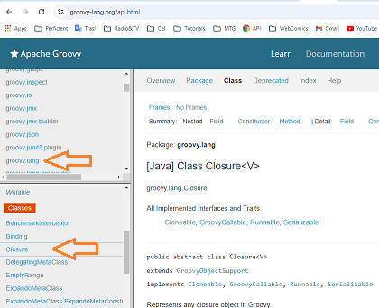
3. Creamos el archivo **exercise.groovy** en la carpeta "Closures",
Con este texto en comentarios del primer ejercicio de 
`Closure Basics` o [Conceptos básicos de cierres](#conceptos-básicos-de-cierres):
* Cree un método que acepte un cierre como argumento
  * Cree un cierre que realice alguna acción
  * Llame al método y pásele el cierre.
4. Ponemos por ejemplo una definición de un método de nombre
`mymethod` con un argumento de tipo `Closure`
```groovy
// - Create a Method that accepts a closure as an argument
def myMethod(Closure c) {
  c()
}
```
5. Hacemos un método q imprima un texto:
```groovy
def foo = { println 'Any text'}
```
6. Llammamos el método `myMethod` con el parámetro del método
`foo`:
```groovy
myMethod(foo)
```
* Cree una lista y utilícela para iterar sobre cada elemento de la lista e imprimirlo
  * _Sugerencia: puede utilizar la variable it implícita o utilizar su propia variable_
7. Creamos la lista `names` y la recorremos con el `each` que
tiene por defecto `it`:
```groovy
List names = ['Ana', 'Berto', 'Carlos', 'Diana', 'Esteban', 'Francia']
names.each { print "${it }, " } 
println ""
```
* Cree un mapa de datos e itere sobre él utilizando cada método.
  * Este método puede tomar un cierre que acepte 1 o 2 argumentos.
  * Utilice 2 argumentos e imprima la clave y el valor en cada línea.
8. Creamos un `Map`, con su clave:valor:
```groovy
Map vehicles = [car: 'Chevrolet', moto: 'Pulsar', rocket: 'Space-X']
```
9. Recorremos los `vehicles` con un `each`:
```groovy
vehicles.each { key, value ->
  print "$key=$value - "
}
println ''
```
* Demuestre el uso de curry e intente encontrar un ejemplo diferente al que utilizamos en la lección.
10. Definimos el método `greet` con 2 parámetros `grreting` y
`name`:
```groovy
def greet = { String greeting, String name ->
  println "$greet, $name"
}
```
11. Solo llamamos el método `greet` con dos textos:
```groovy
greet('Hello', 'Juan')
```
12. Podemos hacer el uso del método `curry`, para que solo enviemos
un parámetro, usando el método `sayHello`:
```groovy
def sayHello = greet.curry('Hello')
sayHello('Piza')
```
>[!TIP]  
>El contenido está en este sitio [Groovy JDK](https://groovy-lang.org/gdk.html), para lo que sigue el ejercicio.  
>Buscamos en la zona inferior izquierda `Collection`
* Busque los métodos find y findAll.
  * ¿Cuál es la diferencia entre ambos?  

  * Escriba un código para mostrar cómo funcionan ambos.
13. Creamos una lista de personas/`people` con dos datos
`name` y `city`
```groovy
List people = [
  [name: 'Zulia', city: 'Bello'],
  [name: 'Yelitza', city: 'Chia'],
  [name: 'Xander', city: 'Dabeiba'],
  [name: 'Wilson', city: 'Espinal'],
  [name: 'Vanesa', city: 'Facativa'],
  [name: 'Ulises', city: 'Gómez Plata']
]
```
14. Imprimimos la primer persona que es de `'Dabeiba'`:
```groovy
println people.find { person -> person.city == 'Dabeiba' }
```
15. Imprimimos las personas que son de `'Bello'`:
```groovy
println people.findAll { person -> person.city == 'Bello' }
```
>[!TIP]  
>El contenido está en este sitio [Groovy JDK](https://groovy-lang.org/gdk.html), para lo que sigue el ejercicio.  
>Buscamos en la zona inferior izquierda `Iterable`
* Busque los métodos any y every.
  * ¿Cuál es la diferencia entre ambos?  

  * Escriba un código para mostrar cómo funcionan ambos.
16. Para el método `any` si esta devuelve `true`, sino `false`
```groovy
println people.any { person -> person.city == 'Facativa' }
println people.any { person -> person.city == 'Zipaquirá' }
```
17. Para el método `every` todas deben cumplir para devolver
 `true`.
```groovy
println people.every { person -> person.city == 'Bello' }
println people.every { person -> person.name.size() >= 4 }
```
* Busque el método groupBy que acepta un cierre
  * ¿Qué hace este método?  

  * Escriba un ejemplo de cómo utilizar este método.
18. para el método `groupBy` definimos la variable 
`peopleByCity` y la agrupamos por ciudad:
```groovy
def peopleByCity = people.groupBy { person -> person.city }
println peopleByCity
```
19. El resultado impreso sería algo como esto:
```dos
[Bello:[[name:Zulia, city:Bello], [name:Tamara, city:Bello]],
Chia:[[name:Yelitza, city:Chia]],
Dabeiba:[[name:Xander, city:Dabeiba], [name:Sonia, city:Dabeiba]],
Espinal:[[name:Wilson, city:Espinal]],
Facativa:[[name:Vanesa, city:Facativa], [name:Raul, city:Facativa]],
Gómez Plata:[[name:Ulises, city:Gómez Plata]]]
```
20. Creamos dos variables mas `bellanitas` y `facas`:
```groovy
def bellanitas = peopleByCity['Bello']
def facas = peopleByCity.Facativa

println bellanitas
println facas
facas.each { print "$it.name, " }
```

# Section 7: Control Structures

## Paso 59. Intro
>[!NOTE]  
>Los mencionamos brevemente en una sección anterior, pero ahora vamos a comenzar a profundizar en ellos.
>A primera vista, podrías pensar que esto no es tan importante.
>
>Sé qué es una declaración if.
>Sé qué es un if else.
>Pero creo que es importante por un par de cosas.
>Una, la verdad maravillosa es muy diferente a evaluar expresiones booleanas en otros lenguajes.
>
>Quizás no del todo porque se puede hacer ese tipo de cosas similares en otros lenguajes, pero definitivamente
>diferente a Java, la forma en que evaluamos expresiones booleanas.
>
>Y debido a ese tipo de lógica condicional se vuelve diferente en diferentes lugares.
>Así que vamos a ver eso.
>
>Vamos a ver la verdad maravillosa, vamos a ver las diferentes estructuras condicionales, una de las cuales es la declaración switch.
>De nuevo, viniendo de otros lenguajes.
>
>Probablemente hayas tenido una declaración switch, pero probablemente no tan poderosa como esta declaración switch.
>Puede hacer muchas cosas realmente interesantes.
>Así que vamos a ver un par de ellas también.
>
>Veremos un poco de manejo básico de excepciones y luego haremos un ejercicio y revisaremos un poco este
>tema.
>Entonces, nuevamente, solo quiero señalar aquí, si estás en la documentación, si vas aquí y vas
>abajo, creo que es semántica.

## Paso 60. The Groovy Truth

>[!NOTE]  
>Antes de sumergirnos en las estructuras condicionales, como if, if else o when, necesitamos entender cuál es
>la verdad de Groovy.
>
>Esto se debe a que las expresiones que se definen en esas estructuras de control deben evaluarse como un valor booleano.
>Y hay una diferencia fundamental en cómo manejamos esto en Groovy en comparación con Java.
>Así que hablemos un poco sobre la evaluación de estas pruebas booleanas.
>Entonces, como dije en una declaración if, que veremos en la próxima lección, necesitamos evaluar
>una expresión como un valor booleano.
>Y tenemos diferentes formas de evaluar estas pruebas booleanas.
>Así que comencemos a echarles un vistazo.
>
>

1. Creamos la carpeta `"ControlStructures"`.
2. Creamos el archivo **`truth.groovy`** dentro de esta nueva 
carpeta, con estos comentarios:
```groovy

// Boolean

// Matcher

// Collection

// Map

// String

// Number

// None of the above
```
3. Empezamos en la línea 1, con un condicional `if`:
```groovy
if (true) {
  println 'true' // true
}
```
4. Comentamos lo anterior.
5. Debajo del comentario `// Boolean`, va este código:
```groovy
assert true
assert !false
```
6. Debajo del comentario `// Matcher`, ponemos esto:
```groovy
assert('a' =~ /a/)
assert!('a' =~ /b/)
```
7. Debajo del comentario `// Collection`, estos `assert`:
```groovy
assert[1]
assert![]
```
8. Debajo del comentario `// Map`, va este código:
```groovy
assert [1:'one']
assert![:]
```
9. Debajo del comentario `// String`, ponemos esto:
```groovy
assert 'Hola'
assert !''
```
10. Debajo del comentario `// Number`, estos `assert`:
```groovy
assert 1
assert 3.5
assert !0
```
11. Por último debajo del comentario `// None of the above`:
```groovy
assert new Object()
assert !null
```

## Quiz 5: The Groovy Truth
>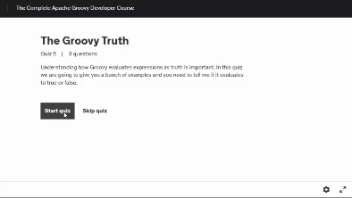

## Paso 61. Conditional Structures

1. Creamos el archivo **`conditional.groovy`** en el fólder
"`ControlStructures`".
2. El condicional `if` simple con estos ejemplos:
```groovy
// if( boolean expression) { //logic}

if (true) {
  println 'TRUE' // TRUE
}

if (true) println true // Ejemplo de sin corchetes // true

def age = 35
if (age >= 35) {
  println 'Puede ser Presidente' // Puede ser Presidente
}
```
3. El condicional `if` mas el uso del `else`:
```groovy
if (false) {
  println 'TRUE'
} else {
  println 'FALSE' // FALSE
}
```
4. Otro ejemplo sería:
```groovy
def yourAge = 21
if (yourAge >= 21){
  println 'Puede comprar cerveza' // Puede comprar cerveza
} else {
  println 'Sin cerveza pa Ud.'
}

```
5. Cambia el valor de `yourAge` por `18` y le aparecerá el 
otro menseje: `Sin cerveza pa Ud.`
6. Otro ejemplo de `if () else` con anidación sería:
```groovy
def someAge = 37
if (someAge >= 21) {
  println 'Puede comprar cerveza' // Puede comprar cerveza
} else if (someAge >= 35) {
  println 'Puede ser Presidente' // Aqui no entra,
} else {
  println 'Menor de ventiuno...'
}
```
7. En el anterior hay un detalle a corregir, sería agregar
en el primer condicional de `if (someAge >= 21) ` otra 
condición unida con el `and` que es el `&&`:
```groovy
if (someAge >= 21 && someAge < 35) {
  println 'Puede comprar cerveza' // 
} else if (someAge >= 35) {
  println 'Puede ser Presidente' // Puede ser Presidente,
} else {
  println 'Menor de ventiuno...'
}
```
8. Vemos el operador ternario `? true : false`:
```groovy
def name = 'Juan'
def isItJuan = (name.toUpperCase() == 'JUAN') ? 'Yes' : 'No'
println isItJuan //Yes
```
9. Añadimos cambiando la función por `toLowerCase()` y sería
el resultado opuesto:
```groovy
isItJuan = (name.toLowerCase() == 'JUAN') ? 'Yes' : 'No'
println isItJuan // No
```
10. Probemos con otro de tipo `string`:
```groovy
def msg
def output = (msg != null) ? msg : 'Default message...'
println output // Default message...
```
11. Añado otro ternario con base en el `msg`:
```groovy
def wichMsg = msg ?: 'Another default message...'
println wichMsg // Another default message...
```
12. Probemos el `switch`:
```groovy
def num = 5
switch (num) {
  case 1: println 'one'
    break
  case 2: println 'two'
    break
  case 3: println 'three'
    break
  case 4: println 'four'
    break
  case 5: println 'five' // five
    break
  case 6: println 'six'
    break
  default : println 'Another number'
}
```
13. Agrego mas condiciones en otro `switch`:
```groovy
switch (num) {
  case Integer: println 'num is Integer' 
    break
  case Float: println 'num is Float'
    break
}
```
14. Puedo preguntar por rangos o listas:
```groovy
switch (num) { // num in in list [0, 5, 10]
  case 1..3: println 'in range 1..3'
    break
  case [0, 5, 10]: println 'num in in list [0, 5, 10]'
    break
}
```
15. Usando el operador `in`:
```groovy
def validAges = 18..35
def age2Valid = 19
println age2Valid in validAges // true
```

## Paso 62. Looping

1. Creamos el archivo **`looping.groovy`**, en el fólder
"`ControlStructures`", con al menos estos comentarios:
```groovy
// looping
// ----------------------

// while

// for

// return/break/continue
```
2. Debajo del comentario `// while` agregamos este código:
```groovy
List numbers = [1, 2, 3]
assert numbers
while (numbers) {
  numbers.remove(0)
}
assert numbers == []
```
3. Debajo del comentario `// for` ponemos esto:
```groovy
numbers = [1, 2, 3]
for (i in numbers) {
  print i + ',' //
}
println ' '
```
4. Otra forma de usar el `for` es solo con un rango:
```groovy
println ' '
for (Integer i in 10..20) {
  print i + ',' // 10,11,12,13,14,15,16,17,18,19,20,
}
println ' '
```
5. Debajop del comentario `// return/break/continue`:
```groovy
Integer a = 1
while (true) { // infinite loop
  a++
  if (a == 3) break
}
assert a == 3
```
6. Un ejemplo simple de `continue` y `break` sería así:
```groovy
for (String s in 'a'..'z') {
  if (s == 'a') continue
  println s
  if (s > 'b') break
}
```

## Paso 63. Exception Handling
1. en la carpeta **"ControlStructures"** creamos el archivo 
**`exceptions.groovy`**.
2. Creamos un método estilo `java`:
```java
public void foo() throw Exception{
  throw new Exception() // Lanzamos una excepción
}
foo()
```
3. Comentamos lo anterior
4. En `goovy` se haría de esta manera:
```groovy
def foo() {
  throw new Exception('Foo Exception')
}
foo()
```
5. Complementamos el uso en **`exceptions.groovy`**:
```groovy
def foo() {
  throw new Exception('Foo Exception')
}

List log = []

try {
  foo()
} catch( Exception e) {
  log << e.message
} finally {
  log << 'finally'
}
// Imprimimos el contenido de la variable `log`
println log // [Foo Exception, finally]
```
6. Un ejemplo de la sintaxis con `java7`:
```java
try {
  // Hace algo
} catch(FileNotfoundException | nullPoinerException e){
  println e.class.name
  println e.message
}
```

## Paso 64. [Exercise] Control Structures
>[!NOTE]
>### [Ejercicio] Estructuras de control
>
>Usamos una clase similar a esta en un ejercicio anterior, pero creo que es un ejemplo breve y conciso de lo que debemos revisar en este ejercicio.
>
>* Crear una clase `Account`
>   * Crear una propiedad de tipo `BigDecimal` llamada `balance` con un valor inicial de 0.0
>* Crear un método llamado `deposit()`
>   * Usar una estructura condicional (`if` funcionaría muy bien aquí) para verificar si el monto que se pasa es menor que cero. Si lo es, deberíamos detectar este caso porque no queremos depositar números negativos. En este caso, lanzar una excepción.
>   * Crear otro método llamado `deposit()` que tome una lista de montos
>     * Usar un bucle `for` para recorrer estos montos y llamar a `deposit`
>
>Ahora que tenemos nuestra clase, probémosla. Puedes hacer todo esto en el mismo archivo (simplemente no crees un archivo llamado **`Account.groovy`**)
>* Crea una instancia de la clase Account
>* Deposita un monto válido
>* Deposita un monto inválido (¿qué sucede?)
>* Intenta / detecta montos inválidos
>* Deposita una lista de montos.
>

## Paso 65. [Exercise Review] Control Structures
1. Creamos en la carpeta **"ControlStructures"** erl archivo
**`exercise.groovy`**, con la definición de una `class` y
dentro la variable `balance` de tipo `bigDecimal`:
```groovy
class Account {
  BigDecimal balance = 0.0
}
```
2. Creamos dos veces el método `deposit()` dentro de la clase
`Account` debajo de la definición de `balance`:
```groovy
  // Crear un método llamado `deposit()`
  def deposit(BigDecimal ammount) {

  }

  // * Crear otro método llamado `deposit()` que tome una lista de montos
  def deposit(List ammounts) {
    
  }
```
3. Completamos los métodos recien creados:
```groovy
  // Crear un método llamado `deposit()`
  def deposit(BigDecimal amount) {
    // * Usar una estructura condicional para verificar el `ammount`
    if(amount<0){
      throw new Exception ('Desposit amount must be greater than 0')
    }
    balance += amount
  }

  // * Crear otro método llamado `deposit()` que tome una lista de montos
  def deposit(List amounts) {
    //* Usar un bucle `for` para recorrer estos montos y llamar a `deposit`
    for(amount in amounts){
      deposit(amount)
    }
  }
```
4. Probamos la clase en el mismo archivo:
```groovy
// * Ahora que tenemos nuestra clase, probémosla. Puedes hacer todo esto en el mismo archivo
Account checking = new Account()
checking.deposit(10)
println( checking.balance) // 10.0
```
5. Probamos enviando un valor negativo:
```groovy
// * Deposita un monto inválido (¿qué sucede?)
try {
  checking.deposit(-20) 
} catch (Exception e){
  println e.message // Desposit amount must be greater than 0
}
println(checking.balance)
```
6. Enviamos un grupo de valores:
```groovy
// * Deposita una lista de montos.
checking.deposit([1,5,10,20,50])
println(checking.balance) // 96.0
```

# Section 8: Object Oriented Programming (OOP)

## Paso 66. Intro
>[!NOTE]  
>En esta sección, veremos las clases.
>Las hemos creado antes, pero ahora vamos a empezar a hablar de ellas.
>
>Clases, campos, variables locales, cómo crear constructores y métodos, cómo organizar
>tus clases.
>También haremos un cuestionario rápido sobre eso.
>
>Ahora hablaremos de algunos temas más avanzados en programación orientada a objetos como
>interfaces de herencia, rasgos que no están disponibles en Java.
>Esto es algo que tienen otros lenguajes, pero los rasgos son muy parecidos.
>También los veremos.
>Y luego veremos qué es un ser maravilloso.
>
>Y luego pasaremos a un ejercicio, un pequeño ejercicio divertido sobre cómo crear tu propia clase que realmente te hará pensar en cómo empezar a diseñar tus clases.

## Paso 67. Classes / Fields / Local Variables

1. Creamos la carpeta **"08-ObjectOrientedProgramming"**.
2. Adentro de la carpeta creamos el archivo **`classes.groovy`**.

>[!NOTE]  
>### El video se pausa y no ejecuta, se adjunta la transcripción
>Si necesitamos declarar una propiedad en una clase, le damos un tipo o no.Si no es necesario y le damos un nombre.
>Ahora tenemos un campo llamado first, llamémoslo.
>Sí, lo dejaremos como first.
>Entonces tenemos first name, ¿cierto?
>Entonces tenemos un campo first name.
>
>Y si sigo adelante y guardo esto y voy a script y voy a inspeccionar como T o command T en Mac,
>básicamente ese aspecto nos da cómo se ve esta clase real cuando se crea.
>
>Entonces, de manera predeterminada, si no le damos ningún modificador de acceso en el nivel de campo, es una variable privada.
>Y con esa variable privada, cuando no declaramos nada, en realidad crea captadores y definidores
>para nosotros.
>Entonces, si tenemos este first name, obtenemos un captador, obtenemos first name y una variable first name establecida.
>
>Hablaremos más sobre las propiedades cuando nos adentremos en los groovy beans más adelante en esta sección.
>Pero por ahora, solo quería señalar que, si no le damos un modificador de acceso,
>eso es lo que sucede.
>
>Ahora bien, ¿qué sucede si le damos un modificador de acceso para que sepamos que, por defecto, es privado, pero qué
>sucede si nosotros mismos lo configuramos como privado?
>```groovy
>class Person {
>  private String firstName
>}
>```
>Entonces, nuevamente, saltemos al este, vemos la cadena privada `firstName`.
>Pero ahora verá que no hay ningún getter ni setter aquí.
>Y eso es porque, de hecho, dijimos explícitamente que ese campo es privado.
>Entonces, Groovy no siguió adelante y generó nada para nosotros.
>
>Solo cuando no declara un modificador de acceso, decide hacerlo.
>Nuevamente, profundizaremos más en eso cuando hablemos de los beans Groovy.
>Pero solo quería hacer esa distinción mientras estamos aquí.
>Así que sigamos adelante y deshagámonos de eso.
>Ahora, también podemos declarar múltiples campos en la misma línea si queremos.
>
>Si ambos campos van a ser cadenas, podemos decir cadena firstname y lastname.
>Entonces, si ahora seguimos adelante y, bueno, ¡ups!, no se ejecutará nada allí.
>Si seguimos adelante y observamos el AST, veremos que ahora hay una cadena privada, nombre, cadena privada, apellido, y tenemos nuestros captadores y definidores generados.
>
>Entonces podemos hacer esa opción:
>```groovy
>class Person {
>  String firstName, lastName
>}
>```
>Tampoco podemos asignarle un tipo.
>Ya hemos hablado de esto antes, la palabra clave def.
>Vamos a crear un campo aquí de tipo, fecha de nacimiento o de nombre con el nombre, fecha de nacimiento,
>pero todavía no hay un tipo y el tipo se determinará más adelante en función de lo que le hayamos asignado.
>
>Pero ahora mismo no queremos asignarle un tipo.
>De nuevo, también hay diferentes modificadores de acceso aquí, por lo que podemos decir que hay privado, que ya hemos
>visto.
>
>Hay protegido que solo se puede usar en el mismo paquete y hay público.
>Entonces podemos entrar aquí y decir cadena protegida `f1`, `f2`, `f3`, podemos crear.
>Vimos privados antes, pero también podemos, por lo que podemos crear una fecha privada creada el y podemos realmente
>inicializar nuestros campos directamente en línea para que podamos decir nueva fecha.
>
>Entonces se inicializará a la fecha de hoy.
>Ahora, también hay dos palabras clave que realmente no hemos visto hasta ahora en este curso y queremos repasarlas
>```groovy
>class Person {
>  String firstName, lastName
>  def dob
>  // private | protected | public
>  protected String f1, f2, f3
>  private Date createOn = new Date()
>
>}
>```
>Muy bien.
>Entonces, vamos a seguir adelante y crear un campo estático aquí.
>Digamos que vamos a crear un campo estático llamado `welcomeMsg` y vamos a asignarle
>un valor de `'HELLO'`.
>
>Entonces, sabemos que normalmente cuando creamos una instancia de una clase o si necesitamos acceder a un campo en una
>clase, necesitamos crear una instancia, ¿cierto?
>```groovy
>class Person {
>  String firstName, lastName
>  def dob
>  // private | protected | public
>  protected String f1, f2, f3
>  private Date createOn = new Date()
>
>  static welcomeMsg = 'HELLO'
>
>}
>```
>Normalmente, diríamos que la persona P es igual a la nueva persona P punto mensaje de bienvenida, ¿no?
>Normalmente, tendríamos que hacer eso.
>Sigamos adelante e imprimamos esto.
>
>Pero con un campo estático podemos acceder a él sin crear realmente una instancia.
>Podemos decir persona punto mensaje de bienvenida y si lo imprimimos, deberíamos tenerlo.
>
>Hola.
>
>Lo que verás a menudo con eso es que esta variable estática se puede cambiar.`
>```groovy
>class Person {
>  String firstName, lastName
>  def dob
>  // private | protected | public
>  protected String f1, f2, f3
>  private Date createOn = new Date()
>
>  static welcomeMsg = 'HELLO'
>
>}
>println Person.welcomeMsg // HELLO
>```
>Y hay muchas ocasiones en las que no quieres que eso se cambie.
>Y la forma en que lo hacemos es usando la palabra clave final.
>Por lo tanto, crearíamos un final estático público, lo que significa que no se puede cambiar.
>
>Esto es de tipo cadena y normalmente esto es lo que llamamos una constante, y otros lenguajes tienen la idea
>de una constante.
>Constantes en Java y Groovy.
>Normalmente las verás todas en mayúsculas.
>
>Y así es como, ya sabes, si miras un campo solo por su nombre, sabrás de inmediato, 
>Hola,
>ese es un campo estático final que no podemos cambiar, que podemos simplemente tomar, podemos acceder sin crear
>una instancia.
>Entonces, si seguimos adelante y le asignamos un valor, digamos hola, podemos decir persona punto, mensaje de bienvenida.
>Y ahí está.
>```groovy
>class Person {
>  String firstName, lastName
>  def dob
>  // private | protected | public
>  protected String f1, f2, f3
>  private Date createOn = new Date()
>
>  static welcomeMsg = 'HELLO'
>  public static final String WELCOME_MSG = welcomeMsg
>
>}
>println Person.WELCOME_MSG // HELLO
>```
>Eso es un poco sobre los campos.
>Hablemos de las variables locales.
>Entonces, si creamos un método aquí, variables locales y digamos def foo y dentro de nuestro
>método aquí, vamos a crear algunas variables.
>
>Entonces, digamos que mensaje es igual a Hola.
>Entonces, ahora esto es una variable local para este método, mientras que estos campos o variables creadas
>dentro de la clase, pero fuera de los métodos son variables que son campos de esa clase o instancias
>de esa clase, mientras que esto se declara dentro de un método, por lo tanto, es una variable local
>solo para ese método.
>
>Entonces, si intentamos crear una instancia aquí de persona y digamos persona punto mensaje, entonces
>dirá, no sé qué estás buscando porque no puedo encontrar un campo llamado mensaje en la clase persona.
>Y eso es porque es local para este método.
>Entonces, podemos crear un mensaje aquí.
>```groovy
>class Person {
>  String firstName, lastName
>  def dob
>  // private | protected | public
>  protected String f1, f2, f3
>  private Date createOn = new Date()
>
>  static welcomeMsg = 'HELLO'
>  public static final String WELCOME_MSG = welcomeMsg
>
>  // local variable
>  def foo(){
>    String msg = 'Hello'
>  }
>
>}
>println Person.WELCOME_MSG // HELLO
>```
>También podemos crear un nombre y lo llamaremos Dan.
>Ahora, el nombre no entrará en conflicto con el nombre en nuestra clase de persona porque tiene un alcance local
>en este método.
>Entonces, si quisiéramos, podemos imprimir la línea y decir nombre del mensaje, vayamos al nombre y cerremos eso.
>
>Ahora lo que podemos hacer es imprimir línea.
>En realidad, vamos a necesitar una instancia para poder decir persona o simplemente decir que def persona
>es igual a nueva persona.
>
>Y ahora lo que quiero hacer es llamar a `foo` print line (`println`) y eso dice  `"$msg, $firstName"`.
>Así que eso es un poco sobre campos y variables locales.
>Nuevamente, vas a escuchar que a veces se hace referencia a ellos como propiedades y muchas veces cuando comenzamos
>a crear beans Groovy, son propiedades porque una propiedad tiene un es un campo de una clase y
>tiene captadores y definidores.
>
>Así que debería comenzar a tener un poco más de sentido a medida que avanzamos en esta sección.
>Así que esos son campos y variables.
>```groovy
>class Person {
>  String firstName, lastName
>  def dob
>  // private | protected | public
>  protected String f1, f2, f3
>  private Date createOn = new Date()
>
>  static welcomeMsg = 'HELLO'
>  public static final String WELCOME_MSG = welcomeMsg
>
>  // local variable
>  def foo() {
>    String msg = 'Hello'
>    String firstName = "Dan"
>    println "$msg, $firstName" // Hello, Dan
>  }
>
>}
>println Person.WELCOME_MSG // HELLO
>def person = new Person()
>println person.foo() // null
>```
>
>Continuemos y pasemos a los métodos.

## Paso 68. Constructors & Methods

1. Dentro de la carpeta **"08-ObjectOrientedProgramming"**
creamos el archivo **`methods.groovy`**.
2. El contenido va a ser la clase `Person` si la instanciamos
el constructor implícto es cero o nada:
```groovy
class Person {

  // Constructor

}

Person p = new Person()
```
3. Definimos dos Atributos `firstName`, y `lastName`, luego
al instanciar asignamos valores a esos atributos:
```groovy
class Person {
  // Attributes
  String firstName, lastName

  // Constructor

}

Person p = new Person(firstName: 'Juan', lastName: 'Piza')
```
4. Agregamos al principio el `@groovy.transform.ToString` y al final `println p` y obtenemos: `Person(Juan, Piza)`.
5. Pongamos en comentarios las dos últimas líneas.
6. Añadimos debajo del comentario `// Constructor` esto:
```groovy
  // Constructor
  Person(String fullName) {
    List parts = fullName.split(' ')
    /* this. */ firstName = parts[0]
    /* this. */ lastName = parts[1]
  }
```
7. Abajo este código:
```groovy
Person p = new Person('Juan Piza')
println p // Person(Juan, Piza, Juan LastName)
```
8. Debajo del constructor ponemos los `Methods`:
```groovy
@groovy.transform.ToString
class Person {

  // Attributes
  String firstName, lastName

  // Constructor
  Person(String fullName) {
    List parts = fullName.split(' ')
    /* this. */ firstName = parts[0]
    /* this. */ lastName = parts[1]
  }

  // Methods
  public void foo(){
    // do stuff
  }
  String getFullName(){
    "$firstName LastName"
  }
  def concat(String... args){
    println args.length
  }

}

// Person p = new Person(firstName: 'Juan', lastName: 'Piza')
// println p // Person(Juan, Piza)
Person p = new Person('Juan Piza')
println p // Person(Juan, Piza, Juan LastName)
p.concat('a', 'b') // 2
```

## Paso 69. Organizing Classes into Packages

>[!IMPORTANT]  
>Comenzamos a usar Groovy Council durante gran parte de este curso porque es muy fácil de usar.
>No tienes que crear un proyecto.
>Puedes simplemente crear un código y ver cómo funciona.
>
>Bueno, a medida que comencemos a abordar cuestiones más complicadas en este curso, usaremos
>la IDEA de [`IntelliJ (Paso 15)`](#paso-15-hello-intellij).
>
>Te dije al principio de este curso que realmente me encanta esta idea.
>Puedes usar otra ID si quieres.
>Puedes usar algo como Eclipse, pero realmente me encanta la idea de IntelliJ, así que la usaré.
>
>Pero a medida que avancemos, la usaremos, así que también podríamos familiarizarnos con ella un poco
>de a poco.
>
>Entonces, en esta lección, hablaremos sobre cómo organizar nuestras clases en paquetes.
>Entonces, vimos cómo crear una clase, todas las diferentes cosas que componen una clase.

>[!TIP]  
>### En mi PC de Windows 11, tengo instalado el [`SDKMAN (Paso 11)`](#paso-11-sdkman). 
>1. Lo consulto >en la `TERMINAL` `Git Bash` de `VisualStudio` y obtengo la versión, tanto de `java`:  
>```bash
>java -version
>openjdk version "1.8.0_412"
>OpenJDK Runtime Environment (Temurin)(build 1.8.0_412-b08)
>OpenJDK 64-Bit Server VM (Temurin)(build 25.412-b08, mixed mode)
>``` 
>2. Como de `groovy`
>```bash
>groovy -version
>Groovy Version: 4.0.22 JVM: 17.0.12 Vendor: Eclipse Adoptium OS: Windows 11
>```
>3. Con el `SDKMAN` instalo la verión 17 de `java`:
>```bash
>sdk install java 17.0.12-tem
>
>Downloading: java 17.0.12-tem
>
>In progress...
>
>############################################################################################################################################ 100.0%
>
>Installing: java 17.0.12-tem
>Done installing!
>
>
>Setting java 17.0.12-tem as default.
>```
>4. Reviso las ruta de instalación en Windows ejecutando este 
>comando en el `CMD` : `%USERPROFILE%\.sdkman\candidates\`.

1. Desde el [`IntelliJ`](#paso-15-hello-intellij), seleccionamos
`New>`->`Poject`.
2. A la izquierda estar seguros que tenemos seleccionado el
`Groovy`.
3. En `Location:` cambiamos la ruta a 
**"08-ObjectOrientedProgramming"**.
4. En `Name:` le ponemos `package-demo`.
5. En `JDK:` buscamos la última instalada, la de 
`temurin-17...17.0.12`.
>[!NOTE]  
>Así luce antes de dar el botón `[Create]`:  
>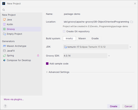

6. Presionamos el botón `[Create]`.
7. En el archivo **`.gitignore`** en el comentario 
`### IntelliJ IDEA ###` ponemos este código:
```yml
### IntelliJ IDEA ###
**/.idea
**/**/.idea
**/**/**/.idea
**/out/
**/**/out/
**/**/**/out/
**/.gitignore
**/**/.gitignore
!**/**/**/src/main/**/out/
!**/**/**/test/**/out/
```
8. Dentro del `IntelliJ`, damos clic derecho a la carpeta 
**"src"** y seleccionamos `New>`->`Groovy Class` y el ponemos el 
nombre `Application`:  
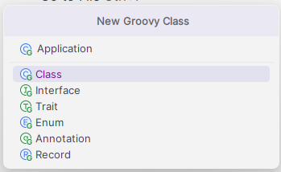  
* y presionamos la tecla `[Enter]`

>[!TIP]  
>Si pregunta por `Add File to Git`, presionamos en 
`Don't ask again` y el botón `[Cancel]:`  
>

9. Dentro del `IntelliJ`, damos clic derecho a la carpeta 
**"src"** y seleccionamos `New>`->`Package` y en el nombre se
pone `com.domain_name`.
10. Usando el `IntelliJ`, movemos el archivo **`Application.groovy`**, dentro de el nuevo paquete
de nombre `com.domain_name`, cuya ruta relativa es:
**"08-ObjectOrientedProgramming/package-demo/src/com/domain_name"** y nos sale algo similar a esto:  
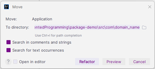
* Damos click en `[Refactor]`.
11. Creamos otro `package` usando `IntelliJ`, con click derecho
en el paquete `com.domain_name`, con el nombre `controller`:  
`com.domain_name.controller`  
Y presionamos la tecla `[Enter]`.
12. Creamos otros dos `package` de nombres: `service` y `domain`
dentro del paquete `com.domain_name`, así se ve el proyecto:  
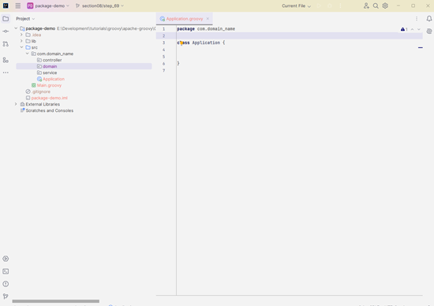
13. Dentro del paquete `controller` creamos la clase Groovy de
nombre **`HelloController`**.
14. Dentro del paquete `domain` creamos la clase Groovy de
nombre **`Person`**.
15. Dentro del paquete `service` creamos la clase Groovy de
nombre **`PersonService`**. 
16. En el archivo **`PersonService.groovy`**, instanciamos
de la clase `Person` una variable de nombre `person` y el debe
importar automáticamente de donde proviene esta clase:
```groovy
package com.domain_name.service

import com.domain_name.domain.Person

class PersonService {
    Person person
}
```

>[!TIP]  
>Así luce el proyecto al final:  
>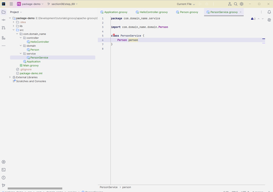


## Quiz 6: Classes Quiz


## Paso 70. Inheritance

1. Volvemos a abrir [`IntelliJ`](#paso-15-hello-intellij), y nos 
muestra el último proyecto que estabamos trabajando.
2. Buscamos el archivo **`Aplication.groovy`**, que debe estar
en esta ruta: **"src/com/domain_name"**.
3. Borramos los archivos :
* **`HelloController.groovy`**
* **`Person.groovy`**
* **`PersonService.groovy`**
4. En el paquete `domain` creamos la clase `Phone` que crea el
archivo **`Phone.groovy`**, colocamos esto en el archivo:
```groovy
package com.domain_name.domain

class Phone {

    String name // Nombre o Marca
    String os // Android o Apple
    String appStore // Sitio de almacenamiento

    def powerOn() {

    }

    def powerOff() {

    }
    def ring() {
        
    }
}
```
5. Creamos en el paquete `domain`  la clase `IPhone` que crea el
archivo **`IPhone.groovy`**, añadimos la herencia con `extends`:
```groovy
package com.domain_name.domain

class IPhone extends Phone{
    
}
```
6. Creamos un `Grovy Script` en el paquete `com.domain_name` con 
el nombre `app`, empezamos con instanciar un `IPhone` con el
nombre `iPhone`:
```groovy
package com.domain_name

import com.domain_name.domain.IPhone

IPhone iPhone = new IPhone(name : '12 Pro Max', appStore: 'App Store - Apple', os: 'iOS 14')
println(iPhone)
```
7. En el archivo **`IPhone.groovy`**, debajo del `package`, 
agregamos esto `@groovy.transform.ToString`.
8. De regreso en **`app.groovy`**, damos click derecho y 
seleccionamos `▶️ Run 'app'`.
9. En el archivo **`IPhone.groovy`**, puedo definir nuevos 
métodos y atributos:
```groovy
    String iOSVersion // Nuevo Atributo

    def homeButtonPressed() { // Nuevo Método 1

    }
    def airPlay() { // Nuevo Método 2

    }
```
10. Redefinir o reescribir métodos del padre:
```groovy
    def powerOn() { // Redefino un método del padre

    }
```
12. Le puedo añadir el tag `@Override` encima del método
que estoy redefiniendo.

## Paso 71. Interfaces

1. Regresando al [`IntelliJ`](#paso-15-hello-intellij), 
creamos un nuevo proyecto llamado `interfaces`, de tipo groovy
en la misma carpeta **"08-ObjectOrientedProgramming"**:  
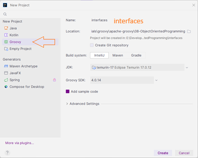
2. Creamos el paquete básico de `com.domain_name`.
3. Borramos el archivo **`Main.groovy`**.
4. Creamos un `Groovy Script` en el paquete `com.domain_name`
 con el nombre `app`.  
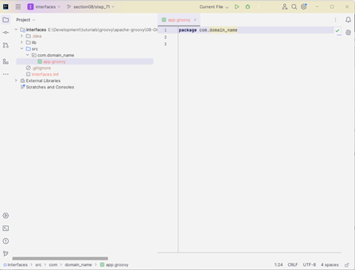
5. Creamos el paquete `service` dentro del paquete `com.domain_name`
6. Creamos dentro del paquete `com.domain_name`, la clase
Groovy de nombre `People`, con esta definición:
```groovy
package com.domain_name

class People {

    String first, last

}
```
7. Creamos otro paquete de nombre `domain` dentro del paquete
`com.domain_name`.
8. Movemos la clase `People` al paquete `domain`:  
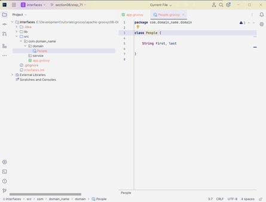
9. Creamos la clase Groovy de tipo `interface` y de nombre `IPersonService`(Siempre se inicia el nombre con la `I` en mayúsculas) dentro del paquete `service`.
* Así luce el proyecto en `IntelliJ`:  
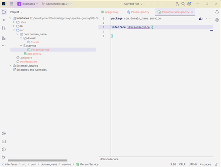

>[!NOTE]  
>Ahora bien, una interfaz es un poco diferente a una clase en el sentido de que, en realidad, es solo un contrato.
>
>Es un conjunto de métodos abstractos.
>Y eso significa que vamos a definir el nombre del método y el tipo de retorno,
>pero en realidad no vamos a definir el cuerpo del método.
>
>No vamos a implementar ninguna lógica, y eso podría tener más sentido en un minuto.

10. Renombramos la clase `People` por `Person`.
11. En la nueva `interface` definimos un par de cosas e 
importamos la clase que vamos a usar:
```groovy
package com.domain_name.service

import com.domain_name.domain.Person

interface IPersonService {
    Person find()

    List<Person> findAll()
}
```
12. Creamos una clase Groovy normal en el paquete `service` de 
nombre `PersonService` e implementamos la `interface`:
```groovy
package com.domain_name.service

class PersonService implements IPersonService{

}
```
13. Damos clic derecho en la clase `PersonService` y seleccionamos `Generate...` y luego `Implement Methods...`  

14. Dejamos todos seleccionados y damos click en `[OK]`:  
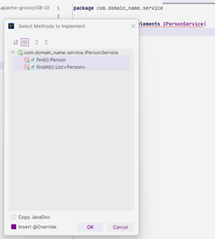
15. Agregamos este código en los métodos `find()` y
`findAll()` de la clase `PersonService`:
```groovy
class PersonService implements IPersonService{
    @Override
    Person find() {
        Person p = new Person(first: 'Juan', last: 'Piza')
        return p
    }

    @Override
    List<Person> findAll() {
        Person p1 = new Person(first: 'Juan', last: 'Piza')
        Person p2 = new Person(first: 'Giov', last: 'Piza')
        [p1, p2]
    }
}
```
16. Antes de correr el `script`, que es el archivo 
**`app.groovy`**, debemos instanciar la clase `PersonService`
e imprimir el método `find()`:
```groovy
import com.domain_name.service.PersonService

PersonService personService = new PersonService()

println personService.find()
```
17. En la clase `Person`, agregamos el `@groovy.transform.ToString`, pero el editor nos sugiere 
cambiar a `@ToString()` 
18. De regreso a **`app.groovy`** damos clic derecho y
seleccionamos `Run 'app'`. Esta sería la respuesta obtenida:  
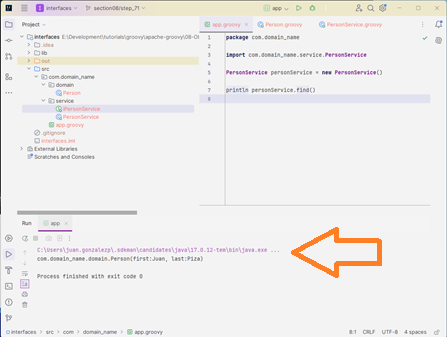

## Paso 72. Traits

1. Empezamos con [`IntelliJ`](#paso-15-hello-intellij), 
creando un nuevo proyecto llamado `traits`, de tipo groovy
en la misma carpeta **"08-ObjectOrientedProgramming"**:  
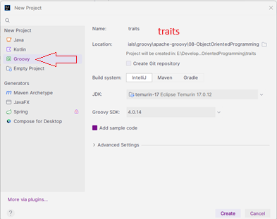
2. Creamos el paquete básico de `com.domain_name` en la
carpeta **"src"**.
3. Borramos el archivo **`Main.groovy`**.
4. Creamos un `Groovy Script` en el paquete `com.domain_name`
 con el nombre `app`.  
5. Creamos el paquete `service` dentro del paquete `com.domain_name`  
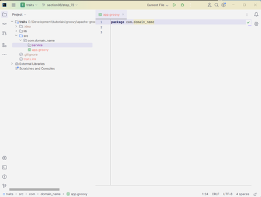.
>[!NOTE]  
>Groovy lo llama `Traits` y los `Traits` básicamente nos permiten incorporar capacidades en nuestras clases.
>
>Al igual que las interfaces, tenemos algo que necesitamos heredar.
>Bueno, un rasgo es una capacidad que queremos hacer, pero cuando implementamos un rasgo, podemos
>heredar la implementación de ese rasgo.
>
>Entonces, si esto comienza a sonar un poco como los métodos predeterminados de `Java 8`, entonces estás en el camino correcto.
>La gran diferencia aquí, sin embargo, es que un rasgo puede contener un estado.
>
>Entonces, antes de comenzar con eso, solo quiero mostrarles a aquellos de ustedes que no han tocado los métodos predeterminados de `Java 8`, un poco lo que son porque es similar a lo que estábamos viendo con las interfaces.
>Entonces, volviendo a nuestro antiguo ejemplo, digamos que creamos un... en realidad, hagámoslo en `Java`.

6. En el paquete `service` creamos una clase `Java` de
tipo `interface` y de nombre `IPersonService`.  
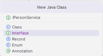
7. Cargamos esto en el archivo **`IPersonService.java`**:
```java
package com.domain_name.service;

public interface IPersonService {
    default public void doSomething(){
        System.out.println("doing something...");
    }
}
```
>[!NOTE]  
>Digamos que nuestro método era public void, do something y básicamente vamos a imprimir
>haciendo algo.
>
>Entonces, ahora no podíamos hacer esto en `Java 7` porque, como saben por nuestra última lección, una interfaz
>no puede tener un cuerpo de método, ¿verdad?
>En realidad, no podemos hacer nada aquí.
>
>Bueno, había una forma un tanto chapucera de hacer esto para básicamente proporcionar una funcionalidad predeterminada
>de un método desde una interfaz en versiones anteriores de Java.
>
>Entonces, `Java 8` siguió adelante y agregó esta capacidad.
>Entonces, ahora, si queremos decir, está bien, aquí están todos los métodos en nuestra interfaz y
>puedes implementarlos si quieres.
>
>Pero para este método en particular, quiero que este sea el predeterminado si nadie anula este método.
>Y para hacerlo, todo lo que tienes que hacer es agregar la palabra clave predeterminada.
>Y ahora esto era válido.

>[!IMPORTANT]  
>### Groovy Language Documentation
>[next: 1.4.5. Traits](https://docs.groovy-lang.org/docs/next/html/documentation/#_traits) ó [latest: 1.4.5. Traits](https://docs.groovy-lang.org/latest/html/documentation/#_traits)
>
>Bien, vuelvo a la documentación y, de hecho, he incluido un enlace a esto en los recursos adicionales.
>Pero hay información muy útil sobre los rasgos.
>Ahora vamos a repasar algunas de estas cosas.
>
>Sin embargo, probablemente no todos los detalles, por lo que es posible que desees leer esta documentación cuando
>tengas la oportunidad.
>
>Básicamente, los rasgos son una construcción estructural del lenguaje que nos permite tener composición
>de comportamiento, implementación de interfaces en tiempo de ejecución, anulación de comportamiento específico y algunas otras cosas.

8. Creamos un paquete llamado `traits` dentro del paquete
`com.domain_name`.
9. Cremos una clase de tipo Groovy, en `traits` de nombre
`Bird`.
10. Creamos en `traits` un clase de tipo `Trait` con el 
nombre `FlyingAbility`.  
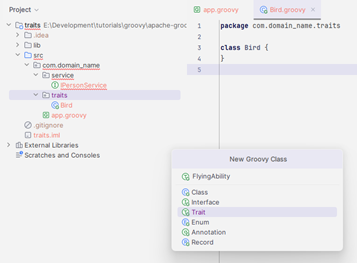
11. Agregamos esto en la clase `FlyingAbility`:
```groovy
package com.domain_name.traits

trait FlyingAbility {
    String fly() {
        "I'm Flying!"
    }
}
```
12. En el archivo **`Bird.groovy`** implementamos la clase 
`FlyingAbility`:
```groovy
class Bird implements FlyingAbility{
    
}
```
13. En el arhivo **`app.groovy`** instanciamos la clase `Bird`:
```groovy
package com.domain_name

import com.domain_name.traits.Bird

Bird b = new Bird()
assert b.fly() == "I'm Flying!"
```
14. Damos clic derecho y seleccionamos `Run 'app'` y este sería
el resultado esperado:  
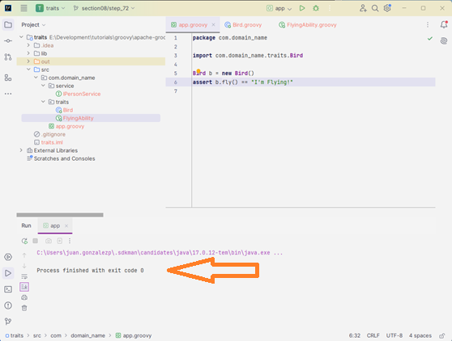
15. Creamos otra clase Groovy de tipo `Trait` con el nombre
`SpeakingAbility` dentro del paquete `traits`.
16. Adento de la clase `SpeakingAbility`, ponemos este código:
```groovy
package com.domain_name.traits

trait SpeakingAbility {

    String speak(){
        "I'm Speaking!"
    }
}
```
17. Regresamos a la clase `Bird` y añadimos la implementación de 
la clase `SpeakingAbility`:
```groovy
class Bird implements FlyingAbility, SpeakingAbility{

}
```
18. En el archivo **`app.groovy`**, añadimos esta línea:
```groovy
assert b.speak() == "I'm Speaking!"
```
19. De nuevo clic derecho y seleccionamos `Run 'app'` y este 
sería el resultado esperado:  
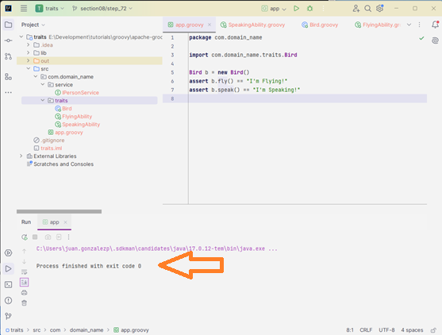
>[!NOTE]  
>Así que eso es comercio a un alto nivel.
>Pero, de nuevo, piensas que parece una interfaz, que parece un método predeterminado de Java 8, y lo es hasta cierto punto, pero podemos llevarlo un poco más allá.
>
>Entonces, si volvemos a nuestra capacidad de volar, supongamos que en este rasgo en particular teníamos un método
>que queríamos crear como abstracto y queríamos que cualquier clase que use este rasgo tuviera que implementar ese método.
>Así que sigamos adelante y digamos abstracto foo.

20. Volvemos la clase `FlyingAbility` y añadimos un método
abstracto de nombre `foo()`, sin implmentar:
```groovy
    abstract String foo()
```
21. De nuevo en la clase `Bird` damos clic derecho y 
seleccionamos `Generate...` y luego `Implement Methods...`:  
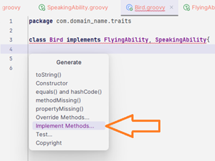
22. A mi solo me muestra el método `foo()`, será el único a 
implementar y damos `[OK]`:  
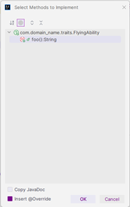
23. Si selecciono luegeo de `Generate...` a 
`Override Methods...`, me sale mas información:  
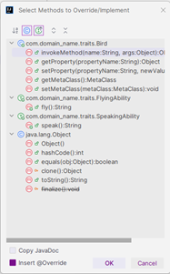
24. En la clase `FlyingAbility` añadimos un método privado:
```groovy
    private String bar() {
        'bar'
    }
```
25. Podemos agregar mas campos públicos o privados, por ejemplo
en la clase `SpeakingAbility`:
```groovy
    public String a
    private String b
```

## Paso 73. Groovy Beans

1. Empezamos con [`IntelliJ`](#paso-15-hello-intellij), 
creando un nuevo proyecto llamado `beans`, de tipo groovy
en la misma carpeta **"08-ObjectOrientedProgramming"**:  
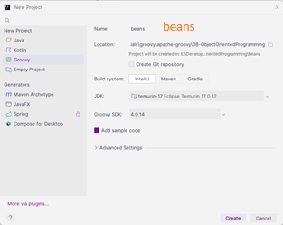
2. Creamos el paquete básico de `com.domain_name` en la
carpeta **"src"**.
3. Borramos el archivo **`Main.groovy`**.
4. Creo el archivo **`GroovyBeans.txt`** en la carpeta
**"src/com/domain_name"**, que es lo mismo que el paquete
del paso 2, con este contenido:
```txt
Un JavaBean es solo un estandar

- Todas las propiedades son privadas (use métodos getterssetters)
- Un constructor publico sin argumentos
- Implementa serializables.
    Java proporciona un mecanismo, llamado serialización de objetos, donde un objeto puede representarse como una
    secuencia de bytes que incluye los datos del objeto, asi como información sobre el tipo del objeto y los
    tipos de datos almacenados en el objeto.
- Crear un Bean Java
- Equivalente a Groovy Bean
- Mira un Groovy Bean debajo del capo
- Como utilizar Groovy Beans
- Como escribir tus propios métodos getter/setter
- Acceso directo al campo
```
5. Dentro del paquete `com.domain_name`, creamos una 
`Java Class` de nombre `EmployeeBean`, con esto al menos en 
la nueva clase:
```java
package com.domain_name;

public class EmployeeBean {
    // private properties

    // public no-arg constructor

    // getters & setters

}
```
6. Debajo de `// private properties`, definimos estas:
```java

    // private properties
    private String first;
    private String last;
    private String email;
```
7. Debajo de `// public no-arg constructor` ponemos esto:
```java
    // public no-arg constructor
    public EmployeeBean(){
        
    }
```
8. Debajo de `// getters & setters`, solo doy click 
derecho, luego selecciono `Generate...`, luego `Getter and Setter`,
selecciono todos y doy `[OK]`:  
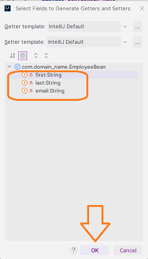
```java
    public String getFirst() {
        return first;
    }

    public void setFirst(String first) {
        this.first = first;
    }

    public String getLast() {
        return last;
    }

    public void setLast(String last) {
        this.last = last;
    }

    public String getEmail() {
        return email;
    }

    public void setEmail(String email) {
        this.email = email;
    }    public String getFirst() {
        return first;
    }
```
9. Añado un comentario de `// toString`, doy click derecho
`Generate...` y luego `toString()` y solo seleccionamos
`first` y `last` y doy `[OK]`:  
'")
```java
    @Override
    public String toString() {
        return "EmployeeBean{" +
                "first='" + first + '\'' +
                ", last='" + last + '\'' +
                '}';
    }
```
10. Al nombre de la clase agrego `implements Serializable`,
el importa automátiamente esta librería:
`import java.io.Serializable;`
>[!NOTE]  
>Así que ese es nuestro bean Java normal.
>Este es un bean de empleado.
>Tiene tres campos.
>Nombre, apellido, dirección de correo electrónico.
>Tenemos nuestro constructor público y luego todos nuestros métodos de obtención y establecimiento para acceder a esos datos.
>
>Entonces, uno de los problemas que enfrentamos en Java es que hay mucho ruido.
>Solo tenemos tres campos aquí, pero muchas clases de datos tendrán más.
>Entonces, imaginen si tuviera como diez clases o diez campos aquí.
>
>Quiero decir, esta clase va a tener más de 200 líneas de código para algo tan simple como almacenar
>y recuperar datos, ¿cierto?
>Esto solo representa a un empleado.
>Entonces, esto es mucho ruido.
>Y sí, todo lo que hicimos fue escribir esto.
>Entiendo que generamos esto, pero digamos que cometimos un error 
>tipográfico y quisimos llamarlo como 
>`firstName` en vez de `first`.

11. Vamos a crear algo similiar pero `Groovy`, comenzamos
creando el archivo `Employee`, como `Groovy Class`, en el 
mismo paquete `com.domain_name`.
12. Empiezo solo con esto:
```groovy
    String first, last, email
```
13. Al frente del nombre de la clase, añado esto:  
`implements Serializable`
14. Añado encima del nombre de la clase esto:  
`@groovy.transform.ToString`  
Pero el editor sugiere cambiarlo a 
```groovy
import groovy.transform.ToString

@ToString
```
15. Se da en el menú `Build` y `Recompile 'Employee.groovy'`
y aparece la carpeta de nombre `out` y si abrimos la clase
`Employee.class`, vemos esto:  
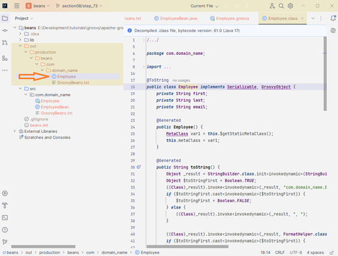

>[!NOTE]  
>Ahora, si observamos lo que sucede en segundo plano, 
>tenemos nuestra clase pública `Employee` que
>va a implementar serializable.
>
>Tenemos nuestros tres campos privados.
>
>Tenemos un constructor sin ARG, tenemos nuestras dos cadenas y luego tenemos nuestros captadores y definidores para
>cada una de nuestras propiedades.
>
>Entonces, en este escenario, es mucho más fácil si solo quiero agregar una, cambiar una o cambiar el nombre de una.
>No hay mucho código de regeneración dentro del IDE aquí.
>Groovy simplemente se encargará de eso por nosotros.
>Así es como se ve nuestro bean groovy.

16. Creamos en el paquete un `Groovy Script` de nombre
`app.groovy`, con este código:
```groovy
Employee emp = new Employee(first: 'Juan', last: 'Piza', email: 'jpiza@mail.com')

println emp
```
17. Doy Clic cerecho al archivo `app.groovy` y selecciono 
`Run 'app'` e imprime esto:
```bash
com.domain_name.Employee(Juan, Piza, jpiza@mail.com)

Process finished with exit code 0
```
18. Creo otra instancia de `Employee`:
```groovy
Employee empl = new Employee()
empl.first = 'Juan' // empl.setFirst('Juan')
empl.last = 'Piza' // empl.setLast('Piza')
empl.email = 'jpiza@mail.com' // empl.setEmail('jpiza@mail.com')
println empl 
```
* Obtengo la misma respuesta en ambos.
19. Agrego otro _atributo_ de nombre `fullName` y una función
`setFullName()`, en el archivo **`Employee.groovy`**:
```groovy
    String fullName

    void setFullName( String first, String last){
        fullName = first + ' ' + last
    }

    String getFullName(){
        "Full name ${fullName}"
    }
```
20. Creamos una `Grovy Class` de nombre `DoubleBean`, con esto
dentro del la clase:
```groovy
    public Integer value

    void setValue(value) {
        this.value = value
    }
    Integer getValue(){
        value * 2
    }
```
21. Volviendo a **`app.groovy`**, ponemos esto en el código:
```groovy
DoubleBean db = new DoubleBean()
db.value = 100
println db.value // 200
println db.@value // 100
```

## Paso 74. [Exercise] What makes up a class

>### [Ejercicio] ¿Qué constituye una clase?
>Tweet
>
>Vamos a crear una clase que represente un solo tweet. Este es un ejercicio tanto sobre el código como para empezar a pensar en lo que se necesita para crear una clase. No hay una respuesta correcta o incorrecta aquí, así que no temas crear tu clase como creas conveniente. Repasaré en la revisión lo que estaba pensando cuando creé la mía, pero nuevamente mi respuesta no es la correcta.
>
>¿Qué propiedades y métodos se utilizan para crear una clase de tweet?
>
>**Puntos extra**  
>¿Cómo podrías extraer menciones y hashtags del texto de la publicación?

## Paso 75. [Exercise Review] What makes a class

1. Empezamos con [`IntelliJ`](#paso-15-hello-intellij), 
creando un nuevo proyecto llamado `tweet`, de tipo groovy
en la misma carpeta **"08-ObjectOrientedProgramming"**:  
2. Creamos el paquete básico de `com.domain_name` en la
carpeta **"src"**.
3. Borramos el archivo **`Main.groovy`**.
4. En el paquete `com.domain_name`, cremos una
`Groovy Class` de nombre `Tweet`.
5. Le añadimos estos atributos:
```groovy
    String post
    String username
    Date postDateTime
```
6. Añadimos unos atributos privados de nombres 
`favorites`, `reTweets`, `mentions`, `hashtags` 
de tipo `List`:
```groovy
    private List favorites = []
    private List reTweets = []
    private List mentions = []
    private List hashtags = []
```
7. Añado encima del nombre de la clase esto:  
`@groovy.transform.ToString` 
8. Creo un `Groovy Script` de nombre `app`, con esto:
```groovy
Tweet tweet = new Tweet(
        post: 'Estoy en un curso de Apache por @therealdanvega #Java #groovyLang',
        username: '@jpiza',
        postDateTime: new Date()
)
println tweet // com.domain_name.Tweet(Estoy en un curso de Apache, @jpiza, Day Mth ## HH:mm:ss COT YYYY)
```
9. Regreso a la clase **`Tweet.groovy`** y añado estas
funciones:
```groovy
    void favorite(String username){
        favorites << username
    }
    List getFavorites(){
        favorites
    }

    void retweets(String username){
        reTweets << username
    }
    List getRetweets(){
        reTweets
    }
```
10. Añadimos esto en el script **`app.groovy`**:
```groovy
tweet.favorite('@ApacheGroovy')
tweet.retweets('@ApacheGroovy')
println tweet.getFavorites() // [@ApacheGroovy]
println tweet.getRetweets() // [@ApacheGroovy]
```
11. En la clase **`Tweet.groovy`** y añado estas
funciones:
```groovy
    List getMentions(){
        String pattern = /\B@[a-z0-9_-]+/
        post.findAll(pattern)
    }
    List getHashTags(){
        String pattern = ~/(?:\s|\A)[##]+([A-Za-z0-9-_]+)/
        post.findAll(pattern)
    }
```
12. En el script **`app.groovy`**, se añade esto:
```groovy
println tweet.getMentions() // [@therealdanvega]
println tweet.getHashTags() // [ #Java,  #groovyLang]
```
13. Puedo correr y obtener la respuesta.

# Section 9: Runtime MetaProgramming

## Paso 76. Intro to Runtime Metaprogramming

>[!NOTE]  
>Hablamos de metaprogramación en tiempo de ejecución.
>Las dos secciones siguientes son bastante extensas.
>
>Um, Groovy es un lenguaje dinámico, como ya sabes, pero muchas de estas capacidades provienen de la metaprogramación.
>Así que realmente vamos a dividir esto en dos secciones: tiempo de ejecución, que son básicamente cosas
>que podemos hacer una vez que el programa está en funcionamiento, de modo que podemos cambiar algún comportamiento mientras el programa está
>en ejecución, y luego, cosas de metaprogramación en tiempo de compilación.
>Podemos cambiar el código antes de que se compilen las clases y agregar alguna funcionalidad de manera muy
>fácil.
>
>Así que estas dos serán bastante divertidas en metaprogramación aquí.
>Vamos a hablar sobre el mop, qué es, cómo funcionan realmente las llamadas de método en Groovy.
>Luego vamos a hablar sobre la metaclase.
>
>Y aquí es donde realmente entran en juego algunos de los comportamientos dinámicos de poder agregar propiedades y métodos a las clases
>en tiempo de ejecución.
>Hablaremos sobre las clases de categorías.
>Por último, el patrón de invocación de caché de intercepción, que realmente ayuda con el rendimiento.
>Y tenemos un pequeño ejercicio agradable que te pide que hagas casi todo lo que hablamos

## Paso 77. Meta Object Protocol  (MOP)

>[!NOTE]  
>En esta lección, vamos a empezar a profundizar en nuestra discusión sobre programación dinámica.
>Más específicamente, en esta sección, nos centraremos en la metaprogramación en tiempo de ejecución y
>en la siguiente sección nos centraremos en la metaprogramación en tiempo de compilación.
>
>Así que vas a escuchar mucho la palabra meta en esta sección y en las próximas dos secciones.
>Y meta y la metaprogramación en particular es básicamente la escritura de programas informáticos que escriben
>o manipulan otros programas e incluso, en algunos casos, a sí mismos.
>
>Así que en esta lección, vamos a profundizar un poco en los conceptos básicos de la metaprogramación en
>Groovy y en lo que hace que todo esto sea posible.
>
>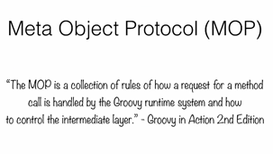
>
>Entonces, lo primero de lo que vamos a hablar es algo llamado protocolo de metaobjetos o mapa.
>Y realmente el mapa es solo una colección de reglas sobre cómo se maneja una solicitud de llamada de método
>por el sistema de ejecución de Groovy y cómo controlar la capa intermedia.
>
>Esto es directamente de la sección Groovy en acción, segunda edición del libro.
>Y básicamente de lo que estamos hablando aquí es que cada vez que Groovy llama a un método, no solo dice:
>Muy bien, ¿qué clase es esa clase?
>Foo, déjame llamar a ese método bar en esa clase foo.
>No hace eso.
>En cambio, le pregunta a esta capa intermedia ¿Qué debo hacer aquí?
>Y en función de un conjunto de reglas en un árbol de decisiones basado en el tipo de objeto con el que estás trabajando,
>así es como sabe qué terminar llamando.
>Y esa capa intermedia se llama `MOP`.
>
>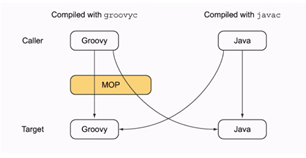
>
>Y aquí estamos viendo un gráfico y básicamente a la izquierda tenemos lo que sucede cuando llamamos desde
>groovy.
>
>A la derecha está cuando llamamos desde Java.
>Sabemos que podemos llamar desde Java a Groovy y viceversa, pero toman caminos un poco diferentes.
>Empecemos por el lado de Java aquí a la derecha, si compilamos un archivo Java
>una clase y la llamamos desde Java, la llama directamente, llama directamente a esa clase y busca
>un método.
>Posteriormente, si creamos una clase en Groovy y la llamamos desde Java, estamos llamando directamente a esa
>clase.
>
>Ahora bien, cuando llamamos desde Groovy, se toma una solicitud un poco diferente.
>Básicamente, cuando un llamador de Groovy llama a un método de Groovy en una clase de Groovy en el destino de un archivo de clase de Groovy, pasamos por este MOP y luego este MOP tiene un montón de reglas sobre lo que debemos hacer a continuación.
>Y eso puede tener un poco más de sentido en un minuto.
>
>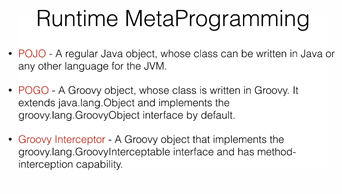
>
>Entonces, cuando hablamos de llamadas desde Groovy, en realidad podríamos estar tratando con tres tipos diferentes
>de objetos, ¿cierto?
>
>### El primero es un `POJO`.
>Tenemos un objeto Java normal cuya clase puede escribirse en Java o en cualquier otro lenguaje para la JVM.
>Entonces tenemos un objeto Java allí.
>Luego tenemos otros dos que están escritos en Groovy.
>### Entonces tenemos un `POGO`.
>que es un objeto Groovy cuya clase está escrita en Groovy.
>Extiende java.lang.object e implementa la interfaz de objeto Groovy Feeling de Groovy de manera predeterminada.
>### Luego también tenemos algo llamado  `Groovy interceptor`.
>Y un interceptor Groovy es simplemente un objeto que implementa la interfaz Groovy Interceptable y tiene
>una capacidad de interceptación de métodos.
>Entonces, estos son los tres tipos diferentes de objetos con los que Groovy va a trabajar y, en función de cuál tenga, tomará una ruta diferente.
>
>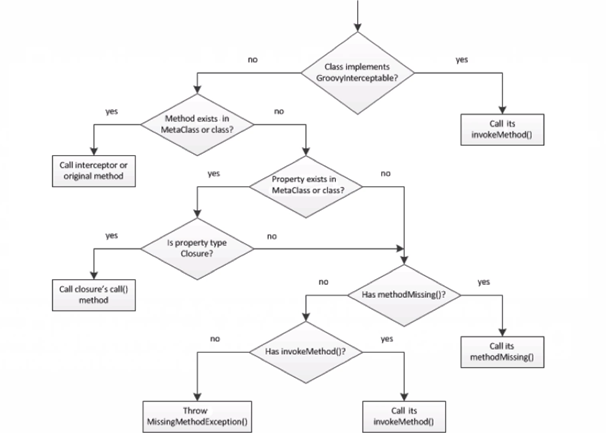
>
>Ahora que podemos ver un poco este árbol de decisiones, podemos hacernos una idea de lo que
>está haciendo el mapa.
>De inmediato, si es un objeto Java, simplemente llama al objeto Java y a su método de destino y sigue adelante.
>Pero cuando es un objeto Groovy, pasa por este árbol de decisiones que se parece a esto.
>
>Entonces, primero, ¿la clase implementa Groovy Interceptable?
>Sí.
>
>¿Llama a su método de invocación?
>No.
>
>Muy bien.
>Ahora tenemos que averiguar si el método existe en su metaclase o en esta clase en sí.
>Entonces, hablaremos de metaclases más adelante en esta sección.
>
>Pero la metaclase es solo una forma de agregar métodos a una clase en particular.
>Entonces, ¿está ahí?
>Sí.
>
>Muy bien.
>Entonces, ¿simplemente llamaremos a ese método original?
>No.
>
>¿La propiedad existe en la metaclase o en la clase?
>No veo ninguna propiedad ahí, así que no.
>
>Si se cae, entonces comenzamos a buscar formas de manipular el mapa y podemos comenzar a personalizar
>y agregar algunos métodos de gancho al mapa que nos permitan hacer lo que queremos hacer con esa llamada.
>Entonces, uno de ellos es que falta un método.
>Entonces, ¿esta clase tiene un método que falta?
>Sí, lo tiene.
>Bien.
>Adelante, llámalo No.
>
>¿Tiene un método de invocación?
>Si lo tiene, adelante, llámalo.
>Y finalmente, si llegamos hasta el final de ese árbol y no pudimos encontrar una llamada, entonces voy a seguir
>adelante y lanzar una excepción de método faltante.
>
>Aí que eso es un poco sobre cómo funciona la naturaleza dinámica de una llamada de método en Groovy.
>Si es un poco confuso ahora, está perfectamente bien.
>Me tomó un tiempo entender esto también.
>Pensé que el mapa era como un objeto mágico, como si viviera en el País de Nunca Jamás o algo así.
>
>Pero no se preocupen.
>Les prometo que comenzará a tener sentido a medida que avancemos en esta sección en la próxima.
>Y lo que me gustaría que hicieran, tal vez, una vez que hayamos pasado por las próximas dos secciones, tal vez regresen y
>miren este video en particular nuevamente, solo porque creo que este árbol de decisiones y la comprensión de lo que está
>haciendo esta capa intermedia, comenzarán a tener un poco más de sentido.
>Así que sigamos adelante y pasemos a la siguiente.

## Paso 78. Customizing the MOP

>[!TIP]  
>### Creamos la carpeta **"09-RuntimeMetaProgramming"**, que usaremos en toda esta sección.

1. Empezamos con [`IntelliJ`](#paso-15-hello-intellij), 
creando un nuevo proyecto llamado `mop`, de tipo groovy
en la misma carpeta **"09-RuntimeMetaProgramming"**:  
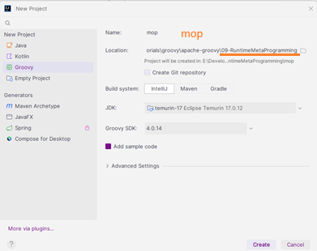
2. Creamos el paquete básico de `com.domain_name` en la
carpeta **"src"**.
3. Borramos el archivo **`Main.groovy`**.
4. Creo el archivo **`MOP.txt`** en la carpeta
**"src/com/domain_name"**, que es lo mismo que el paquete
del paso 2, con este contenido:
```txt
Personalizando el MOP con `Hooks`

- GroovyObject
  - Employee.groovy
- invokeMethod()
- get property
- property missing
- set property
- method missing
```
5. Creo una `Groovy Class` de nombre `Employee`, sin ningún
cambio, lo dejamos tal cual.
6. Creo un simple `Groovy Script` de nombre `InvokeMethodDemo`,
empezamos a colocar esto en el código:
```groovy
// this method is called when the method you called si not presen on Groovy object
class InvokeDemo {
    def test(){
        return 'method exist'
    }
}

def invokeDemo = new InvokeDemo()

assert invokeDemo.test() == 'method exist'
```
7. Doy click derecho y selecciono `Run 'InvokeMethodDemo'`,
este ejecuta sin errores.
8. Si agrego otro `assert`, como este:  
`assert invokeDemo.someMethod() == ''`  
click dereho y `Run 'InvokeMethodDemo'`, obtengo este error:
```diff
-Caught: groovy.lang.MissingMethodException: No signature of method: com.domain_name.InvokeDemo.someMethod() is applicable for argument types: () values: []
-Possible solutions: invokeMethod(java.lang.String, java.lang.Object)
-groovy.lang.MissingMethodException: No signature of method: com.domain_name.InvokeDemo.someMethod() is applicable for argument types: () values: []
-Possible solutions: invokeMethod(java.lang.String, java.lang.Object)
-	at com.domain_name.invokeMethodDemo.run(invokeMethodDemo.groovy:13)

Process finished with exit code 1
```
9. Agrego dentro de la `class InvokeDemo` y antes de 
`def test()`, este otro método:
```groovy
    def invokeMethod(String name, Object args){
        return "called invokeMethod $name $args"
    }
```
10. Ajusto el segundo `assert` con este texto:  
`assert invokeDemo.someMethod() == 'called invokeMethod someMethod []'`  
Doy Click derecho y selecciono `Run 'invokeMethodDemo'`,
este ejecuta sin errores.  

11. Buscando en el árbol de directorios a la izquierda del
[`IntelliJ`](#paso-15-hello-intellij), expando `out`, 
y abro la clase `invokeDemo`:  
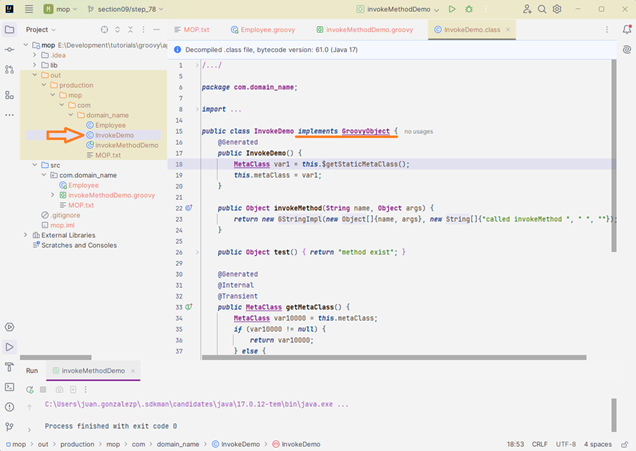
12. Creo un simple `Groovy Script` de nombre `GetPropertyDemo`,
dentro del paquete `com.domain_name`
empezamos a colocar esto en el código:
```groovy
// Every read access to a property can be intercepted by overriding a getProperty() method of the current object.
class PropertyDemo {
    // Some properties or attributes
    def prop1 = 'prop1'
    def prop2 = 'prop2'
    def prop3 = 'prop3'
}

def pd = new PropertyDemo()
println pd.prop1 // prop1
println pd.prop2 // prop2
println pd.prop3 // prop3
```
* Damos click derecho para ejecutar y nos salen los tres 
mensanjes.
13. Agrego este método:
```groovy
    def getProperty(String name){
        println "getProperty() is called with argument $name"
    }
```
* Doy click derecho para ejecutar y obtengo esto:
```bash
getProperty() is called with argument prop1
null
getProperty() is called with argument prop2
null
getProperty() is called with argument prop3
null

Process finished with exit code 0
```
14. Si agrego al nuevo método este texto:
```groovy
    def getProperty(String name){
        println "getProperty() is called with argument $name"
        // return
        metaClass.getProperty(this, name)
    }
```
* Ejecuto y obtengo esto:
```bash
getProperty() is called with argument prop1
prop1
getProperty() is called with argument prop2
prop2
getProperty() is called with argument prop3
prop3

Process finished with exit code 0
```
15. Agregamos al final la impresión de una propiedad que 
no existe: `println pd.prop4`
16. En el método `getProperty()` agrego esta condicional:
```groovy
        if(metaClass.hasProperty(this, name)) {
            // return
            metaClass.getProperty(this, name)
        } else {
            println 'lets do something fun with this property'
            return 'party time...'
        }
```
* Ejecuto y obtengo esto:
```bash
getProperty() is called with argument prop1
prop1
getProperty() is called with argument prop2
prop2
getProperty() is called with argument prop3
prop3
getProperty() is called with argument prop4
lets do something fun with this property
party time...

Process finished with exit code 0
```
17. Creo un simple `Groovy Script` de nombre 
`PropertyMissingDemo`, dentro del paquete `com.domain_name`
empezamos a colocar esto en el código:
```groovy
// Groovy supports the concept of propertyMissing for intercepting failing property resolution attemps

class Foo{
    def propertyMissing(String name){
        "caught missing property: $name"
    }
}

println new Foo().bar
```
* Doy click derecho y selecciono `Run 'PropertyMissingDemo'`,
y obtengo esto:
```bash
caught missing property: bar

Process finished with exit code 0
```
18. Creo un simple `Groovy Script` de nombre 
`SetPropertyDemo`, dentro del paquete `com.domain_name`
empezamos a colocar esto en el código:
```groovy
// You can intercept write access to properties by overriding the setProperty() method:
class POGO{
    String property

    void setProperty(String name, Object value){
        this.@"$name" = 'overridden'
    }
}

def pogo = new POGO()
pogo.property = 'a'

assert pogo.property == 'overridden'
```
* Ejecuto con click derecho y obtengo cero errores, todo ok 👍
19. Creo un simple `Groovy Script` de nombre 
`MissingMethodDemo`, dentro del paquete `com.domain_name`
empezamos a colocar esto en el código:
```groovy
// Groovy supports the concept of methodMissing. This method differs from invokeMethod() in that it is only
// invoke in case or a failed method dispach, when on method can be found for the given name and/or the given arguments:
class MyEmployee {
    def methodMissing(String name, def args){
        println "Method Missing called on: $name"
        println "with arguments ${args}"
    }
}

MyEmployee emp = new MyEmployee()
```
* Click derecho y ejectuo, para obtener esto:
```bash
Method Missing called on: someMethod
with arguments [1, 2, 3]

Process finished with exit code 0
```
20. Agrego al final otro llamado a otro método que no existe:  
`emp.someOtherMethod(4,5,6)`
21. Dentro del método `methodMissing()`, porngo esta condicional:
```groovy
        if(name != 'someMethod'){
            throw new MissingMethodException(name, args)
        }
```
* Ejecuto y obtengo lo siguiente
```diff
Method Missing called on: someMethod
with arguments [1, 2, 3]
-Caught: groovy.lang.GroovyRuntimeException: Could not find matching constructor for: groovy.lang.MissingMethodException(String, [Ljava.lang.Object;)
-groovy.lang.GroovyRuntimeException: Could not find matching constructor for: groovy.lang.MissingMethodException(String, [Ljava.lang.Object;)
-	at com.domain_name.MyEmployee.methodMissing(MissingMethodDemo.groovy:8)
-	at com.domain_name.MissingMethodDemo.run(MissingMethodDemo.groovy:17)

Process finished with exit code 1
``` 
* Así termina el proyecto:  


## Paso 79. MetaClass

1. Empezamos con [`IntelliJ`](#paso-15-hello-intellij), 
creando un nuevo proyecto llamado `meta-class`, de tipo groovy
en la misma carpeta **"09-RuntimeMetaProgramming"**:  
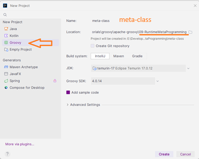
2. Esta vez **NO** Creamos el paquete básico de `com.domain_name` en la
carpeta **"src"**.
3. Borramos el archivo **`Main.groovy`**.
4. Creo un simple `Groovy Script` de nombre 
`MetaClassDemo`, dentro de la carpeta **"src"**
empezamos a colocar esto en el código:
```groovy
// MetaClass Demo

class Developer{

}

Developer me = new Developer()
println 'Cualquier texto sin impotancia'
```
* En la línea de `println 'Cualquier texto sin impotancia'`
ponemos una pausa:  
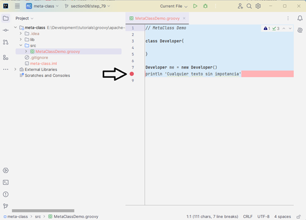
5. Damos click derecho y seleccionamos `Debug 'MetaClassDemo'`

>[!WARNING]  
>Puede que salga una pantalla de permisos, simplemente
>le damos click en `[Allow]`:  


6. Expandimos la instancia `me` y vemos que contiene por 
defecto una `metaClass`:  


7. Expandimos esa `metaClass` y vemos un montón de 
información.
8. Ocultamos el `println` y colocamos este nuevo código:
```groovy
Expando e = new Expando()
```
* Si doy [Ctrl]+[Click] en el primer `Expando`, nos
muestra el contenido de la biblioteca **`Expando.java`**.
9. Agregamos mas código debajo de `Expando e =`:
```groovy
e.name = 'Juan'
e.writeCode = { -> println "$name ama aprender código"}
e.writeCode()
```
* Si doy click derecho y selecciono `Run 'MetaClassDemo'`,
este ejecuta y mustra lo siguiente:
```bash
Juan ama aprender código

Process finished with exit code 0
```
10. Bajo la definición de la clase, debajo del `Expando`, 
así como esto:
```groovy
// MetaClass Demo

Expando e = new Expando()
e.name = 'Juan'
e.writeCode = { -> println "$name ama aprender código"}
e.writeCode()

class Developer{

}

Developer me = new Developer()
// println 'Cualquier texto sin impotancia'
```
11. Agrego este código, sabiendo que estas propiedades
no existen:
```groovy
// MetaClass Demo

// Expando e = new Expando()
// e.name = 'Juan'
// e.writeCode = { -> println "$name ama aprender código"}
// e.writeCode()

class Developer{

}
// per instance
Developer me = new Developer()
// println 'Cualquier texto sin impotancia'
me.name = 'Juan'
me.writeCode = { -> println "$name ama aprender código"}
me.writeCode()
```
* Click derecho y Ejecuto y obtengo esto:  
```diff
-Caught: groovy.lang.MissingPropertyException: No such property: name for class: Developer
-groovy.lang.MissingPropertyException: No such property: name for class: Developer
-	at MetaClassDemo.run(MetaClassDemo.groovy:14)

Process finished with exit code 1
```
12. Ahora hagamos una corrección al código:
```groovy
me.metaClass.name = 'Juan'
me.metaClass.writeCode = { -> println "$name ama aprender código"}
me.writeCode()
```
* Ejecuto el código y este es el resultado:  
```bash
Juan ama aprender código

Process finished with exit code 0
```
13. Probemos con este otro código con el uso de `metaClass`:
```groovy
String.metaClass.shout = { -> toUpperCase() }
println 'hola juan'.shout() // HOLA JUAN
```
* Y la respuesta será `HOLA JUAN`

## Paso Quiz 7: Runtime Metaprogramming
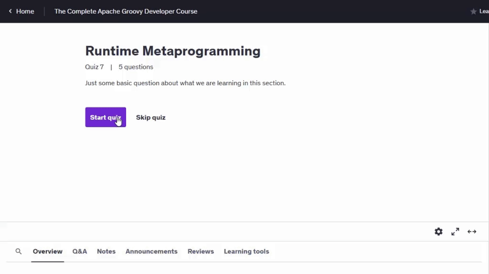

## Paso 80. Category Classes

>[!NOTE]  
>El uso de Metaclass para agregar capacidades dinámicas a nuestros programas suele ser la mejor opción.
>
>A veces, sin embargo, podríamos preferir un método alternativo que sea un poco más limitado y no
>tan amplio para toda la aplicación.
>
>En esta lección, quiero analizar este problema y mostrar cómo las categorías nos ayudan a resolverlo.
>También hay algunas categorías integradas en el lenguaje y hoy veremos una demostración de una de ellas.

1. Empezamos con [`IntelliJ`](#paso-15-hello-intellij), 
creando un nuevo proyecto llamado `meta-class`, de tipo groovy
en la misma carpeta **"09-RuntimeMetaProgramming"**:  
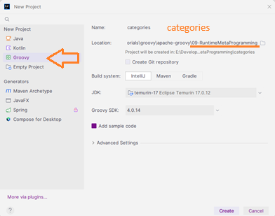
2. Esta vez **NO** Creamos el paquete básico de `com.domain_name` en la
carpeta **"src"**.
3. Borramos el archivo **`Main.groovy`**.
4. Creamos en la carpeta **"src"** un `Groovy Script` de
nombre `catdemo`, y ponemos este código:
```groovy
String.metaClass.shout = { -> toUpperCase() }
println 'Hello, World'.shout()
```
* Ejecutamos y esta es la respuesta:  
`HELLO, WORLD`

>[!NOTE]  
>Muchas veces esto va a funcionar muy bien, pero puedes ver un problema aquí.
>
>Entonces, estamos agregando un método a la clase de cadena, que es la clase de cadena que vamos a usar en todos
>nuestros programas.
>¿Correcto?
>
>Y sabes, en un escenario en el que estamos trabajando, especialmente en equipos o incluso en un proyecto de código abierto, es posible que la gente no sepa que ese método existe a menos que haya una API bien definida.
>Entonces, agregar métodos esporádicamente a la clase de cadena probablemente no sea una gran idea.
>
>Lo que podemos hacer es crear algo llamado una clase de categoría, y nos permite confinar
>y solo agregar métodos a un bloque particular de código en lugar de solo a toda la aplicación.

5. Creamos en la misma carpeta una `Groovy Class` de nombre
`StringCategory` y ponemos este código:
```groovy
class StringCategory {
    static String shout(String str ){
        str.toUpperCase()
    }
}
```
6. Regresamos al archivo **`catdemo.groovy`**, comentamos
lo escrito y hacemos un _hook_ de la clase `StringCategory`:
```groovy
use(StringCategory) {
    println 'Hello, World'.shout()
}

println 'Hello, World'.shout()
```
>[!NOTE]  
>Entonces, nuevamente, esto funcionará exactamente como lo hacía antes, pero probablemente puedas saberlo con una gran advertencia:
>solo está disponible dentro de este `use`.
>
>Bloquear Entonces, si seguimos adelante e intentamos copiar eso y pegar esto aquí.
>Esto arrojará un error.
>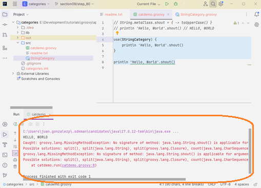

7. Creamos otra `Groovy Script` de nombre `time`, con este código:
```groovy
import groovy.time.TimeCategory

use(TimeCategory){
    println 1.minute.from.now
    println 10.hours.ago

    def someDate = new Date()
    println someDate - 3.months
}
```
* Al ejecutar aparecen las tres fechas sin error.

## Paso 81. Intercept / Cache / Invoke Pattern

1. Empezamos con [`IntelliJ`](#paso-15-hello-intellij), 
creando un nuevo proyecto llamado `inter-cache-invok`, de tipo groovy
en la misma carpeta **"09-RuntimeMetaProgramming"**:  
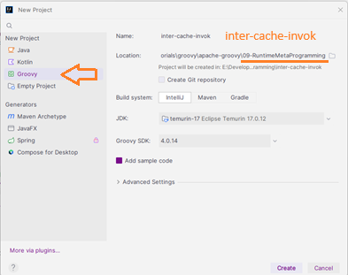
2. Esta vez **NO** Creamos el paquete básico de `com.domain_name` en la
carpeta **"src"**.
3. Borramos el archivo **`Main.groovy`**.
4. Creamos en la carpeta **"src"** un `Groovy Script` de
nombre `InterCacheInvok`, y ponemos este código:
```groovy
// Intercept / Cache / Invoke Pattern
class Developer {
    def methodMissing(String name, args) {
        println "${name}() method was called..."
    }
}

Developer dev = new Developer()
dev.writeGroovy()
```
* Lo ejecuto y obtengo esto:
```bash
writeGroovy() method was called...

Process finished with exit code 0
```
5. Agregamos en la `class Developer` antes del 
`methodMissing()`, lo siguiente:
```groovy
    List languages = []
```
6. Luego del instanciar la clase `Developer`, ponemos esto:
```groovy
dev.languages << 'Groovy'
dev.languages << 'Java'
    println dev.metaClass.methods.size()
```
* Ejecuto y obtengo esto:
```bash
15
writeGroovy() method was called...

Process finished with exit code 0
```
7. Repito varias veces el `dev.writeGroovy()` y el
`println dev.metaClass.methods.size()` y añado otro:
```groovy
Developer dev = new Developer()
dev.languages << 'Groovy'
dev.languages << 'Java'
    println dev.metaClass.methods.size()
dev.writeGroovy()
dev.writeGroovy()
dev.writeGroovy()
    println dev.metaClass.methods.size()
dev.writeJava()
    println dev.metaClass.methods.size()
```
* Y la respuesta no varía mucho:
```bash
15
writeGroovy() method was called...
writeGroovy() method was called...
writeGroovy() method was called...
15
writeJava() method was called...
15

Process finished with exit code 0
```
8. Dentro del clase agrego un condicional:
```groovy
        if(name.startsWith('write')){
            String language = name.split('write')[1]

            if(languages.contains(language)){
                def imp = { Object[] theArgs ->
                    println "I like to write code in $language"
                }
                getMetaClass()."$name" = imp
                return imp(args)
            }
        }
```
* Ejecuto y obtengo esto:
```bash
15
writeGroovy() method was called...
I like to write code in Groovy
I like to write code in Groovy
I like to write code in Groovy
16
writeJava() method was called...
I like to write code in Java
17

Process finished with exit code 0
```

## Paso 82. [Exercise] Runtime Metaprogramming
>[!NOTE]  
>### [Ejercicio] Metaprogramación en tiempo de ejecución
>**GroovyObject**
>* Cree una clase e implemente cada uno de los siguientes métodos desde la interfaz GroovyObject
>   * invokeMethod
>   * getProperty
>   * setProperty
>
>**Expando**
>* Cree una clase Expando
>* Agregue algunas propiedades y métodos
>* Sabiendo que la metaclase de una clase es un expando, cree su propia clase y agréguele propiedades y métodos.
>
>**Times Two**
>* Agregue un nuevo método a la clase Integer llamado `timesTwo`
>* Este método debería estar disponible para cualquier instancia de Integer
>* ¿Qué otro enfoque podemos adoptar para crear este método que sea un poco más controlado?

## Paso 83. [Exercise Review] Runtime Metaprogramming

1. Empezamos con [`IntelliJ`](#paso-15-hello-intellij), 
creando un nuevo proyecto llamado `excercise`, de tipo groovy
en la misma carpeta **"09-RuntimeMetaProgramming"**:  

2. Esta vez **NO** Creamos el paquete básico de `com.domain_name` en la
carpeta **"src"**.
3. Borramos el archivo **`Main.groovy`**.
4. Creamos la `Groovy Class` de nombre `Developer`, con
estos atributos y estos métodos:
```groovy
//**GroovyObject**
//* Cree una clase e implemente cada uno de los siguientes métodos desde la interfaz GroovyObject
class Developer {

    // Properties
    String first
    String last
    String email
    List languages

    // Constructor
    Developer(){

    }
    
    //   * invokeMethod
    def invokeMethod(String name, Object args){
        println "invokeMethod() called with args $args"
    }

    //   * getProperty
    def getProperty(String property){
        println 'getProperty called...'
        metaClass.getProperty(this, property)
    }

    //   * setProperty
    void setProperty(String property, Object newValue){
        println "setProperty() called with name $property and newValue $newValue"
        metaClass.setProperty(this, property, newValue)
    }

}
```
5. Creamos un `Groovy Script` de nombre `GroovyObjectDemo`,
con este código:
```groovy

Developer dev = new Developer(
        first: 'Juan',
        last: 'Piza',
        email: 'jpiza@mail.com'
)
dev.writeCode('Groovy')
println dev.first
dev.languages=['Groovy', 'Java']
```
6. Ejecuto este último y obtengo lo siguiente:
```bash
invokeMethod() called with args [Groovy]
getProperty called...
Juan
setProperty() called with name languages and newValue [Groovy, Java]

Process finished with exit code 0
```
7. Creamos un `Groovy Script` de nombre `ExpandoDemo`,
con este código:
```groovy
// **Expando**

// * Cree una clase Expando
Expando e = new Expando()

// * Agregue algunas propiedades y métodos
// Properties
e.first = 'Juan'
e.last = 'Piza'
e.email = 'jpiza@mail.com'
// Methods
e.getFullName = {
    "$first $last"
}

println e.toString()
println e.getFullName()

// * Sabiendo que la metaclase de una clase es un expando, cree su propia clase y agréguele propiedades y métodos.
@groovy.transform.ToString(includeNames = true)
class Person {
    String first, last
}

Person p = new Person(first: 'Juan', last: 'Piza')
p.metaClass.email = 'jpiza@mail.com'
println p
println p.email
```
8. Ejecuto el _script_ de nombre `ExpandoDemo` y obtengo
esto:
```bash
{last=Piza, getFullName=ExpandoDemo$_run_closure1@315df4bb, first=Juan, email=jpiza@mail.com}
Juan Piza
Person(first:Juan, last:Piza)
jpiza@mail.com

Process finished with exit code 0
```
9. Creamos un `Groovy Script` de nombre `SquareDemo`,
con este código:
```groovy
// **Times Two**
// * Agregue un nuevo método a la clase Integer llamado `timesTwo`
Integer.metaClass.timesTwo = {delegate * 2}
// * Este método debería estar disponible para cualquier instancia de Integer
println 2.timesTwo()
println 4.timesTwo()
println 5.timesTwo()
println 10.timesTwo()
```
10. Ejecuto el _script_ de nombre `SquareDemo` y obtengo
esto:
```bash
4
8
10
20

Process finished with exit code 0
```
>[!NOTE]  
>Entonces, aquí, en este caso, ese delegado, vamos a multiplicar por dos y si ejecutamos esto, simplemente multiplicará por
>cada uno de estos números porque son instancias de enteros multiplicados por dos.
>De nuevo, hablamos de esto en la sección.
>
>Pero si fueras a esto, es un poco peligroso porque estás agregando a un tipo de datos, la clase de tipos de datos aquí y probablemente ese no sea siempre el mejor caso en el que querrías
>simplemente, ya sabes, pegar métodos a voluntad.
>
>**Entonces, ¿cuál sería una mejor manera de hacer esto?**
>
>Hablamos un poco sobre esto en la sección que se trataba de usar una clase de categoría.
>
>Entonces, tal vez crear una clase de categoría de enteros donde tienes un montón de métodos, uno de los cuales es multiplicado por
>dos, y luego es más un caso de control donde simplemente usas esa clase de categoría y llamas a ese método estático en ella.


# Section 10: Compile Time MetaProgramming

## Paso 84. Intro

>[!NOTE]  
>Estamos viendo la metaprogramación en tiempo de compilación.
>
>Espero que hayas disfrutado la sección sobre metaprogramación en tiempo de ejecución.
>Solo quiero señalar en la documentación que hay una sección muy buena aquí sobre metaprogramación en tiempo de ejecución y
>en tiempo de compilación, por lo que lo desglosa, de manera similar a lo que hemos estado haciendo.
>
>Hablaremos primero sobre el tiempo de ejecución y luego sobre la metaprogramación en tiempo de compilación.
>
>Entonces, en la sección diez estamos hablando sobre metaprogramación en tiempo de compilación, y realmente de lo que estamos
>hablando hoy es de transformaciones.
>
>No vamos a profundizar en cómo crear tu propia transformación AST.
>Solo pensé que podría haber sido demasiado para abordarlo en esta sección.
>
>Entonces, lo que haremos básicamente es echar un vistazo a ejemplos de muchas de las transformaciones AST básicas que querrás usar.
>Y creo que una vez que comiences a verlos, entonces comenzará a tener sentido que podamos pegar una anotación
>y personalizarla en una clase o en algunos métodos.
>Y cuando el compilador se ejecuta, crea este código para nosotros que está básicamente allí en la clase de compilación.
>
>Veremos las clases de compilación.
>Y así nos hace la vida mucho más fácil sin tener que escribir algo de este código aburrido y repetitivo.
>Por ejemplo, vamos a ver dos cadenas o un equals y hashCode o sortable o inmutable,
>solo un montón de transformaciones ast realmente geniales que vamos a ver.
>Y te prometo que son realmente buenas.
>Nos ahorran mucho tiempo.

## Paso 85. @ToString

>[!NOTE]  
>En esta lección, vamos a echar un vistazo a la transformación de dos cadenas.
>
>Estoy aquí, en Groovy Docs, en la API, y todas las transformaciones están en un paquete llamado Groovy
>dot Transform.
>
>[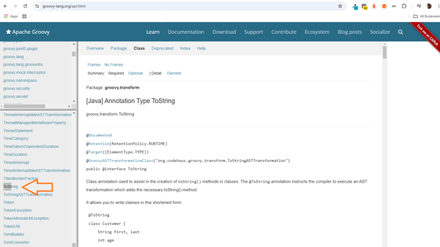](https://groovy-lang.org/api.html)
>
>Entonces, voy a entrar allí, bajar y ver la transformación de dos cadenas.
>Por lo tanto, una transformación de dos cadenas realmente nos ayuda a crear un método de dos cadenas para una
>clase en particular.
>
>Podríamos escribir estos dos métodos de dos cadenas nosotros mismos o podemos generarlos desde el IDE.
>Pero nuevamente, si algo cambia en esa clase, entonces siempre necesitamos actualizar ese método y
>lo hace mucho más limpio.
>
>Si simplemente continuamos y agregamos la anotación de dos cadenas a nuestra clase.
>Ahora está la manera fácil.
>Una vez que agregas eso, básicamente creará un método de dos cadenas que incluye todas las propiedades
>de tu clase.
>Obviamente, ese no siempre es el escenario ideal.
>
>Entonces, hay opciones que puedes incluir o atributos que puedes incluir en la transformación para que puedas personalizar cómo quieres que se vea.
>Por ejemplo, cosas como exclusiones, tal vez no quería que un campo en particular, como un ID, apareciera en nuestro método de dos cadenas.
>Puedo seguir adelante y excluir ese campo en particular.
>Ignorar valores nulos.
>
>Tal vez quería ignorar cualquier valor que sea nulo.
>No quiero mostrar esos nombres de inclusión, ya sea que se incluyan o no los nombres de las propiedades reales,
>cuando se proporcionan, cuando se muestran los pares de valor de nombre reales.
>Por lo tanto, te animo a que sigas adelante y mires la documentación sobre todos los diferentes atributos
>que puedes incluir.
>Pero sigamos adelante y echemos un vistazo a un ejemplo.

>[!TIP]  
>### Creamos la carpeta **"10-ast"**, que usaremos en toda esta sección.

1. Empezamos con [`IntelliJ`](#paso-15-hello-intellij), 
creando un nuevo proyecto llamado `transformations`, de tipo groovy
en la misma carpeta **"10-ast"**:  
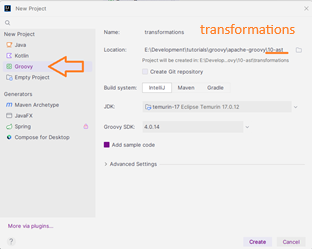
2. Creamos el paquete básico de nombre `tostring` en la
carpeta **"src"**.
3. Borramos el archivo **`Main.groovy`**.
4. Creamos una `Groovy Class` de nombre `Person`, dentro 
del paquete `tostring`, completamos la clase con esto:
```groovy
package tostring

class Person {
    String first
    String last
    String email
}
```
5. Doy Click derecho  en la clase y seleccionamos `Generate...`
y luego `toString()`:  
")
6. De que propiedades vamos a incluir, dejamos todas selccionadas,
por defecto dejo activo el `insert @Override` y le damos al 
botón `[OK]`, y esto nos va a aparecer:
```groovy
    @Override
    public String toString() {
        return "Person{" +
                "first='" + first + '\'' +
                ", last='" + last + '\'' +
                ", email='" + email + '\'' +
                '}';
    }
```
7. Creamos en el paquete `tostring` un `Groovy Script` de 
nombre `app`, con esto:
```groovy
package tostring

Person p = new Person(first: 'Juan', last: 'Piza',email: 'jpiza@mail.com')
println p.toString()
```
* Ejecutamos y esto es lo que obtenemos:
```bash
Person{first='Juan', last='Piza', email='jpiza@mail.com'}

Process finished with exit code 0
```
>[!NOTE]  
>Ahora, si ejecutamos esto, obtenemos esta bonita representación de dos cadenas de nuestra clase de persona.
>
>El problema con esto es que si entramos y cambiamos campos o agregamos campos, siempre tenemos que
>actualizar este método en particular y no es así, es un fastidio tener que mantenerlo.
>
>Entonces, voy a eliminar esto.
>Lo que queremos hacer es agregar una anotación de dos cadenas a nuestra clase.
>Entonces, si comenzamos a escribir dos cadenas, veremos que están en el paquete de transformación de puntos de Groovy.
>Si presionamos Enter, eso continúa y las importa por nosotros.
8. Borramos o comentamos el `@Override` y lo que hay debajo.
9. Agregamos justo antes de la definición de la clase este
código:  
```groovy
import groovy.transform.ToString
@ToString
```
* Regresamos a **`app.groovy`**, ejecutamos de nuevo
 y esto es lo que obtenemos:
```bash
tostring.Person(Juan, Piza, jpiza@mail.com)

Process finished with exit code 0
```
10. Regreeso a la clase `Person`, agrego a `@ToString`
paréntesis y este parámetro: `(includeNames = true)`
* Regreso al script `app`, ejecuto de nuevo para ver esto:
```bash
tostring.Person(first:Juan, last:Piza, email:jpiza@mail.com)

Process finished with exit code 0
```
11. En la clase `Person`, para `@ToString`, agrego otro 
parámetro: `excludes = ['email']`
* Ejecuto el script `app` y obtengo esto:
```bash
tostring.Person(first:Juan, last:Piza)

Process finished with exit code 0
```
12. Expandimos el árbol de carpetas o directorios y buscamos
en la ruta **"out/production/transformations/tostring"** el
archivo **`Person.class`** y lo abrimos:  
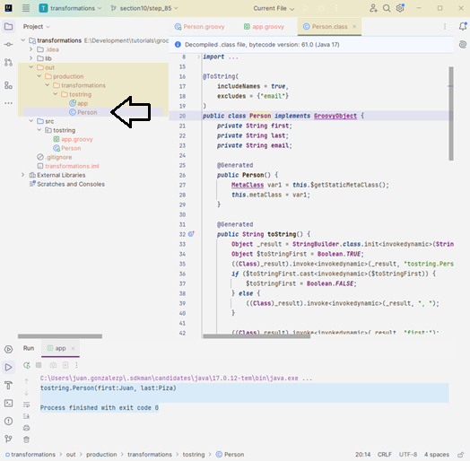

>[!NOTE]  
>Y nuevamente, podemos agregarlo a una clase que obtenemos que se genera si miramos el código de bytes real.
>
>Entonces, si miramos la clase person dot, en realidad puedes ver un método de dos cadenas aquí.
>Es bastante complejo.
>Hay mucho que sucede allí.
>
>Y nuevamente, eso no es algo que queramos escribir.
>
>Eso no es algo que queramos tener que mantener o actualizar cada vez que cambiamos un campo en nuestra
>clase.

## Paso 86. @EqualsAndHashCode

>[!NOTE]  
>En esta lección, vamos a echar un vistazo a la transformación `EqualsAndHashCode`.
>
>Así que si eres nuevo en el mundo de Java y Groovy, no te preocupes por eso.
>Vamos a ver un ejemplo de para qué se utilizan realmente Equals y hashCode.
>
>Pero en realidad, esto, al igual que todas las demás transformaciones que vamos a ver, simplemente
>limpia nuestro código y separa esa lógica real en, creo, una solución mucho más limpia.
>Así que, al igual que la anotación de dos cadenas, aquí hay algo de documentación sobre cómo empezar a usarla.
>
>Hay algunas formas en las que podemos... hay algunas propiedades diferentes que podemos configurar aquí en nuestros atributos
>que podemos configurar en la transformación, una de las cuales es exclusiones si queremos excluir como una propiedad particular
>del cálculo real de si un objeto es igual o no.
>Así que saltemos a una demostración real aquí.

1. Regresamos a [`IntelliJ`](#paso-15-hello-intellij), 
al mismo proyecto de nombre `transformations`.
2. Creamos el paquete de nombre `equals`, en la carpeta
**"src"**
3. Creamos una `Groovy Class` de nombre `Person`, 
en el paquete `equals`, con esta información:
```groovy
package equals

class Person {
    String first
    String last
    String email
}
```
4. Creamos en el paquete `equals` un `Groovy Script` de 
nombre `app`, y le ponemos este código:
```groovy
package equals

Person p1 = new Person(first: 'Juan', last: 'Piza',email: 'jpiza@mail.com')
Person p2 = new Person(first: 'Juan', last: 'Piza',email: 'jpiza@mail.com')

assert p1 == p2
```
* Ejecutamos el _script_ y esto es lo que obtenemos:
```diff
-Caught: Assertion failed: 

-assert p1 == p2
-       |  |  |
-       |  |  equals.Person@307765b4
-       |  false
-       equals.Person@4a9e6faf

-Assertion failed: 

-assert p1 == p2
-       |  |  |
-       |  |  equals.Person@307765b4
-       |  false
-       equals.Person@4a9e6faf

-	at equals.app.run(app.groovy:6)

Process finished with exit code 1
```
>[!NOTE]  
>Son solo referencias de una instancia real.
>Y entonces, esa instancia, esas dos instancias son completamente diferentes.
>No sabe cómo compararlas.
>
>Entonces, lo que hacemos en Java y Groovy aquí es crear un método equals y hashCode.
>Y así es como sabemos si dos objetos son iguales.
>Entonces.
>Un problema con la creación de estos es que podemos seguir adelante y crearlos nosotros mismos.
>
>Pero nuevamente, al igual que con la cadena, si alguna propiedad cambia, vamos a tener que regenerarla
>o reescribirla y crearla desde cero o incluso copiar y pegar algún código antiguo es muy propenso a errores.

5. En la clase damos click derecho seleccionamos `Generate...`
y luego `equals() and hashCode()`:  
 and hashCode()")
6. En la ventana que pide el `Template:`, lo cambiamos a 
`ìntelliJ Default` y presionamos el botón `[Next]`.
7. En la ventana `Choose fields to be included in equals()`
dejamos por defecto la selección de las tres 
_propiedades_ o _atributos_ ( si faltan seleccionarlas, 
simplemente se marcan las tres con las teclas `[shift]` y
el click del mouse), y botón `[Next]`.
8. En la ventana `Choose fields to be included in hashCode()`
dejamos por defecto la selección de las tres 
_propiedades_ o _atributos_ ( si faltan seleccionarlas, 
simplemente se marcan las tres con las teclas `[shift]` y
el click del mouse), y botón `[Next]`.
9. En la ventana `Select all non-null fields`
dejamos por defecto la selección de las tres 
_propiedades_ o _atributos_ ( si faltan seleccionarlas, 
simplemente se marcan las tres con las teclas `[shift]` y
el click del mouse), y botón `[Create]` o `[Finish]`.
* Esto es lo que se agrega al código de la clase `Person`:
```groovy
    boolean equals(o) {
        if (this.is(o)) return true
        if (o == null || getClass() != o.class) return false

        Person person = (Person) o

        if (email != person.email) return false
        if (first != person.first) return false
        if (last != person.last) return false

        return true
    }

    int hashCode() {
        int result
        result = (first != null ? first.hashCode() : 0)
        result = 31 * result + (last != null ? last.hashCode() : 0)
        result = 31 * result + (email != null ? email.hashCode() : 0)
        return result
    }
```
10. Regresamos al _script_ de nombre `app` y lo ejecutamos,
obteniendo cero errores, es decir funciona correctamente.
11. Borramos o comentamos lo nuevo de la clase `Person`.
12. Antes de la definición de la clase escribimos este 
código:  
```groovy
import groovy.transform.EqualsAndHashCode

@EqualsAndHashCode
```
13. Regresamos al _script_ de nombre `app` y lo ejecutamos,
obteniendo cero errores, es decir funciona correctamente,
también.
14. Cambiemos en el archivo **`app-groovy`**, el correo del
segundo por esto: `'jpiza@mailtwo.com'`, ejecutamos este
_script_ y vemos este resultado:
```diff
-Caught: Assertion failed: 

-assert p1 == p2
-       |  |  |
-       |  |  equals.Person@2e7067a7
-       |  false
-       equals.Person@87f30d55

-Assertion failed: 

-assert p1 == p2
-       |  |  |
-       |  |  equals.Person@2e7067a7
-       |  false
-       equals.Person@87f30d55
-
-	at equals.app.run(app.groovy:6)

Process finished with exit code 1
```
15. En el archivo **`Person.groovy`** para el 
`@EqualsAndHashCode`, agregamos unos paréntesis y un 
parámetro:
```groovy
@EqualsAndHashCode( excludes = ['email'])
```
16. Regreso al _script_ `app` y ejecuto, para obtener que
ejecuta sin errores, todo correcto.  
![@EqualsAndHashCode( excludes = ['email'])](images/section10-step_86_equals2.png "@EqualsAndHashCode( excludes = ['email'])")


## Paso 87. @TupleConstructor

>[!NOTE]  
>En esta lección.
>Vamos a echar un vistazo al constructor de tuplas como transformación.
>Será muy breve, pero también muy útil.
>
>Groovy nos proporciona una buena manera de crear instancias y objetos, ¿no?
>En esta primera instancia, puedes ver que estamos creando un nuevo cliente y estamos usando parámetros con nombre.
>Aunque no configuramos un constructor que tome todos estos parámetros con nombre de forma predeterminada.
>Groovy nos da esa capacidad.
>
>Bueno, hay ciertas ocasiones en las que solo tenemos un objeto pequeño, o tal vez estamos creando este objeto
>desde Java donde solo queremos pasar los parámetros implícitos y no queremos tener que sentarnos
>y nombrarlos.

1. Regresamos a [`IntelliJ`](#paso-15-hello-intellij), 
al mismo proyecto de nombre `transformations`.
2. Creamos el paquete de nombre `tuple`, en la carpeta
**"src"**
3. Creamos una `Groovy Class` de nombre `Person`, 
en el paquete `tuple`, con esta información:
```groovy
package tuple

import groovy.transform.ToString
import groovy.transform.TupleConstructor

@ToString
@TupleConstructor
class Person {
    String first
    String last
    String email
    
}
```
4. Creamos en el paquete `tuple` un `Groovy Script` de 
nombre `app`, y le ponemos este código:
```groovy
package tuple

Person p = new Person('Juan', 'Piza','jpiza@mail.com')
println p.toString()
```
* Ejecutamos este _script_ y esto es lo que obtenemos:
```bash
tuple.Person(Juan, Piza, jpiza@mail.com)

Process finished with exit code 0
```
>[!NOTE]  
>Ahora puedo continuar y ejecutarlo y verás que no proporcioné ningún parámetro con nombre a esta instancia en particular, pero con el constructor de tuplas entiendo que los tomará a medida que aparezcan en la clase.
>
>Entonces, el primero que enviamos fue el nombre, apellido, correo electrónico, etcétera.
>
>Al igual que todas las otras transformaciones que hemos visto, hay algunos atributos diferentes
>que puedes agregar a este constructor de tuplas para personalizarlo según tus necesidades.
>Así que echa un vistazo a la documentación y sigamos adelante.

## Paso 88. @Canonical

>[!NOTE]
>
>[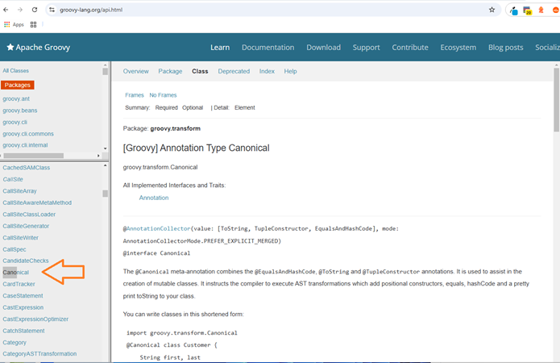](https://groovy-lang.org/api.html)
>
>La siguiente transformación que vamos a ver es la canónica.
>
>En realidad, se trata de una combinación de las tres anotaciones anteriores que vimos `@ToString`
>`@EqualsAndHashCode` y el `@TupleConstructor`.
>
>Por lo tanto, estas tres se usan tan comúnmente y se usan juntas que decidieron crear una
>nueva anotación llamada `@Canonical`.
>
>Entonces, nuevamente, veremos una demostración, pero en realidad es solo una combinación de las tres anteriores en
>una.

1. Regresamos a [`IntelliJ`](#paso-15-hello-intellij), 
al mismo proyecto de nombre `transformations`.
2. Creamos el paquete de nombre `canonical`, en la carpeta
**"src"**
3. Creamos una `Groovy Class` de nombre `Person`, 
en el paquete `canonical`, con esta información:
```groovy
package canonical

import groovy.transform.Canonical

@Canonical
class Person {
    String first
    String last
    String email
    
}
```
4. Creamos en el paquete `canonical` un `Groovy Script` de 
nombre `app`, y le ponemos este código:
```groovy
package canonical

Person p1 = new Person('Juan', 'Piza','jpiza@mail.com')
Person p2 = new Person('Juan', 'Piza','jpiza@mail.com')

assert p1 == p2
println p1.toString()
```
* Ejecutamos y obtenemos esto:

```bash
canonical.Person(Juan, Piza, jpiza@mail.com)

Process finished with exit code 0
```
>[!NOTE]  
>Entonces, esa es la cadena de impresión.
>Esa es la impresión de dos cadenas.
>La aserción ocurrió.
>No tuvimos un error allí.
>Entonces sabemos que se realizó.
>Bien.
>
>Entonces, nuevamente, eso es todo lo que voy a decir al respecto.
>Se usan comúnmente.
>Te encontrarás usándolos mucho.
>Entonces, si necesitas los tres, definitivamente puedes usar Canonical.
>
>Lo único que diré es que si necesitas personalizar solo uno, digamos que quieres excluir un nombre para dos
>cadenas, entonces necesitarás agregar las dos cadenas a la clase en particular y luego pasar los
>atributos particulares que necesitas.
>Así que espero que haya sido de ayuda.

## Paso 89. @Singleton

>[!NOTE]
>
>[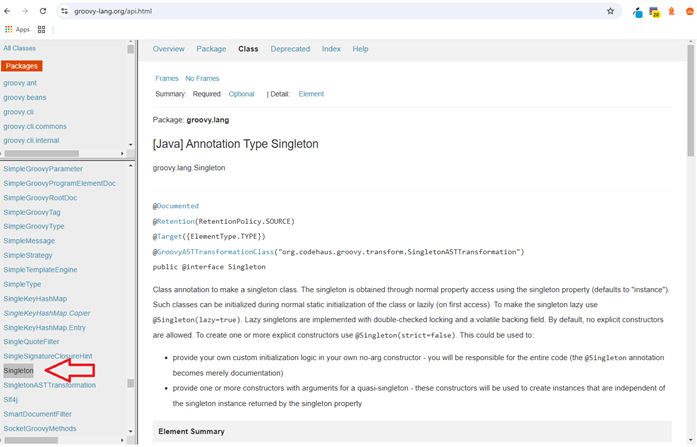](https://groovy-lang.org/api.html)
>
>La siguiente transformación que vamos a ver es Singleton.
>Y Singleton es una forma de hacer que una clase pueda seguir un estándar determinado.
>
>Básicamente, un singleton en el mundo Java significa que solo podemos tener una instancia de esta clase en existencia.
>La forma de solucionarlo en Java es crear un campo estático que contenga la instancia y
>un constructor privado.
>
>Por lo tanto, nunca se puede crear una instancia de esa clase.
>Solo se puede llamar a su método de obtención de instancia o a su método estático para obtener una instancia de esa
>clase.

1. Regresamos a [`IntelliJ`](#paso-15-hello-intellij), 
al mismo proyecto de nombre `transformations`.
2. Creamos el paquete de nombre `singleton`, en la carpeta
**"src"**
3. Creamos una `Groovy Class` de nombre `DatabaseConnection`, 
en el paquete `singleton`, con esta información:
```groovy
package singleton

@Singleton
class DatabaseConnection {

}
```
4. Creamos en el paquete `singleton` un `Groovy Script` de 
nombre `app`, y le ponemos este código:
```groovy
package singleton

DatabaseConnection bdConn = new DatabaseConnection()
println dbConn
```
* Si ponemos el mouse encima del la instancia obtenemos este 
error:  
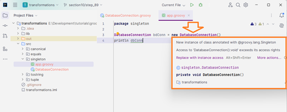
* Ejecutamos y obtenemos este error:
```diff
-Caught: java.lang.RuntimeException: Can't instantiate singleton singleton.DatabaseConnection. Use singleton.DatabaseConnection.instance
-java.lang.RuntimeException: Can't instantiate singleton singleton.DatabaseConnection. Use singleton.DatabaseConnection.instance
-	at singleton.DatabaseConnection.<init>(DatabaseConnection.groovy)
-	at singleton.app.run(app.groovy:3)

Process finished with exit code 1
```

>[!NOTE]  
>De nuevo, algo que podemos hacer fácilmente en Groovy es agregar el `@Singleton` como transformación.
>
>Y ahora, cuando sigamos adelante y creemos una instancia, obtendremos un error aquí.
>Básicamente, diremos que no queremos poder crear una instancia de
>ella.
>
>Solo existirá una, y si desea una instancia de la conexión a la base de datos, entonces
>debe obtenerla a través de su método de instancia.
>Una forma sencilla de ver esto es si pasamos al código de clase real aquí, el código de clase generado

5. Entramos en el árbol de carpetas a buscar esta 
**"out/production/transformations/singleton"** y abrimos el 
archivo **`DatabaseConnection.class`**  
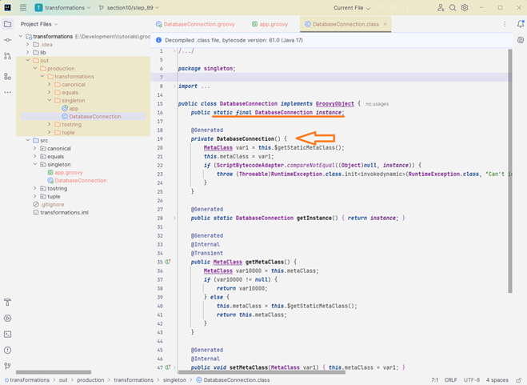
* Verás que hay una instancia de conexión de base de datos final estática pública.
Por lo tanto, si quieres obtener una instancia, básicamente estás llamando al método de obtención de instancia y luego hay
un constructor privado.
Por lo tanto, si intentas crear públicamente una nueva instancia de esto, básicamente obtendrás ese error de tiempo de ejecución.
6. Comentamos el código del _script_ `app` y ponemos este
nuevo código:
```groovy
DatabaseConnection db = DatabaseConnection.instance
println db
```
* Ejecutamos y corre sin problemas, sin errores.

## Paso 90. @Sortable

>[!NOTE]
>
>[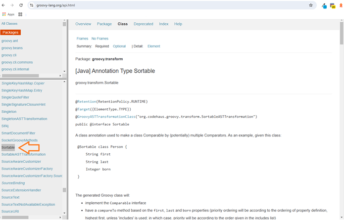](https://groovy-lang.org/api.html)
>
>La siguiente transformación que vamos a ver es `@Sortable`.
>
>`@Sortable` es una transformación muy útil y hace que ordenar objetos o clases sea muy fácil.
>Por lo general, lo que tienes que hacer es, si miras aquí abajo, si quieres escribir tu propia clase en Java,
>tienes que hacer algunas cosas para asegurarte de que se pueda ordenar.
>
>Tienes que implementar la interfaz comparable.
>Luego, necesitas tener un método allí llamado compare to que se basa en las propiedades con las que
>quieres comparar.
>
>Por lo tanto, hay algo de trabajo involucrado para hacer que esto sea ordenable, pero en nuestro caso, en Groovy, no necesitamos
>escribir nuevamente esa lógica subyacente.
>Y luego, cada vez que las propiedades cambien, tengamos que actualizar o mantener esa lógica, simplemente podemos agregar la
>anotación sortable a nuestra clase.

1. Regresamos a [`IntelliJ`](#paso-15-hello-intellij), 
al mismo proyecto de nombre `transformations`.
2. Creamos el paquete de nombre `sorted`, en la carpeta
**"src"**
3. Creamos una `Groovy Class` de nombre `Person`, 
en el paquete `sorted`, con esta información:
```groovy
package sorted

import groovy.transform.Canonical
import groovy.transform.Sortable

@Canonical
// @Sortable
class Person {
    String first
    String last
}
```
4. Creamos en el paquete `sorted` un `Groovy Script` de 
nombre `app`, y le ponemos este código:
```groovy
package sorted

Person p1 = new Person('Carlos','Piza')
Person p2 = new Person('Juan','Piza')
Person p3 = new Person('Paula','Piza')
Person p4 = new Person('Camila','Piza')

def pizas = [p1, p2, p3, p4]
println pizas
```
* Ejecuto este _script_ y obtengo esto:
```bash
[sorted.Person(Carlos, Piza), sorted.Person(Juan, Piza), sorted.Person(Paula, Piza), sorted.Person(Camila, Piza)]

Process finished with exit code 0
```
5. Volvemos a la clase `Person` y descomentamos 
`// @Sortable`, de regreso al _script_ `app`
y agregamos al `println pizas` la función `.toSorted()`.
Corremos y este es el resultado:
```bash
[sorted.Person(Camila, Piza), sorted.Person(Carlos, Piza), sorted.Person(Juan, Piza), sorted.Person(Paula, Piza)]

Process finished with exit code 0
```
6. Agregamos en el archivo **`app.groovy`** otra instancia,
y lo mismo al arreglo:
```groovy
...
Person p5 = new Person('Julian', 'Gonzalez')

def pizas = [p1, p2, p3, p4, p5]
println pizas.toSorted()
```
* Ejecutamos y obtenemos esta respuesta:
```bash
[sorted.Person(Camila, Piza), sorted.Person(Carlos, Piza), sorted.Person(Juan, Piza), sorted.Person(Julian, Gonzalez), sorted.Person(Paula, Piza)]

Process finished with exit code 0
```
7. En el archivo **`Person.groovy`**, agregamos al `@Sortable`
un par de paréntesis y un parámetro:
```groovy
@Sortable(includes = ['last'])
```
8. Regreso al _script_ `app` y lo ejecuto y este es el 
resultado:
```bash
[sorted.Person(Julian, Gonzalez), sorted.Person(Carlos, Piza), sorted.Person(Juan, Piza), sorted.Person(Paula, Piza), sorted.Person(Camila, Piza)]

Process finished with exit code 0
```

## Paso 91. @Immutable

>[!NOTE]
>
>[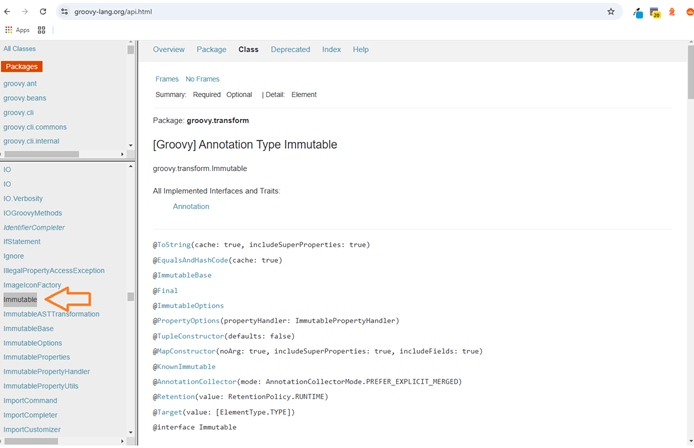](https://groovy-lang.org/api.html)
>
>La siguiente transformación que vamos a ver es `@Immutable`.
>
>`@Immutable` significa básicamente que una vez que creamos una instancia de algo, no podemos cambiar su
>estado.
>
>Y para hacerlo, especialmente en Java, seguimos un conjunto de convenciones como que la clase se convierte automáticamente en final.
>Todas las propiedades deben ser privadas, campos de respaldo finales con métodos get y setter.
>De nuevo, puedes leer qué hace que una clase sea inmutable.
>
>Pero, de nuevo, Groovy hace que sea muy fácil no tener que seguir cada una de estas convenciones y simplemente agregar
>esta transformación `AST` a nuestra clase.
>Y Groovy hará esto por nosotros.

1. Regresamos a [`IntelliJ`](#paso-15-hello-intellij), 
al mismo proyecto de nombre `transformations`.
2. Creamos el paquete de nombre `immutable`, en la carpeta
**"src"**
3. Creamos una `Groovy Class` de nombre `Person`, 
en el paquete `immutable`, con esta información:
```groovy
package immutable

import groovy.transform.Immutable
import groovy.transform.ToString

@ToString
@Immutable
class Person {
    String first
    String last
}
```
4. Creamos en el paquete `immutable` un `Groovy Script` de 
nombre `app`, y le ponemos este código:
```groovy
package immutable

Person p = new Person(first: 'Juan', last: 'Piza')
println p.toString()
```
* Ejecutamos, y sale esto: `immutable.Person(Juan, Piza)` 
5. Añado algo mas al _script_ como esto: `p.first('John')`,
ejecuto y obtengo esto:
```diff
-Caught: groovy.lang.MissingMethodException: No signature of method: immutable.Person.first() is applicable for argument types: (String) values: [John]
-Possible solutions: find(), print(java.io.PrintWriter), print(java.lang.Object), getFirst(), find(groovy.lang.Closure), getAt(java.lang.String)
-groovy.lang.MissingMethodException: No signature of method: immutable.Person.first() is applicable for argument types: (String) values: [John]
-Possible solutions: find(), print(java.io.PrintWriter), print(java.lang.Object), getFirst(), find(groovy.lang.Closure), getAt(java.lang.String)
-	at immutable.app.run(app.groovy:6)
```
>[!NOTE]  
>Entonces, si volvemos a la clase inmutable y a la clase persona, vimos en la documentación que lo que realmente hace que
>una clase sea inmutable es que sigue un conjunto de estándares.  
>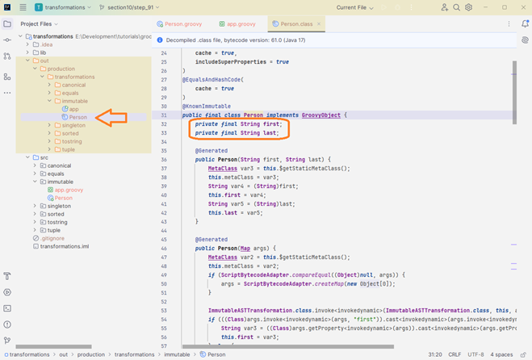  
>Uno es que tenemos una clase final persona aquí.
>Tenemos nuestras cadenas finales privadas aquí que tienen los captadores aquí abajo.
>Por lo tanto, no hay establecedores para ese campo en particular.
>
>Entonces, nuevamente, algo que podría hacer por su cuenta, pero con Groovy agregando una anotación fácil a nuestra clase,
>ahora tenemos una clase inmutable.

## Paso 92. @TypeChecked

>[!NOTE]
>
>[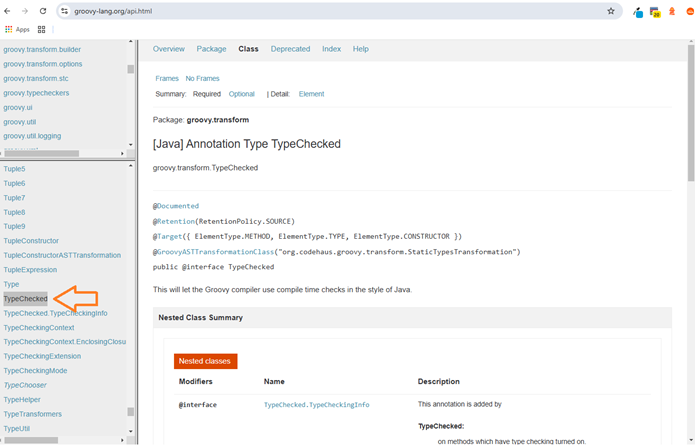](https://groovy-lang.org/api.html)
>
>En esta lección, vamos a echar un vistazo a una transformación `AST` llamada `@TypeChecked`.
>
>Una de las mayores quejas sobre los lenguajes dinámicos es la falta de verificación de tipo en tiempo de compilación.
>
>Y debido a la naturaleza dinámica de Groovy, tampoco tenemos mucho de eso, pero podemos con esta
>transformación AST en particular.

1. Regresamos a [`IntelliJ`](#paso-15-hello-intellij), 
al mismo proyecto de nombre `transformations`.
2. Creamos el paquete de nombre `typechecked`, en la carpeta
**"src"**
3. Creamos una `Groovy Class` de nombre `Person`, 
en el paquete `typechecked`, con esta información:
```groovy
package typechecked

import groovy.transform.TypeChecked

// @TypeChecked
class Person {
    String firstName
    String lastName

        String getFullName(){
        "$firstName $lasName"  // Mal escrito el `lastName`
    }
}
```
4. Podemos crear o no en el paquete `typechecked` un 
`Groovy Script` de nombre `app`, ya que no lo vamos a usar.
5. Damos en el menú `Build` -> `Recompile 'Person.groovy'` 
y todo funciona correctamente, sin errores.
>[!NOTE]  
>Y todo va a estar bien.
>Porque aunque no pueda encontrar ese campo en particular, apellido, no sabemos si eso es necesariamente
>un problema.
>
>Entonces, después de haber visto la ejecución, sabemos que las capacidades de metaprogramación en tiempo de ejecución nos permiten
>probablemente continuar y agregar apellido cuando quisiéramos.
>Entonces, aunque no esté bien en este punto, el apellido podría eventualmente ser un valor válido.
>
>Entonces, lo que podemos hacer es decir que queremos poder verificar el tipo de esto y podemos agregar esta
>anotación en el nivel de clase, lo que significa que todo en esta clase será verificado por tipo, o
>podríamos agregarlo en métodos o propiedades individuales.

6. Descomentamos el `// @TypeChecked`, de nuevo del menú
`Build` -> `Recompile 'Person.groovy'`, y nos sale esto en
el `Build Output`:
```diff
-Groovyc: [Static type checking] - The variable [lasName] is undeclared.
```
>[!NOTE]  
>Si bien Groovy es un lenguaje dinámico, muchas personas no saben que tiene capacidades de tipos estáticos.
>
>Por lo tanto, entre la verificación de tipos y las anotaciones estáticas de compilación, realmente podemos tratarlo en ciertas
>situaciones como un lenguaje estático si es necesario o como un lenguaje de tipos estáticos si es necesario.

## Paso 93. @CompileStatic

>[!NOTE]
>
>[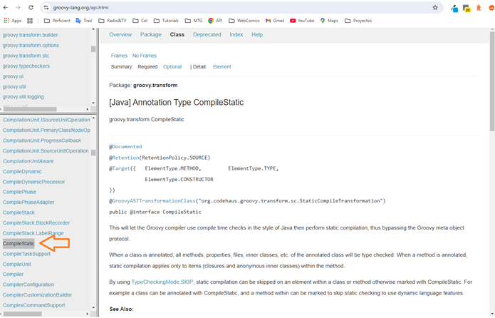](https://groovy-lang.org/api.html)
>
>En una lección anterior, analizamos la verificación de tipo at.
>Transformación `AST`.
>En esta lección, analizaremos la compilación estática y la que, que van juntas.
>
>La `@CompileStatic` permitirá que el compilador Groovy utilice verificaciones en tiempo de compilación en el mismo estilo de Java y luego realice la compilación estática,
>evitando así el protocolo de metaobjetos Groovy o el `MOP`.
>
>Ya analizamos el `MOP` antes y esto puede sonar como una verificación de tipo at, de entrada
>lo es.
>Sin embargo, hay una diferencia importante, y es el `MOP`.
>
>Por lo tanto, se evita el protocolo de metaprogramación de objetos Groovy.
>Por lo tanto, la verificación de tipo at sigue pasando por el `MOP`, mientras que la compilación estática genera llamadas de método similares al código de bytes de Java.
>
>Esto realmente significa que su semántica es diferente, pero también significa que aún puede aplicar la compilación Metaprogram sobre el código de verificación de tipo at siempre que las llamadas de método se puedan resolver en tiempo de compilación.
>
>De modo que esa es realmente la diferencia en la verificación de tipos que le permitirá seguir haciendo algo de programación dinámica
>mientras compila.
>El código estático realmente se acerca más al bytecode generado de Java.

1. Regresamos a [`IntelliJ`](#paso-15-hello-intellij), 
al mismo proyecto de nombre `transformations`.
2. Creamos el paquete de nombre `immutable`, en la carpeta
**"src"**
3. Creamos una `Groovy Class` de nombre `SomeClass`, 
en el paquete `compile`, con esta información:
```groovy
package compile

import groovy.transform.CompileStatic

@CompileStatic
class SomeClass {
    String foo(){
        'foo'
    }

    String bar(){
        'bar'
    }

    void noReturn(){

    }
}
```
4. No se requiere un `Groovy Script` de nombre `app`
5. Puedo del menú seleccionar
`Build` -> `Recompile 'SomeClass.groovy'` y muestra un
_log_ de ejecución.
6. Le agrego al método `noReturn()` esto encima 
`@CompileStatic(TypeCheckingMode.SKIP)`, vuelvo al menú,
selecciono `Build` -> `Recompile 'SomeClass.groovy'` y muestra 
el mismo _log_ de ejecución.

>[!NOTE]  
>Ahora bien, esto no pasará por lo mismo que el resto de los métodos de la clase.
>
>De nuevo, es una demostración bastante aburrida.
>
>Si siguiéramos adelante y compiláramos esto, funcionaría perfectamente.
>No hay nada especial.
>Solo quería mostrarles tanto en Typecheck como en la compilación.
>`@CompileStatic` simplemente les brinda un poco más de flexibilidad cuando necesitan cambiar la forma en que funcionan las cosas en Groovy para que coincidan con Java.
>Así que creo que eso es todo para `@CompileStatic` y seguiremos adelante.

## Paso 94. @Builder

>[!NOTE]
>
>[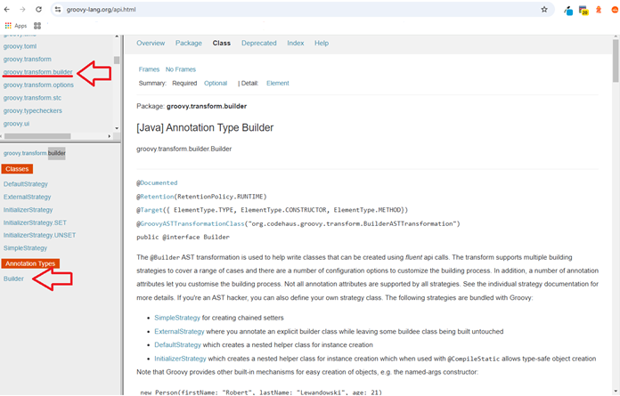](https://groovy-lang.org/api.html)
>
>En esta lección, vamos a echar un vistazo a una transformación bastante interesante llamada `@Builder`.
>
>Hasta este punto, todas las transformaciones que hemos visto han estado en el paquete de transformación Groovy punto.
>El material del `@Builder` está en otro paquete llamado Groovy punto Transform Builder.
>
>Así que vayamos a ese paquete y verás un tipo de anotación para el `@Builder` y luego algunas otras clases
>aquí que son diferentes tipos de estrategias para usar con este `@Builder`.
>
>Así que podemos ver, mirando la documentación aquí, que la transformación at Builder se usa para ayudar a escribir
>clases que se pueden crear usando algo llamado llamadas API fluidas.
>
>Básicamente, el `@Builder` te permite una nueva forma de construir objetos y realmente puede ayudar
>cuando estás creando objetos de objetos también.
>Así que veremos que hay algunas estrategias diferentes aquí.
>
>Hoy solo veremos la estrategia predeterminada, pero al final les daré una manera
>de utilizar otras estrategias si quieren ir a la documentación y verla.
>
>Entonces, solo una nota rápida: Groovy proporciona algunos mecanismos integrados para crear objetos, cuando
>llamamos a New person.
>Podemos pasar parámetros de nombre y valores para construir nuestro objeto, o incluso podemos hacer algo como new
>person dot width y luego establecer nuestros campos prop aquí.
>Así que es posible que no encuentren ningún valor en usar el `@Builder`.
>
>Pero definitivamente cuando se adentren en alguna integración de Java o en algunos casos en una seguridad de tipos mejorada, esa
>transformación del `@Builder` puede resultar útil.
>Y honestamente, me gusta la sintaxis para construir algunos de nuestros objetos.
>Así que vamos a echarle un vistazo y luego realmente depende de ustedes averiguar si encuentran algún uso para
>él.
>
>De nuevo, estamos en la anotación del generador de aplicaciones y luego en la documentación, y luego puedes ver que hay
>diferentes estrategias aquí cuando no pasas una estrategia a la anotación del generador de aplicaciones, de manera predeterminada,
>se usará la estrategia predeterminada.
>Entonces, este es el primer lugar donde querrás buscar.

1. Regresamos a [`IntelliJ`](#paso-15-hello-intellij), 
al mismo proyecto de nombre `transformations`.
2. Creamos el paquete de nombre `builder`, en la carpeta
**"src"**
3. Creamos una `Groovy Class` de nombre `Developer`, 
en el paquete `builder`, con esta información:
```groovy
package builder

import groovy.transform.ToString
import groovy.transform.builder.Builder

@Builder
@ToString(includeNames = true)
class Developer {

    String firstName
    String lastName
    String middleInitial
    String email
    Date hireDate
    List languages

}
```
4. Creamos en el paquete `builder` un `Groovy Script` de 
nombre `default`, y le ponemos este código:
```groovy
package builder

Developer dev = Developer
    .builder()
    .firstName('Juan')
    .lastName('Piza')
    .middleInitial('G')
    .email('jpiza@mail.com')
    .hireDate(new Date())
    .languages(['Java', 'Groovy'])
    .build()

println dev
assert dev.firstName == 'Juan'
assert dev.lastName == 'Piza'
assert dev.languages.size() == 2
```

>[!WARNING]  
>Me sale un error de un ejercicio anterior, entonces procedo
>a arregarlo:  
>

5. Ejecutamos el _script_ y obtenemos esto:
```bash
builder.Developer(firstName:Juan, lastName:Piza, middleInitial:G, email:jpiza@mail.com, hireDate:Day Mth MM HH:mm:ss COT YYYY, languages:[Java, Groovy])

Process finished with exit code 0
```

>[!NOTE]  
>Entonces, podríamos ver simplemente otra forma sencilla de instanciar un objeto aquí usando la anotación del generador de aplicaciones
>y simplemente una forma de crear algunas API fluidas.
>Es como si funcionara, ¿no?
>
>Parece que si alguien mirara esto, tendría un poco más de sentido para ellos.
>A veces, cuando las personas están de acuerdo, realmente no entienden que, ya sabes, un objeto
>como nuestro objeto de desarrollador aquí tiene la capacidad de tomar parámetros de nombre porque no ven un constructor.
>Y luego, obviamente, si alguien mirara esto de inmediato, entendería
>que simplemente estamos llamando a los establecedores en nuestro objeto de desarrollador para construirlo.
>
>Entonces, nuevamente, depende de ti encontrar si tienes un uso para esto.
>A mí personalmente me gusta esta sintaxis.
>No la uso todo el tiempo, pero siento que tiene algún valor.
>Así que espero que haya sido de ayuda.

## Paso 95. [Exercise] AST Transformations

>[!NOTE]  
>### [Ejercicio] Transformaciones AST
>**Transformaciones AST**
>
>En esta sección veremos muchas transformaciones AST. Ahora quiero que revises la documentación y encuentres una que no hayamos visto y veas si puedes hacer que funcione por tu cuenta.

## Paso 96. [Exercise Review] AST Transformations

>[!NOTE]
>
>[](https://groovy-lang.org/api.html)
>Estamos de vuelta y estamos revisando el ejercicio de transformaciones.
>Y básicamente el ejercicio fue, bueno, vimos un montón de transformaciones diferentes en esta sección.
>
>Lo que quería que hicieras era revisar la documentación, encontrar otra que te pudiera resultar útil,
>y simplemente probarla.
>Así que esta no es una respuesta correcta o incorrecta.
>Nuevamente, la mía.
>
>La que estoy eligiendo es `@AutoClone`.
>Si elegiste otra, no hay problema.
>Solo quería que pudieras revisar la documentación y hacer esto tú mismo.
>Así que aquí estamos.
>
>Voy a echar un vistazo a `@AutoClone` y básicamente `@AutoClone` nos permite ayudar en la creación
>de clases Cloneable.
>Entonces, la anotación `@AutoClone` le indica al compilador que ejecute la transformación AST, que agrega un
>método de clonación pública y agrega cloneable a la lista de interfaces que implementa esta clase.
>
>Entonces, profundicemos y echemos un vistazo a esto.

1. Regresamos a [`IntelliJ`](#paso-15-hello-intellij), 
al mismo proyecto de nombre `transformations`.
2. Creamos el paquete de nombre `clone`, en la carpeta
**"src"**
3. Creamos una `Groovy Class` de nombre `Person`, 
en el paquete `clone`, con esta información:
```groovy
package clone

import groovy.transform.AutoClone

@AutoClone
class Person {
    String first
    String last
    List favItems
    Date since
}
```
4. Creamos en el paquete `clone` un `Groovy Script` de 
nombre `clonedemo`, y lo dejamos vacío:
5. Estando en la clase `Person`, voy al menú, y selecciono 
`Build` -> `Recompile 'Person.groovy'`

>[!NOTE]  
>Ahora vamos a echar un vistazo a lo que se compiló.  
>  
>
>Si observamos la clase persona, podemos ver que implementa el objeto Groovy de forma predeterminada y ahora
>también implementa `Cloneable`.
>Ahora tenemos un objeto `Cloneable` y tenemos este método llamado clone que se agregó para nosotros.
>
>De modo que, según todas las propiedades, se descubrió y escribió este método que ahora podemos
>usar para clonar una nueva persona en nuestro clon, una persona existente en una nueva persona.

6. Ahora si de regreso al _script_ de nombre `clonedemo`
y colocamos esto en el código:
```groovy
package clone

def p = new Person(first: 'Juan', last: 'Piza', favItems: ['Learning', 'coding'], since: new Date())
def p2 = p.clone()

assert p instanceof Cloneable
assert p.favItems instanceof Cloneable
assert p.since instanceof Cloneable
assert !(p.first instanceof Cloneable)

assert !p.is(p2)
assert !p.favItems.is(p2.favItems)
assert !p.since.is(p2.since)
assert p.first.is(p2.first)
```
>[!NOTE]  
>Simplemente vamos a colocar este código.
>Entonces, todo lo que están haciendo aquí es en P, estamos instanciando una nueva persona.
>
>Entonces, tenemos primero, último elementos favoritos y luego una propiedad de sentido.
>
>Entonces, en P dos, podemos llamar a un método en persona en nuestra nueva persona llamada clon.
>Y eso se agregó a él mediante esa transformación AST para nosotros.
>
>Entonces, podemos preguntar cosas como, bien, ¿es P una i0nstancia de clonable, que será
>porque implementamos esa interfaz P punto elementos favoritos instancia de Cloneable.
>Sí.
>Entonces, estas son todas las propiedades que son instancias de clonable.
>Entonces, um.
>
>Ahora, lo que podemos hacer es también verificar el método Is.
>Entonces, es una forma de preguntar, ¿es igual, es igualdad, es igualdad?
>Entonces, no estamos probando.
>
>¿Cada propiedad individual allí resulta ser lo mismo que estamos preguntando?
>¿Son estos dos objetos iguales?
>
>Y en este caso, no lo son.
>Serán dos objetos diferentes en la memoria.
>
>Así que sigamos adelante y ejecutemos esto y, con suerte, todas nuestras afirmaciones pasarán y estaremos listos para continuar.
>Así que, si alguna vez necesitas clonar algo, esta es la forma más fácil de hacerlo.
>Agrega la anotación de clonación automática a tu objeto y deberías estar listo.

# Section 11: Working with Builders

## Paso 97. Intro to Builders

>[!NOTE]  
>Estamos en la Sección 11, avanzando rápidamente, comenzando a abordar algunas cuestiones realmente divertidas.
>
>La Sección 11 trata sobre cómo trabajar con constructores.
>
>En esta sección no vamos a hablar de mucho.
>Hablaremos específicamente de constructores y veremos, creo, 3 o 4 de ellos aquí.
>
>Los constructores son una forma muy conveniente de crear objetos.
>Vamos a ver diferentes tipos de constructores.
>Vamos a ver uno, que es un constructor de marcado, que se puede usar para crear objetos como
>XML o HTML, por ejemplo.
>
>Es una forma muy sencilla de crear este tipo de cosas en comparación con, por ejemplo, Java, donde crear algo como XML es simplemente molesto.
>Vamos a ver eso, vamos a ver la documentación del constructor para que puedas
>orientarte.
>Vamos a ver el generador de Json para crear Json, que será muy útil
>en la siguiente sección cuando comencemos a hablar sobre los servicios web.
>
>Y, por último, veremos el generador de gráficos de objetos, que es realmente útil para crear gráficos
>de objetos en sus aplicaciones.
>Y veremos una lista de todos los generadores que están disponibles en Groovy.
>Y creo que ahí es donde terminaremos.
>Así que en esta sección nos divertiremos mucho con los generadores, que son realmente útiles.

## Paso 98. MarkupBuilder - XML

>[!NOTE]
>
>[](https://groovy-lang.org/api.html)
>
>En la introducción a esta sección, aprendimos un poco sobre qué son los constructores y cómo pueden
>ayudarnos.
>Ahora lo que quiero hacer es comenzar a analizar algunos de los diferentes constructores y ver algunos
>ejemplos de cómo funcionan. Una vez que los veas en acción, tendrás una idea de lo útiles que pueden ser para nosotros.
>
>El primero que veremos hoy es el constructor de marcado, y lo usaremos específicamente
>para generar XML.
>Estoy en la documentación de Groovy aquí y el constructor de marcado está en el paquete Groovy dot XML.
>Si ingresas aquí, puedes ver los diferentes constructores que tenemos, los diferentes métodos que
>tenemos disponibles. Pero volveremos a esto.

>[!TIP]  
>### Creamos la carpeta **"11-builders"**, que usaremos en toda esta sección.

1. Empezamos con [`IntelliJ`](#paso-15-hello-intellij), 
creando un nuevo proyecto llamado `builders-demo`, de tipo 
groovy en la misma carpeta **"11-builders"** 
2. Borramos el archivo **`Main.groovy`**.
3. Creamos una `Groovy Script` de nombre `xml`, dentro 
de la carpeta **"src"**, completamos el script con esto:
```groovy
import groovy.xml.MarkupBuilder

MarkupBuilder builder = new MarkupBuilder()
builder.sports(){

}
```
4. En el método `sports()`, empezamos a crear la estructura
a utilizar en el `xml`:
```groovy
builder.sports(){
    sport(id:1){
        name 'Baseball'
    }
    sport(id:2){
        name 'Basketball'
    }
    sport(id:3){
        name 'Football'
    }
    sport(id:4){
        name 'Hockey'
    }
}
```
* Ejecutamos este _script_ y esto sería el resultado:
```xml
<sports>
  <sport id='1'>
    <name>Baseball</name>
  </sport>
  <sport id='2'>
    <name>Basketball</name>
  </sport>
  <sport id='3'>
    <name>Football</name>
  </sport>
  <sport id='4'>
    <name>Hockey</name>
  </sport>
</sports>
Process finished with exit code 0
```
>[!NOTE]  
>Entonces, tenemos que el `sports` es el nodo raíz.
>Así que ese es nuestro nodo raíz.
>Y luego todo lo que está debajo de él comienza a construirse.
>
>Entonces, tenemos un deporte, por lo que crea un deporte aquí, tiene un ID de uno, luego el `name`.
>Entonces, tenemos un `sport`, por lo que crea un `sport` aquí, tiene un ID de uno, luego el `name`.
>Entonces, tenemos un `name` de elemento con el texto de `Basketball`.
>
>Entonces, esto es increíblemente fácil de usar.
>No sé si has usado Java antes, es muy, muy detallado y difícil de construir `XML`.
>Es casi doloroso.
>Um, solo por todos los obstáculos que tienes que superar solo para imprimir cosas simples, simples es simplemente
>realmente, realmente difícil de usar.
>
>Y sé que en algunos otros lenguajes aún no es ni siquiera más fácil que Java, pero aún no es simple
>en absoluto.
>Para mí, esto es muy simple.
>Podemos usar código para construir nuestra estructura `XML` aquí, así que esto es realmente genial.
>
>Entonces, quiero volver a la documentación.  
>
>[](https://groovy-lang.org/api.html) 
>
>Entonces, cuando creamos este generador de marcado, no pasamos ningún argumento al constructor aquí.
>
>El valor predeterminado es simplemente seguir adelante e imprimir esto en la pantalla.
>Pero si observamos los constructores, una de las sobrecargas del constructor es tomar un escritor.
>Entonces, si quisiéramos, podríamos escribir esto en un archivo y generar una cadena, una cadena, etcétera.
>Eso es bastante útil.
>
>Además, hay algunos métodos excelentes y bastante útiles aquí, que veremos ahora.
>Entonces, quiero ver un par de ellos.
>Entonces, en realidad, no los configuremos.
>Entonces, configurar `omitEmptyAttributes` para permitir que los atributos vacíos se eliminen del marcado generado y
>configurar `omit null` y luego configure, creo, elementos expandidos.
>
>Entonces, echemos un vistazo a esto.

5. Agregamos esto al método `sports()`:
```groovy
    sport(id:null){
        name ''
    }
```
* Si lo ejecuto encuento esto al final como datos vacíos:
```xml
  <sport id=''>
    <name></name>
  </sport>
```
6. Agregamos esto después de definir la variable `builder`:
```groovy
builder.omitEmptyAttributes = true
builder.omitNullAttributes = true
```
* Ejecuto este _script_ y obtengo esta respuesta:
```xml
<sports>
  <sport id='1'>
    <name>Baseball</name>
  </sport>
  <sport id='2'>
    <name>Basketball</name>
  </sport>
  <sport id='3'>
    <name>Football</name>
  </sport>
  <sport id='4'>
    <name>Hockey</name>
  </sport>
  <sport>
    <name></name>
  </sport>
</sports>
Process finished with exit code 0
```

## Paso 99. Builder Documentation

>[!NOTE]  
>Ahora que vimos un ejemplo de cómo usar el generador de marcado, quiero hablar rápidamente de algo más
>que tiene que ver con la documentación.
>
>Así que no puedo atribuirme el mérito.
>De hecho, aprendí este pequeño truco de Ken Cousin, que es un presentador, orador y bloguero increíble,
>hace muchos videos en YouTube.
>Está en el podcast Groovy.
>
>Si estás en esta comunidad, lo conocerás bastante rápido.
>Hace un gran trabajo enseñando cosas relacionadas con Groovy y es muy importante en la comunidad.
>Así que, si tienes la oportunidad, no dudes en echarle un vistazo.
>Creo que lo aprendí de él en una conferencia y una de las cosas que dijo fue que
>la documentación de Groovy para Builder es un poco ligera.
>
>Entonces, a qué me refiero con eso, vayamos al grano rápidamente.
>Entonces, si vamos a la API y buscamos un generador de marcado o, en realidad, vamos a marcar.
>Más antiguo.
>Y deberíamos.
>Ahí está.
>
>Entonces, si miramos el generador de mercado, solo dice una clase auxiliar para crear marcado XML o HTML.
>Hay un ejemplo rápido y un montón de métodos y realmente nada más.
>Entonces, además de hacer lo normal y lo básico, probablemente te encontrarás con preguntas,
>
>Bueno, ¿cómo hago esto?
>¿O cómo hago aquello?
>Y la documentación es un poco deficiente en esa área.
>Bueno, una cosa que aprendí de él, una forma fácil de ver otros ejemplos de esto es ir al
>código fuente real y mirar algunas de las pruebas unitarias.
>
>Entonces, esta es otra ventaja de usar proyectos de código abierto.
>
>[](https://github.com/apache/groovy)
>
>Bueno, una cosa que aprendí de él, una manera fácil de ver otros ejemplos de esto es ir al
>código fuente real y ver algunas de las pruebas unitarias.
>Esta es otra ventaja de usar proyectos de código abierto.
>
>Los desarrolladores de Groovy son muy buenos escribiendo pruebas para todos sus diferentes casos de prueba.
>Entonces, aquí estamos en el sitio de GitHub para Apache Groovy.
>Y si bajamos a los subproyectos y echamos un vistazo a Groovy XML, vayamos aquí.
>Vamos a ir al código fuente, a las pruebas, a Groovy, a Groovy XML.
>Y ahora tenemos todas estas diferentes pruebas aquí.
>
>Entonces, vamos a ver la prueba del generador de marcado y esta es una prueba para probar el generador de marcado.
>Entonces, hay algo de información de configuración aquí y luego hay una variedad de pruebas.
>Entonces, prueba un árbol pequeño con texto y atributos.
>Entonces, nuevamente, si lo desea, puede ingresar aquí y copiar algunas de estas pruebas en, por ejemplo,
>
>IntelliJ o Groovy Console y jugar con ellas para ver qué sucede aquí.
>Y esta es una excelente manera de aprender no solo las cosas básicas, sino que luego, cuando comience a tener preguntas
>sobre, bueno, esto es un poco diferente del ejemplo básico normal.
>
>¿Cómo hago X?
>¿Cómo hago Y?
>Y verá.
>Entonces, pruebe el marcado con dos puntos y espacios de nombres.
>Entonces, puede tener una instancia donde tenga dos puntos y desee asegurarse de que eso funcione
>también.
>Al bajar aquí para generar marcado con caracteres especiales, tal vez desee usar comillas dobles para
>realmente poder configurar ese generador.
>
>Puede configurar una propiedad llamada Comillas dobles.
>Entonces, llame al establecedor y configure las comillas dobles como verdaderas.
>Um, omitiendo los valores nulos, uh, algunas otras cosas aquí.
>Entonces, comenzamos con las pruebas.
>No se pueden escapar los atributos.
>Quizás querías ingresar un enlace y, en el caso de los enlaces, no querrías escapar los atributos.
>
>Este es otro ejemplo de que quizás no lo hayas hecho de inmediato, pero tarde o temprano
>puede que llegues a esto y te preguntes: "Espera un minuto, ¿cómo hago eso?".
>Nuevamente, esta prueba que ejecuta las diferentes pruebas para todos los diferentes constructores es una excelente
>manera de aprender a hacer diferentes cosas que están fuera del ejemplo normal que ves en la documentación.
>Nuevamente, agradecemos a Ken Cousin por ese pequeño consejo.
>Es realmente genial para aprender todas las diferentes sintaxis de constructores.

## Paso 100. Markup Builder - HTML

1. Usando el mismo [`IntelliJ`](#paso-15-hello-intellij), 
en el mismo proyecto `builders-demo`, creamos una 
`Groovy Script` de nombre `html`, dentro 
de la carpeta **"src"**, completamos el script con esto:
```groovy
import groovy.xml.MarkupBuilder

MarkupBuilder builder = new MarkupBuilder()

builder.html() {

}
```
2. Completamos el contenido del método `html()`:
```groovy
    head {
        title 'Juan Piza'
        description 'Página acerca de mi'
        keywords 'Juan Piza, Groovy, Java, Spring'
    }
    body {
        h1 'Una breve biografía'
        p 'Una reseña resumida de mi labor'
        section {
            h2 'Cursos'
            table{
                tr {
                    th 'id'
                    th 'nombre'
                }
                tr {
                    td '1'
                    td 'Groovy'
                }
                tr {
                    td '2'
                    td 'JavaScript'
                }
            }
        }
    }
```
3. Ejecutamos este _script_ y esto es lo que se obtiene:
```html
<html>
  <head>
    <title>Juan Piza</title>
    <description>Página acerca de mi</description>
    <keywords>Juan Piza, Groovy, Java, Spring</keywords>
  </head>
  <body>
    <h1>Una breve biografía</h1>
    <p>Una reseña resumida de mi labor</p>
    <section>
      <h2>Cursos</h2>
      <table>
        <tr>
          <th>id</th>
          <th>nombre</th>
        </tr>
        <tr>
          <td>1</td>
          <td>Groovy</td>
        </tr>
        <tr>
          <td>2</td>
          <td>JavaScript</td>
        </tr>
      </table>
    </section>
  </body>
</html>
Process finished with exit code 0
```
4. Lo propuesto por el instructor y lo que debe tener 
correctamente un archivo **`*.html`**, se le deben hacer
las siguientes correcciones:
```groovy
    head {
        title 'Juan Piza'
        meta (name : 'description', content:'Página acerca de mi')
        meta (name:'keywords', content: 'Juan Piza, Groovy, Java, Spring')
    }
    body {
        h1 'Una breve biografía'
        p 'Una reseña resumida de mi labor'
        section {
            h2 'Cursos'
            table{
                tr {
                    th 'id'
                    th 'nombre'
                }
                tr {
                    td '1'
                    td 'Groovy'
                }
                tr {
                    td '2'
                    td 'JavaScript'
                }
            }
        }
    }
```
5. Al ejecutar de nuevo el _script_ con las correcciones
obtengo esto:
```html
<html>
  <head>
    <title>Juan Piza</title>
    <meta name='description' content='Página acerca de mi' />
    <meta name='keywords' content='Juan Piza, Groovy, Java, Spring' />
  </head>
  <body>
    <h1>Una breve biografía</h1>
    <p>Una reseña resumida de mi labor</p>
    <section>
      <h2>Cursos</h2>
      <table>
        <tr>
          <th>id</th>
          <th>nombre</th>
        </tr>
        <tr>
          <td>1</td>
          <td>Groovy</td>
        </tr>
        <tr>
          <td>2</td>
          <td>JavaScript</td>
        </tr>
      </table>
    </section>
  </body>
</html>
```
* Ahora bien, llevando el resultado en un arhivo
**`index.html`** y exponiéndolo a un browser, obtengo esto:  

6. Vamos ha hacer unos cambios en el archivo **`html.groovy`**:
```groovy
import groovy.xml.MarkupBuilder

MarkupBuilder builder = new MarkupBuilder()

List courses =[
        [id:1, name:'Apache Groovy'],
        [id:2, name:'JavaScript']
]

builder.html() {
    head {
        title 'Juan Piza'
        meta (name : 'description', content:'Página acerca de mi')
        meta (name:'keywords', content: 'Juan Piza, Groovy, Java, Spring')
    }
    body {
        h1 'Una breve biografía'
        p 'Una reseña resumida de mi labor'
        section {
            h2 'Cursos'
            table{
                tr {
                    th 'id'
                    th 'nombre'
                }
                courses.each { course ->
                    tr{
                        td course.id
                        td course.name
                    }
                }
            }
        }
    }
}
```
* Al ejecutar obtengo una respuesta válida:

7. Creamos en la carpeta **"src"**, una nueva carpeta de nombre
**"html"**
8. Agregamos la forma de se cree un archivo, justo con otras
mejoras:
```groovy
import groovy.xml.MarkupBuilder

FileWriter writer = new FileWriter('html/about.html')
MarkupBuilder builder = new MarkupBuilder(writer)

List courses =[
        [id:1, name:'Apache Groovy'],
        [id:2, name:'JavaScript']
]

builder.html(lang:'es') {
    head {
        title 'Juan Piza'
        meta (name : 'description', content:'Página acerca de mi')
        meta (name:'keywords', content: 'Juan Piza, Groovy, Java, Spring')
    }
    body {
        h1 'Una breve biografía'
        p 'Una reseña resumida de mi labor'
        section {
            h2 'Cursos'
            table{
                tr {
                    th 'id'
                    th 'nombre'
                }
                courses.each { course ->
                    tr{
                        td course.id
                        td course.name
                    }
                }
            }
        }
    }
}
```
9. Ejecutamos este _script_ y abrimos el archivo resultante
de nombre **`about.html`**

## Paso 101. [Exercise] MarkupBuilder
>[!NOTE]  
>**1. `XML`**  
>Utilizar el `MarkupBuilder` para generar el siguiente `XML`
>```xml
><books>
>    <book isbn="978-1935182443">
>        <title>Groovy in Action 2nd Edition</title>
>        <author>Dierk Koenig</author>
>        <price>50.58</price>
>    </book>
>    <book isbn="978-1935182948">
>        <title>Making Java Groovy</title>
>        <author>Ken Kousen</author>
>        <price>33.96</price>
>    </book>
>    <book isbn="978-1937785307">
>        <title>Programming Groovy 2: Dynamic Productivity for the Java Developer</title>
>        <author>Venkat Subramaniam</author>
>        <price>28.92</price>
>    </book>
></books>
>```
>
>**2. `HTML`**  
>Con los mismos datos de la versión `xml`, cree una página `HTML` que enumere esos datos.
>
>**3. Bonus**  
>Usando un `FileWriter` escribe el contenido del `HTML` desde `MarkupBuilder` a un archivo.

### **1. `XML`** -> Utilizar el `MarkupBuilder` para generar el siguiente `XML`

1. Empezamos con [`IntelliJ`](#paso-15-hello-intellij), 
creando un nuevo proyecto llamado `builders-exercise`, de tipo 
groovy en la misma carpeta **"11-builders"** 
2. Borramos el archivo **`Main.groovy`**.
3. Creamos una `Groovy Script` de nombre `xml`, dentro 
de la carpeta **"src"**, completamos el script con esto:
```groovy
import groovy.xml.MarkupBuilder

MarkupBuilder builder = new MarkupBuilder()
builder.books(){

}
```
4. Como son varios elementos repetidos de elemento `book`,
los vamos a colocar en una lista para luego usarlos en un 
ciclo `each`:
```groovy
List books =[
        [isbn:'978-1935182443', title:'Groovy in Action 2nd Edition', author:'Dierk Koenig', price:50.58],
        [isbn:'978-1935182948', title:'Making Java Groovy', author:'Ken Kousen', price:33.96],
        [isbn:'978-1937785307', title:'Programming Groovy 2: Dynamic Productivity for the Java Developer', author:'Venkat Subramaniam', price:28.92],
]
```
5. Ahora bien completo el método `builder.books()`, con el 
el ciclo `each`:
```groovy
builder.books(){
    books.each { aBook ->
        book( isbn: aBook.isbn ) {
            title  aBook.title
            author  aBook.author
            price  aBook.price
        }
    }
}
```
6. Ejecuto este _script_ y esta es la respuesta obtenida:
```xml
<books>
  <book isbn='978-1935182443'>
    <title>Groovy in Action 2nd Edition</title>
    <author>Dierk Koenig</author>
    <price>50.58</price>
  </book>
  <book isbn='978-1935182948'>
    <title>Making Java Groovy</title>
    <author>Ken Kousen</author>
    <price>33.96</price>
  </book>
  <book isbn='978-1937785307'>
    <title>Programming Groovy 2: Dynamic Productivity for the Java Developer</title>
    <author>Venkat Subramaniam</author>
    <price>28.92</price>
  </book>
</books>
Process finished with exit code 0
```

### **2. `HTML`** -> Con los mismos datos de la versión `xml`, cree una página `HTML` que enumere esos datos.

1. Empezamos con [`IntelliJ`](#paso-15-hello-intellij), 
usando el mismo proyecto llamado `builders-exercise`, de tipo 
groovy en la misma carpeta **"11-builders"**, creamos una `Groovy Script` de nombre `html`, dentro 
de la carpeta **"src"**, completamos el script con esto:
```groovy
import groovy.xml.MarkupBuilder

MarkupBuilder builder = new MarkupBuilder()
builder.html(){

}
```
2. Como La lista de `books` va a ser usada en ambos archivos,
convertimos el contenido en una clase. Creamos la 
`Groovy Class` de nombre `Books` con este conetenido:
```groovy
class Books {
    List books =[
            [isbn:'978-1935182443', title:'Groovy in Action 2nd Edition', author:'Dierk Koenig', price:50.58],
            [isbn:'978-1935182948', title:'Making Java Groovy', author:'Ken Kousen', price:33.96],
            [isbn:'978-1937785307', title:'Programming Groovy 2: Dynamic Productivity for the Java Developer', author:'Venkat Subramaniam', price:28.92],
    ]
}
```
3. Hacemos un cambio antes en el archivo **`xml.groovy`**:
```groovy
import groovy.xml.MarkupBuilder

MarkupBuilder builder = new MarkupBuilder()

Books b = new  Books()

builder.books(){
    b.books.each { aBook ->
        book( isbn: aBook.isbn ) {
            title  aBook.title
            author  aBook.author
            price  aBook.price
        }
    }
}
```
4. Regresamos al archivo **`html.groovy`**, para completar
el método `builder.html()`, antes instanciamos la clase
`Books` y luego ponemos este código:
```groovy
import groovy.xml.MarkupBuilder

MarkupBuilder builder = new MarkupBuilder()

Books b = new  Books()

builder.html(lang:'es') {
    head {
        title 'Lista de Libros'
        meta (name : 'description', content:'Algunos Libros')
        meta (name:'keywords', content: 'Books, Groovy, Java, Developer')
    }
    body {
        h1 'lista de libros'
        p 'Algunos libros sugeridos'
        section {
            h2 'Libros'
            table{
                tr {
                    th 'ISBN'
                    th 'Titulo'
                    th 'Autor'
                    th 'Precio'
                }
                b.books.each { aBook ->
                    tr{
                        td aBook.isbn
                        td aBook.title
                        td aBook.author
                        td aBook.price
                    }
                }
            }
        }
    }
}
```
* Al ejecutar y llevar el resultado a un archivo, por ejemplo
**`index.html`**, y lo exponemos al browser y esto sería lo
que veremos en pantalla:  


### **3. Bonus** -> Usando un `FileWriter` escribe el contenido del `HTML` desde `MarkupBuilder` a un archivo.
1. En la carpeta **"src"**, creamos la carpeta **"html"**.
2. Agregamos una instanciación a `FileWriter` con el nombre
`writer`, indicamos la ruta de almacenamiento y nombre de
archivo con la respuesta:
```groovy
FileWriter writer = new FileWriter('html/books.html')
```
3. Justo en la instanciación de `MarkupBuilder`, ponemos
como parámetro el recién creado de `writer`:
```groovy
MarkupBuilder builder = new MarkupBuilder(writer)
```
4. Ejecutamos este _script_ y revisamos el achivo generado
de nombre `books.html` y lo vemos en un browser:  


## Paso 102. [Exercise Review] Markup Builder

>[!NOTE]  
>Estas son las soluciones propuestas por el instructor:
>* **`XML`**  
>
>* **`HTML`**  
>
>
>Pero en definitiva la que hice esta mucho mejor. Tal vez le
>quedó faltando guardar en un archivo el resultado de
>**`xml.groovy`**, pero fue mas elegante el uso de una
>`class` con los valores para ambos procesos, sin repetir 
>tanto código.

## Paso 103. JSON Builder

1. Usando el mismo [`IntelliJ`](#paso-15-hello-intellij), 
en el mismo proyecto `builders-demo`, creamos una 
`Groovy Script` de nombre `json`, dentro 
de la carpeta **"src"**, completamos el script con esto:
```groovy
import groovy.json.JsonBuilder

JsonBuilder builder = new JsonBuilder()

builder.books(){

}
```
2. Completamos el contenido del método `books()`:
```groovy
builder.books(){
    book {
        title 'Alicia en el Pais de las Maravillas'
        isbn '978-84-37610-92-4'
        author (first:'Lewis', last: 'Carroll', x :'@_Lewis_Carroll_' )
        related 'Novela de fantasía', 'Escritor británico Charles Lutwidge Dodgson', 'Bajo el seudónimo de Lewis Carroll', 'Publicada en 1865'
    }
}

println builder.toString()
```
3. Ejecutamos este _script_, pulimos el json en alguna
herramienta de tipo _beautifer_ y esto es lo que se obtiene:
```json
{
  "books": {
    "book": {
      "title": "Alicia en el Pais de las Maravillas",
      "isbn": "978-84-37610-92-4",
      "author": {
        "first": "Lewis",
        "last": "Carroll",
        "x": "@_Lewis_Carroll_"
      },
      "related": [
        "Novela de fantasía",
        "Escritor británico Charles Lutwidge Dodgson",
        "Bajo el seudónimo de Lewis Carroll",
        "Publicada en 1865"
      ]
    }
  }
}

Process finished with exit code 0
```
4. Agregamos otro `key` de nombre `book`, con la siguiente 
información:
```groovy
builder.books(){
    book {
        title 'Alicia en el Pais de las Maravillas'
        isbn '978-84-37610-92-4'
        author (first:'Lewis', last: 'Carroll', x :'@_Lewis_Carroll_' )
        related 'Novela de fantasía', 'Escritor británico Charles Lutwidge Dodgson', 'Bajo el seudónimo de Lewis Carroll', 'Publicada en 1865'
    }
    book {
        title 'YO, JULIA'
        isbn '978-84-08197-40-9'
        author (first:'Santiago', last: 'Posterguillo', x :'@SPosteguillo' )
        related 'Premio Planeta 2018 “Yo, Julia”.', 'Escritor Español', 'Autor de \'Los asesinos del emperador\' y de la trilogía de Publio Cornelio Escipión', 'Publicada en 2018'
    }
}
```
5. Al ejecutar esta es la respuesta obtenida, luego de 
pasar por un _beautifer_:
```json
{
  "books": {
    "book": {
      "title": "YO, JULIA",
      "isbn": "978-84-08197-40-9",
      "author": {
        "first": "Santiago",
        "last": "Posterguillo",
        "x": "@SPosteguillo"
      },
      "related": [
        "Premio Planeta 2018 “Yo, Julia”.",
        "Escritor Español",
        "Autor de 'Los asesinos del emperador' y de la trilogía de Publio Cornelio Escipión",
        "Publicada en 2018"
      ]
    }
  }
}

Process finished with exit code 0
```
>[!CAUTION]  
>### Al usar dos veces la misma `key`, solo deja de respuesta el último, entonces se sugiere usar diferentes nombres.

6. Cambio el nombre de ambas `key` de `book` por otros:
```groovy
builder.books(){
    book001 {
        title 'Alicia en el Pais de las Maravillas'
        isbn '978-84-37610-92-4'
        author (first:'Lewis', last: 'Carroll', x :'@_Lewis_Carroll_' )
        related 'Novela de fantasía', 'Escritor británico Charles Lutwidge Dodgson', 'Bajo el seudónimo de Lewis Carroll', 'Publicada en 1865'
    }
    book002 {
        title 'YO, JULIA'
        isbn '978-84-08197-40-9'
        author (first:'Santiago', last: 'Posterguillo', x :'@SPosteguillo' )
        related 'Premio Planeta 2018 “Yo, Julia”.', 'Escritor Español', 'Autor de \'Los asesinos del emperador\' y de la trilogía de Publio Cornelio Escipión', 'Publicada en 2018'
    }
}
```
7. Ejecuto y paso por un _beautifer_ y obtengo esto:
```json
{
  "books": {
    "book001": {
      "title": "Alicia en el Pais de las Maravillas",
      "isbn": "978-84-37610-92-4",
      "author": {
        "first": "Lewis",
        "last": "Carroll",
        "x": "@_Lewis_Carroll_"
      },
      "related": [
        "Novela de fantasía",
        "Escritor británico Charles Lutwidge Dodgson",
        "Bajo el seudónimo de Lewis Carroll",
        "Publicada en 1865"
      ]
    },
    "book002": {
      "title": "YO, JULIA",
      "isbn": "978-84-08197-40-9",
      "author": {
        "first": "Santiago",
        "last": "Posterguillo",
        "x": "@SPosteguillo"
      },
      "related": [
        "Premio Planeta 2018 “Yo, Julia”.",
        "Escritor Español",
        "Autor de 'Los asesinos del emperador' y de la trilogía de Publio Cornelio Escipión",
        "Publicada en 2018"
      ]
    }
  }
}

Process finished with exit code 0
```
8. El `JsonBuilder` tiene un método de nombre 
`toPrettyString()`, que vamos a utilizar en vez del simple
`toString()` y al ejecutar obtenemos esto directamente sin 
pasar por un _beautifer_ adicional:
```json
{
    "books": {
        "book001": {
            "title": "Alicia en el Pais de las Maravillas",
            "isbn": "978-84-37610-92-4",
            "author": {
                "first": "Lewis",
                "last": "Carroll",
                "x": "@_Lewis_Carroll_"
            },
            "related": [
                "Novela de fantas\u00eda",
                "Escritor brit\u00e1nico Charles Lutwidge Dodgson",
                "Bajo el seud\u00f3nimo de Lewis Carroll",
                "Publicada en 1865"
            ]
        },
        "book002": {
            "title": "YO, JULIA",
            "isbn": "978-84-08197-40-9",
            "author": {
                "first": "Santiago",
                "last": "Posterguillo",
                "x": "@SPosteguillo"
            },
            "related": [
                "Premio Planeta 2018 \u201cYo, Julia\u201d.",
                "Escritor Espa\u00f1ol",
                "Autor de 'Los asesinos del emperador' y de la trilog\u00eda de Publio Cornelio Escipi\u00f3n",
                "Publicada en 2018"
            ]
        }
    }
}

Process finished with exit code 0
```
9. Creamos la carpeta **"json"** dentro de la carpeta 
**"src"**.
10. Colocamos este código al final, para llevar el resultado
a un archivo:
```groovy
new File('json/books.json').write(builder.toPrettyString())
```
11. Ejecutamos y abrimos el archivo **`books.json`**:  


## Paso 104. Object Graph Builder

>[!NOTE]  
>En esta lección.
>Vamos a echar un vistazo al generador de gráficos de objetos.
>Ahora bien, este es, para mí, uno de los generadores más geniales que existen y realmente es extremadamente útil en ciertas
>situaciones.
>
>Entonces, encontrará este generador en el paquete de utilidades Groovy.
>
>Nuevamente, este es el `Object Graph Builder` y es un generador para crear gráficos de objetos.
>Cada nodo define la clase que se creará y la propiedad de su padre, si la hay, al mismo tiempo.
>
>[](https://groovy-lang.org/api.html)
>
>De nuevo, echaría un vistazo a la documentación y vería todos los métodos diferentes que están disponibles, pero aquí solo veremos un ejemplo bastante simple.

1. Empezamos con [`IntelliJ`](#paso-15-hello-intellij), 
creando un nuevo proyecto llamado `object-graph`, de tipo 
groovy en la misma carpeta **"11-builders"**  

2. Borramos el archivo **`Main.groovy`**.
3. Creamos una `Groovy Script` de nombre `books`, dentro 
de la carpeta **"src"**, completamos el script con esto:
```groovy
class Book{
    String title
    String summary
    List<Section> sections =[]
}

class Section {
    String title
    List<Chapter> chapters = []
}

class Chapter{
    String title
}
```
4. Antes de la definición de cada `class`, agregamos esto:  
`@ToString(includeNames = true)`  
Por ende se hace la importación de esta librería
5. Adiciono este código al estilo de `Java`:
```java
// Java style
public Book createBook(){
    Book b = new Book();
    b.setTitle('My Book');
    b.setSummary('My Summary');

    Section s = new Section();
    s.setTitle('Section 1');

    Chapter c1 = new Chapter();
    c1.setTitle('Chapter 1');
    Chapter c2 = new Chapter();
    c2.setTitle('Chapter 2');

    s.addChapter(c1, c2);
    b.getSections().add(s);

    return book;
}
```
>[!NOTE]  
>Así que esto es básicamente algo, ya sabes, no vamos a ejecutar esto.
>
>Esto es solo para darte una idea de lo que se necesita para crear este gráfico de objetos, ¿verdad?
>Todo lo que queremos hacer es crear un nuevo libro y agregarle algo de información.
>
>En este caso, estamos agregando una sección y dos capítulos para que puedas ver que esto es muy detallado y solo
>hay que escribir mucho para algo tan trivial como crear un nuevo libro.
6. Simplemente vamos a encerrar todo lo que acabamos de
escribir relacionado con `java` en un gran comentario.
7. Escribimos usando el `ObjectGraphBuilder` en el formato 
`Groovy`:
```groovy
// Groovy style
ObjectGraphBuilder builder = new ObjectGraphBuilder()
def book = builder.book(
        title: 'Groovy en Action 2nd Edition',
        summary: 'Groovy in Action, Second Edition an more text') {
    section(title: 'Section 1') {
        chapter(title: 'Chapter 1')
        chapter(title: 'Chapter 2')
        chapter(title: 'Chapter 3')
            }
    section(title: 'Section 2') {
        chapter(title: 'Chapter 4')
        chapter(title: 'Chapter 5')
        chapter(title: 'Chapter 6')
    }
}
println book
```
8. Ejecutamos y este es el resultado:
```bash
Book(title:Groovy en Action 2nd Edition, summary:Groovy in Action, Second Edition an more text, section:[Section(title:Section 1, chapters:[Chapter(title:Chapter 1), Chapter(title:Chapter 2), Chapter(title:Chapter 3)]), Section(title:Section 2, chapters:[Chapter(title:Chapter 4), Chapter(title:Chapter 5), Chapter(title:Chapter 6)])])

Process finished with exit code 0
```
9. Agregamos unos `assert`, para validar los elementos
a modo de objetos con respecto a las `class` definidas
al principio:
```groovy
assert book.title == 'Groovy en Action 2nd Edition' // Referencia a la clase `Book`
assert book.sections.size() == 2 // Referencia a la clase `Section`
assert book.sections[0].title == 'Section 1' // Referencia a la clase `Section`
assert book.sections[0].chapters.size() == 3 // Referencia a la clase `Chapter`
```
* Ejecuto y sale sin errores

## Paso 105. List of Builders

>[!NOTE]
>En esta sección, hemos visto algunos ejemplos de los diferentes constructores que se incluyen en el lenguaje de programación Groovy, como `MarkupBuilder` y `JasonBuilder`.
>
>Ahora no tenemos tiempo para revisar cada constructor que existe, pero quiero señalarte rápidamente dónde puedes encontrar más información sobre los constructores disponibles en Groovy.
>
>Así que te vincularé a esta documentación.
>Pero si vienes aquí y miras, podemos ver una lista de un montón de constructores diferentes.
>Vemos nuestro constructor de marcado y nuestro `JasonBuilder` que ya hemos visto.
>Y también hay constructores correspondientes llamados `StreamingMarkupBuilder` y `StreamingJsonBuilder`.
>
>Si no estás muy seguro de qué es eso, siempre puedes saltar a la API y hacer una búsqueda rápida.
>
>[](https://groovy-lang.org/api.html)
>
>Entonces, `StreamingJsonBuilder` Y si miras el ejemplo, aquí está la documentación, el generador de JSON de transmisión transmite directamente a un escritor sin ninguna estructura de datos de memoria.
>
>Entonces, si no necesitas modificar la estructura y quieres un enfoque más eficiente en el uso de la memoria, puedes
>usar el generador de JSON de transmisión.
>Entonces, podemos entrar aquí y mirar.
>
>También hay cosas para los nodos de Doms, un generador de Swing para crear GUI.
>Entonces, si alguna vez creaste una GUI en Swing, Groovy te brinda un generador muy bueno para que puedas crearlas, lo cual es realmente genial.
>También hay otros generadores aquí.
>
>Entonces, tenemos el generador de Swing.
>
>Si quieres crear archivos de compilación de Ant, puedes crearlos directamente en Groovy CLI.
>
>Hay un generador de gráficos de objetos bastante bueno y luego un generador de árboles de archivos para crear árboles de archivos.
>Entonces, hay muchos más aquí.
>También puedes escribir el tuyo propio.
>Pero solo quería darte el enlace a la documentación.
>
>Así que sabías que no estabas limitado solo al generador de Json y al generador de marcado.
